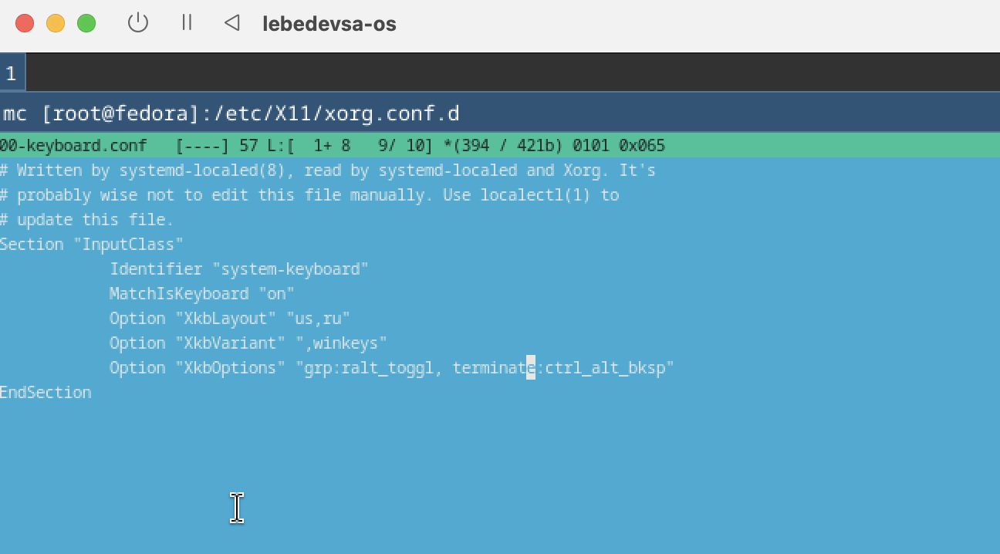
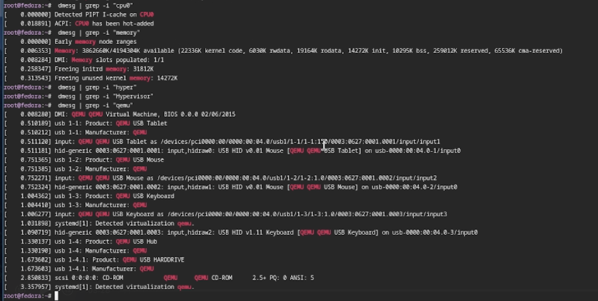
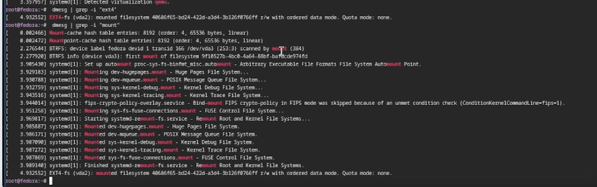

## Титульный слайд

**Дисциплина:** Архитектура компьютеров и операционные системы (раздел «Операционные системы»)  
**Работа:** Лабораторная работа 1 - Установка ОС Linux

**Студент:** Лебедев Сергей Алексеевич  
**Преподаватель:** Кулябов Дмитрий Сергеевич, д.ф.-м.н., профессор  
**Организация:** Российский университет дружбы народов (РУДН)

---

## Содержание

1. Вводная часть (Актуальность, Цели, Задачи)
2. Материалы и инструменты
3. Подготовка и установка ОС
4. Базовая настройка системы
5. Анализ загрузки (dmesg)
6. Выводы

---

## Информация о докладчике

:::::::::::::: {.columns align=center}
::: {.column width="65%"}
- **Лебедев Сергей Алексеевич**
- студент направления **02.03.00 Компьютерные и информационные науки**
- РУДН, 1 курс
- ЛР №1: установка Fedora + настройка окружения Sway
:::

::: {.column width="35%"}

:::
::::::::::::::

---

## Актуальность темы

- Установка ОС в виртуальной машине — базовый навык для дальнейших лабораторных.
- Linux повсеместно используется в разработке и администрировании, поэтому важно уметь:
  - устанавливать систему с нуля;
  - настраивать пользователя и сеть;
  - выполнять базовую конфигурацию безопасности;
  - анализировать процесс загрузки системы через логи ядра.

---

## Цель, гипотеза, задачи

**Цель:** приобрести практические навыки установки ОС на виртуальную машину и настроить минимально необходимые сервисы.

**Задачи:**
1. Создать VM и выделить ресурсы.
2. Установить Fedora Linux.
3. Развернуть окружение с оконным менеджером **Sway**.
4. Выполнить базовую настройку (SELinux, раскладка, удаленный доступ).
5. Выполнить анализ загрузки через `dmesg`.

---

## Материалы, методы и инструменты

- **Виртуализация:** UTM (Apple Hypervisor для M1)
- **ОС:** Fedora Linux (Workstation)
- **Оконный менеджер:** Sway (Wayland)
- **Командная строка:** bash, доступ по SSH
- **Пакетный менеджер:** `dnf`
- **Анализ логов:** утилиты `dmesg`, `grep`, `less`

---

## Подготовка виртуальной машины

Создана виртуальная машина в UTM. Выделены ресурсы для комфортной работы: RAM 4096 MB, Disk 60 GB.

{width=70%}

---

## Установка Fedora

Загружен ISO-образ Fedora, выполнена базовая установка операционной системы на выделенный виртуальный диск.

{width=70%}

---

## Установка оконного менеджера Sway

Из-за особенностей архитектуры ARM64 (чип M1) Sway был установлен поверх стандартной сборки Workstation с помощью пакетного менеджера `dnf`.

{width=70%}

---

## Запуск Sway и настройка доступа

Выполнен успешный запуск тайлингового оконного менеджера. Для повышения комфорта работы и решения проблемы с буфером обмена настроен удаленный доступ по **SSH** со встроенного терминала macOS.

{width=70%}

---

## Настройка системы: отключение SELinux

Система принудительного контроля доступа SELinux была переведена в режим `permissive` для упрощения дальнейшего конфигурирования сервисов.

{width=70%}

---

## Настройка системы: раскладка клавиатуры

Создан конфигурационный файл для раскладки клавиатуры в среде Sway, заданы горячие клавиши для переключения языков ввода.

{width=70%}

---

## Домашнее задание: Ядро и процессор

С помощью вывода утилит и логов ядра определены:
- Версия ядра Linux (`linux version`)
- Частота процессора (`mhz`)

{width=70%}

---

## Домашнее задание: Память и гипервизор

Определены ключевые параметры среды виртуализации:
- Объем доступной оперативной памяти (`memory available`)
- Тип обнаруженного гипервизора (`hypervisor detected`)

{width=70%}

---

## Домашнее задание: Файловая система

Определен тип файловой системы корневого раздела (`EXT4`) и проанализирована последовательность монтирования файловых систем при загрузке.

{width=70%}

---

## Итог и выводы

**Результаты:**
- Установлена ОС Fedora Linux в виртуальной среде UTM.
- Настроено рабочее окружение с оконным менеджером Sway.
- Выполнена базовая конфигурация (пользователь, SSH, SELinux, раскладка).
- Успешно извлечены параметры загрузки с помощью утилиты `dmesg`.

**Вывод:**
Получена стабильная и полностью готовая среда Linux для выполнения последующих лабораторных работ курса.

---

## Ресурсы

- Fedora Linux: https://getfedora.org/
- Sway Window Manager: https://swaywm.org/
- UTM (Virtual machines for Mac): https://mac.getutm.app/
- Документация Pandoc: https://pandoc.org/
