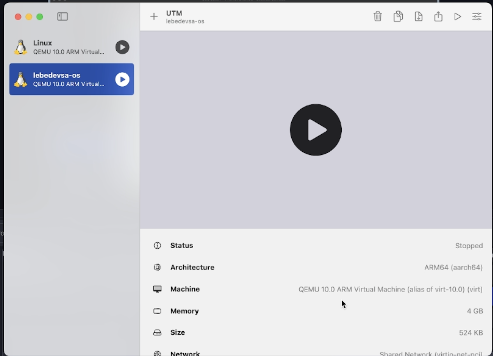
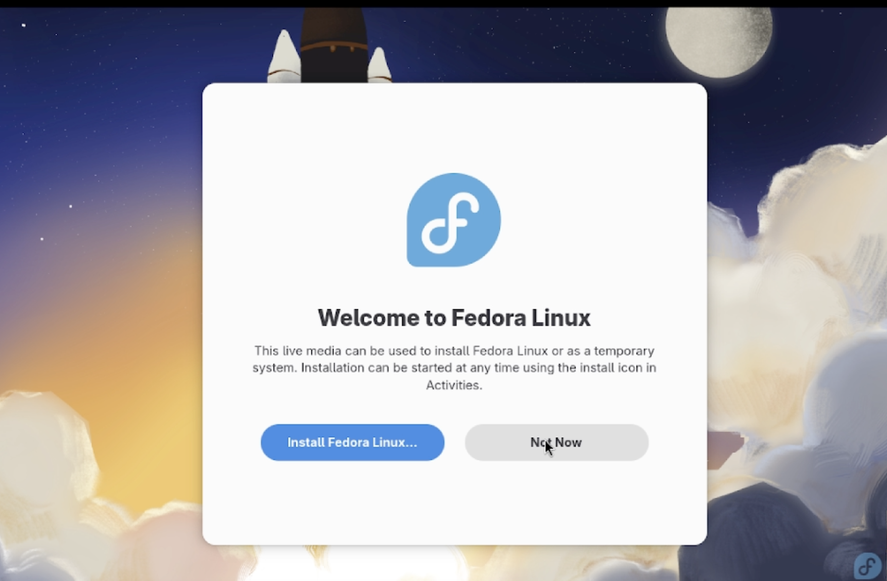
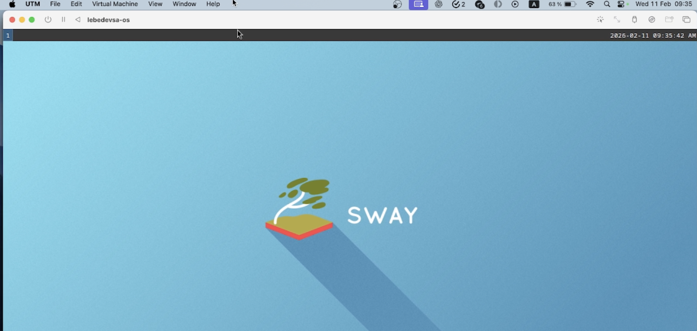
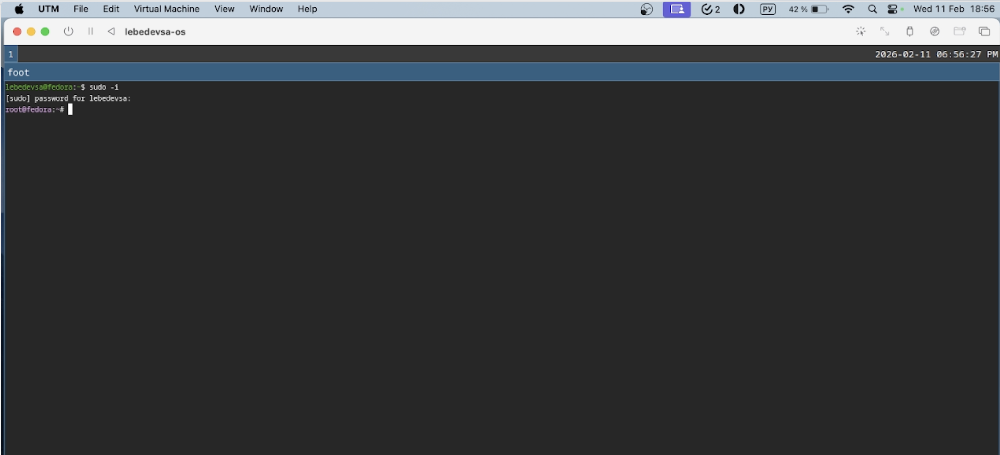
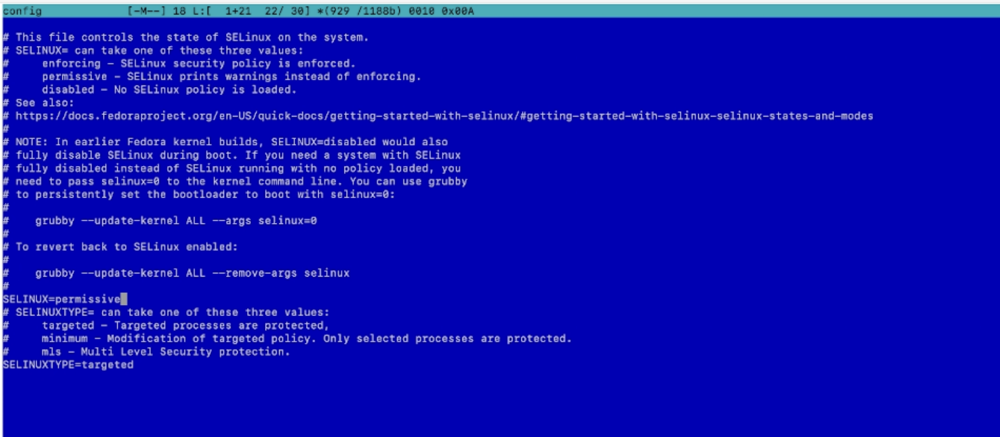
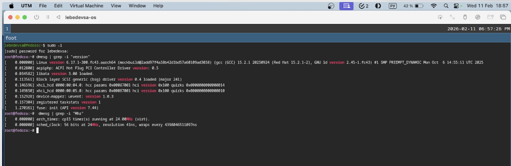

---
## Front matter
title: "Лабораторная работа №1"
subtitle: "Введение в операционные системы. Установка ОС Linux"
author: "Лебедев С. А."

## Generic options
lang: ru-RU\
toc-title: "Содержание"

## Bibliography
bibliography: bib/cite.bib
csl: pandoc/csl/gost-r-7-0-5-2008-numeric.csl

## Pdf output format
toc: true # Table of contents
toc-depth: 2
lof: true # List of figures
lot: true # List of tables
fontsize: 12pt
linestretch: 1.5
papersize: a4
documentclass: scrreprt

## I18n polyglossia
polyglossia-lang:
  name: russian
  options:
  - spelling=modern
  - babelshorthands=true
polyglossia-otherlangs:
  name: english

## I18n babel
babel-lang: russian
babel-otherlangs: english

## Fonts
mainfont: IBM Plex Serif
romanfont: IBM Plex Serif
sansfont: IBM Plex Sans
monofont: IBM Plex Mono
mathfont: STIX Two Math
mainfontoptions: Ligatures=Common,Ligatures=TeX,Scale=0.94
romanfontoptions: Ligatures=Common,Ligatures=TeX,Scale=0.94
sansfontoptions: Ligatures=Common,Ligatures=TeX,Scale=MatchLowercase,Scale=0.94
monofontoptions: Scale=MatchLowercase,Scale=0.94,FakeStretch=0.9
mathfontoptions:

## Biblatex
biblatex: true
biblio-style: "gost-numeric"
biblatexoptions:
  - parentracker=true
  - backend=biber
  - hyperref=auto
  - language=auto
  - autolang=other*
  - citestyle=gost-numeric

## Pandoc-crossref LaTeX customization
figureTitle: "Рис."
tableTitle: "Таблица"
listingTitle: "Листинг"
lofTitle: "Список иллюстраций"
lotTitle: "Список таблиц"
lolTitle: "Листинги"

## Misc options
indent: true
header-includes:
  - \usepackage{indentfirst}
  - \usepackage{float} # keep figures where there are in the text
  - \floatplacement{figure}{H} # keep figures where there are in the text
---

# Цель работы

Целью данной работы является приобретение практических навыков установки операционной системы на виртуальную машину, настройки минимально необходимых для дальнейшей работы сервисов.

# Задание

1. Установить Fedora Linux на виртуальную машину.
2. Использовать окружение с оконным менеджером **Sway** (Fedora Workstation + установка Sway поверх).
3. Выполнить базовую настройку системы (обновления, удобства, SELinux, раскладка, имя пользователя и hostname).
4. Выполнить домашнее задание: проанализировать загрузку системы командой `dmesg` и извлечь требуемые параметры.
5. Ответить на контрольные вопросы.

# Теоретическое введение

**Fedora Linux** — дистрибутив GNU/Linux, спонсируемый компанией Red Hat и поддерживаемый сообществом. Отличается частыми релизами и использованием передовых технологий с открытым исходным кодом.

**Sway** — тайлинговый оконный менеджер, полностью совместимый с i3, но работающий поверх протокола Wayland. Он потребляет минимум системных ресурсов и управляется преимущественно с помощью горячих клавиш.

Для запуска виртуальных машин на архитектуре Apple Silicon (M1) используются решения на базе QEMU и фреймворка Apple Hypervisor, такие как **UTM**, обеспечивающие высокую производительность без эмуляции архитектуры x86.

# Выполнение лабораторной работы

### Подготовка виртуальной машины

Создана виртуальная машина и выделены ресурсы. Параметры VM: RAM 4096 MB, Disk 60 GB (рис. -@fig:001).

{#fig:001 width=70%}

### Установка Fedora

Загружен ISO-образ Fedora, выполнена базовая установка операционной системы на диск (рис. -@fig:002).

{#fig:002 width=70%}

### Установка и запуск Sway

Установлен Sway поверх сборки Workstation. Напрямую скачать готовую сборку со Sway не получилось из-за использования платформы Mac на чипе M1 (рис. -@fig:003). 

{#fig:003 width=70%}

Выполнен успешный запуск оконного менеджера (рис. -@fig:004). Настроено имя пользователя `lebedevsa`, как указано в задании.

{#fig:004 width=70%}

### Повышение комфорта работы 

Так как возникли проблемы с настройкой общего буфера обмена между хостом и гостевой ОС, я использовал удаленный доступ к системе через встроенный терминал на Macbook по SSH.

### Отключение SELinux

Система принудительного контроля доступа SELinux была отключена для упрощения дальнейшей настройки. Для этого в конфигурационном файле параметр `SELINUX=enforcing` был заменен на `SELINUX=permissive` (рис. -@fig:005).

{#fig:005 width=70%}

### Настройка раскладки клавиатуры

Создан конфигурационный файл для раскладки клавиатуры, настроены горячие клавиши для смены языка ввода (рис. -@fig:006).

{#fig:006 width=70%}

# Домашнее задание

С помощью вывода утилит и логов ядра узнаем версию ядра Linux и частоту процессора (рис. -@fig:007).

{#fig:007 width=70%}

Определяем модель процессора, объём доступной оперативной памяти и тип обнаруженного гипервизора (рис. -@fig:008).

{#fig:008 width=70%}

Определяем тип файловой системы корневого раздела и последовательность монтирования файловых систем (рис. -@fig:009).

{#fig:009 width=70%}

# Контрольные вопросы

**1. Какую информацию содержит учётная запись пользователя?**
Учётная запись пользователя содержит имя пользователя (login), уникальный идентификатор UID, основной идентификатор группы GID, список дополнительных групп, домашний каталог, используемую оболочку (shell) и права доступа, определяющие, что пользователь может делать в системе.

**2. Команды терминала (примеры):**
* Справка по команде: `man ls` или `ls --help`.
* Перемещение по файловой системе: `cd /etc`.
* Просмотр содержимого каталога: `ls -l`.
* Определение объёма каталога: `du -sh /home`.
* Создание / удаление каталогов и файлов: `mkdir test`, `touch file.txt`, `rm file.txt`, `rmdir test`.
* Задание прав на файл / каталог: `chmod 755 file.txt`, `chown user:user file.txt`.
* Просмотр истории команд: `history`.

**3. Что такое файловая система?**
Файловая система — это способ организации хранения и управления данными на диске. Она определяет структуру каталогов, файлов и права доступа. Примеры: `ext4` (стандартная Linux ФС, стабильная и быстрая), `xfs` (эффективна для больших файлов и серверов), `FAT32` (простая, совместимая с разными ОС, но с ограничениями).

**4. Как посмотреть, какие файловые системы подмонтированы?**
Можно использовать команды `mount`, `lsblk -f` или `df -h`, которые показывают подключённые разделы и их точки монтирования.

**5. Как удалить зависший процесс?**
Сначала нужно определить его PID с помощью `ps aux` или `top`, затем завершить командой `kill PID`, а если процесс не реагирует — принудительно завершить сигналом `kill -9 PID`.

# Выводы

В ходе работы была установлена и настроена ОС Fedora Linux в виртуальной машине, выполнена базовая конфигурация системы и пользователя. Были изучены основы работы с Linux, терминалом и анализом загрузки системы через `dmesg`.

# Список литературы{.unnumbered}

::: {#refs}
:::