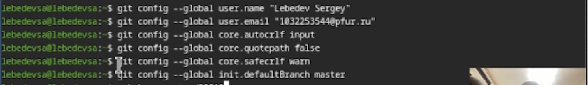
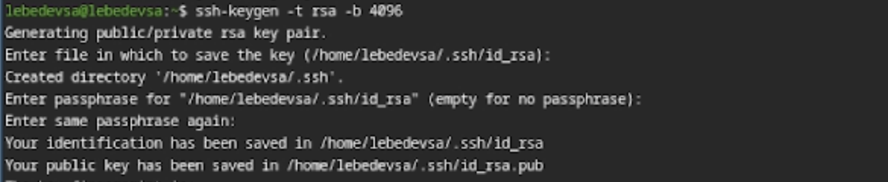
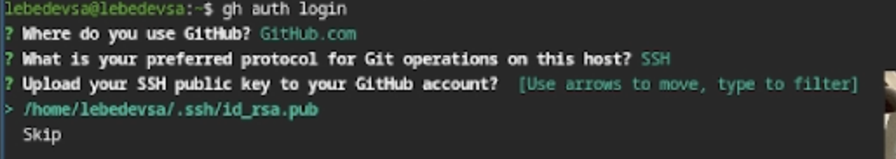

## Титульный слайд

**Дисциплина:** Архитектура компьютеров и операционные системы
**Работа:** Лабораторная работа №2 - Система контроля версий Git

**Студент:** Лебедев Сергей Алексеевич  
**Преподаватель:** Кулябов Дмитрий Сергеевич, д.ф.-м.н., профессор
**Организация:** Российский университет дружбы народов (РУДН)

---

## Содержание

1. Теоретическое введение
2. Цель и задачи работы
3. Базовая настройка Git
4. Генерация ключей (SSH и PGP)
5. Настройка GitHub CLI и подписи коммитов
6. Работа с репозиторием курса
7. Выводы

---

## Информация о докладчике

:::::::::::::: {.columns align=center}
::: {.column width="65%"}
- **Лебедев Сергей Алексеевич**
- Студент направления **02.03.00 Компьютерные и информационные науки**
- РУДН, 1 курс
- ЛР №2: Изучение и настройка системы контроля версий Git
:::

::: {.column width="35%"}
 
:::
::::::::::::::

---

## Теоретическое введение

**Система контроля версий (VCS)** — инструмент для хранения истории изменений проекта и организации совместной работы. Позволяет фиксировать изменения, возвращаться к старым версиям и отслеживать авторство.

**Git** является распределённой системой: у каждого участника хранится полная копия. 
Для безопасной работы с GitHub используются:
- **SSH-ключи** — для безопасной аутентификации.
- **PGP/GPG-подписи** — для криптографического подтверждения авторства коммитов.

---

## Цель и задачи работы

**Цель:** Изучение идеологии VCS и освоение практических навыков работы с Git.

**Задачи:**
1. Создать базовую конфигурацию `git`.
2. Создать ключи SSH и PGP, привязать их к GitHub.
3. Настроить автоматическую подпись коммитов.
4. Авторизоваться через терминал с помощью `gh`.
5. Создать локальный каталог курса по шаблону и отправить файлы на сервер.

---

## Установка ПО и базовая настройка git

Выполнена установка утилит `git` и `gh`. Заданы глобальные параметры: имя пользователя, email, корректный вывод UTF-8 и учет переносов строк (`autocrlf`).

{width=70%}

---

## Создание ключей SSH и PGP

Сгенерирован SSH-ключ (RSA 4096 бит) для доступа к серверу, а также создан PGP-ключ для криптографической подписи коммитов.

:::::::::::::: {.columns align=center}
::: {.column width="50%"}
**SSH-ключ:**
{width=100%}
:::
::: {.column width="50%"}
**PGP-ключ:**
{width=100%}
:::
::::::::::::::

---

## Добавление PGP-ключа и настройка подписи

Выполнен экспорт публичного PGP ключа в GitHub. Включена автоматическая подпись коммитов (`commit.gpgsign`) для подтверждения авторства.

{width=70%}

---

## Настройка GitHub CLI (gh)

Выполнена успешная авторизация в утилите `gh`, что позволяет управлять репозиториями GitHub напрямую из терминала.

{width=70%}

---

## Создание репозитория и отправка файлов

Репозиторий курса клонирован на локальную машину на основе шаблона. Удалены лишние файлы, сформирована нужная структура и выполнен `git push` на сервер.

{width=70%}

---

## Контрольные вопросы (Кратко)

- **VCS** предназначена для хранения истории и совместной работы. Основные понятия: хранилище (репозиторий), commit, рабочая копия.
- **Git** — это распределённая VCS (у каждого есть полная копия истории), в отличие от централизованных систем (SVN), где история хранится только на сервере.
- **Порядок работы:** получить изменения (`pull`), внести правки, добавить в индекс (`add`), зафиксировать (`commit`), отправить (`push`).

---

## Выводы

**Результаты:**
- Установлены и настроены инструменты `git` и `gh`.
- Успешно созданы и привязаны ключи SSH и PGP.
- Настроена верификация коммитов (статус Verified).
- Создан и синхронизирован репозиторий курса.

**Итог:** Получены устойчивые практические навыки настройки и работы с Git в связке с GitHub, подготовлено рабочее пространство для всего курса.

---

## Ресурсы

- Документация Git: https://git-scm.com/doc
- GitHub CLI: https://cli.github.com/
- Pandoc: https://pandoc.org/