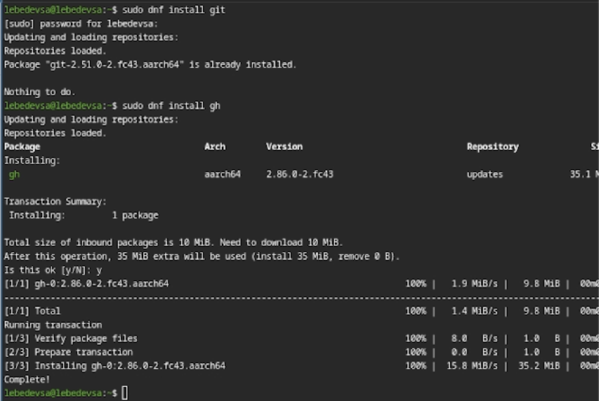
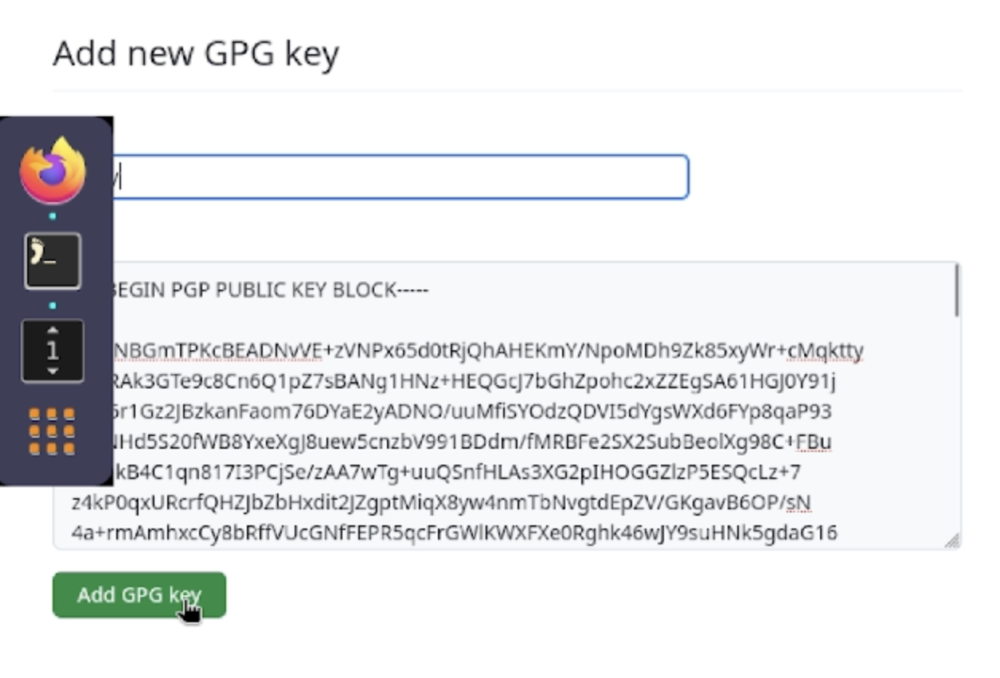
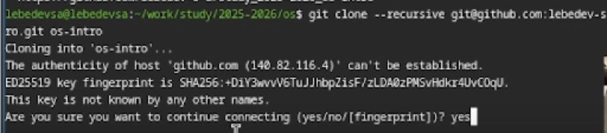
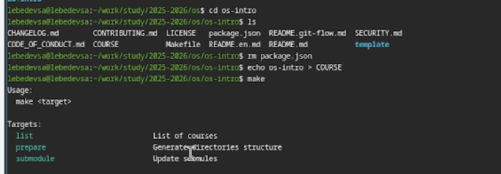
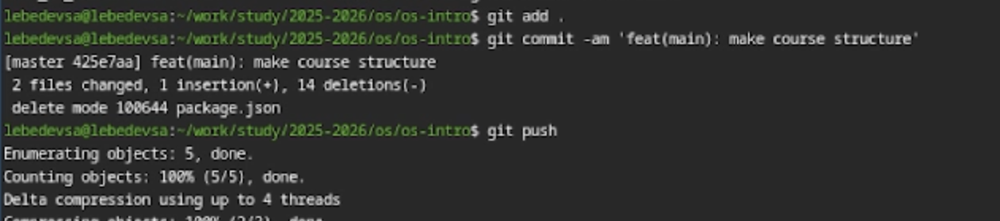

---
## Front matter
title: "Лабораторная работа №2"
subtitle: "Введение в операционные системы. Архитектура компьютеров и операционные системы"
author: "Лебедев С. А."

## Generic options
lang: ru-RU\
toc-title: "Содержание"

## Bibliography
bibliography: bib/cite.bib
csl: pandoc/csl/gost-r-7-0-5-2008-numeric.csl

## Pdf output format
toc: true # Table of contents
toc-depth: 2
lof: true # List of figures
lot: true # List of tables
fontsize: 12pt
linestretch: 1.5
papersize: a4
documentclass: scrreprt

## I18n polyglossia
polyglossia-lang:
  name: russian
  options:
  - spelling=modern
  - babelshorthands=true
polyglossia-otherlangs:
  name: english

## I18n babel
babel-lang: russian
babel-otherlangs: english

## Fonts
mainfont: IBM Plex Serif
romanfont: IBM Plex Serif
sansfont: IBM Plex Sans
monofont: IBM Plex Mono
mathfont: STIX Two Math
mainfontoptions: Ligatures=Common,Ligatures=TeX,Scale=0.94
romanfontoptions: Ligatures=Common,Ligatures=TeX,Scale=0.94
sansfontoptions: Ligatures=Common,Ligatures=TeX,Scale=MatchLowercase,Scale=0.94
monofontoptions: Scale=MatchLowercase,Scale=0.94,FakeStretch=0.9
mathfontoptions:

## Biblatex
biblatex: true
biblio-style: "gost-numeric"
biblatexoptions:
  - parentracker=true
  - backend=biber
  - hyperref=auto
  - language=auto
  - autolang=other*
  - citestyle=gost-numeric

## Pandoc-crossref LaTeX customization
figureTitle: "Рис."
tableTitle: "Таблица"
listingTitle: "Листинг"
lofTitle: "Список иллюстраций"
lotTitle: "Список таблиц"
lolTitle: "Листинги"

## Misc options
indent: true
header-includes:
  - \usepackage{indentfirst}
  - \usepackage{float} # keep figures where there are in the text
  - \floatplacement{figure}{H} # keep figures where there are in the text
---

# Цель работы

Целью лабораторной работы является изучение идеологии и применения средств контроля версий, а также освоение практических навыков работы с системой контроля версий **Git** (установка, первичная настройка, создание SSH и PGP ключей, настройка подписи коммитов и подготовка рабочего репозитория).

# Задание

1. Создать базовую конфигурацию для работы с `git`.
2. Создать ключ SSH и добавить его в учётную запись GitHub.
3. Создать ключ PGP (GPG) и добавить его в учётную запись GitHub.
4. Настроить автоматическую подпись коммитов в `git`.
5. Авторизоваться в GitHub с помощью `gh` (GitHub CLI).
6. Создать локальный каталог и репозиторий курса на основе шаблона, отправить изменения на сервер.

# Теоретическое введение

**Система контроля версий (VCS)** — это инструмент для хранения истории изменений проекта и организации совместной работы. VCS позволяет фиксировать изменения (коммиты), возвращаться к предыдущим версиям, объединять изменения разных участников и отслеживать авторство правок.

**Git** является распределённой системой контроля версий: у каждого участника хранится полная копия репозитория и история изменений. Для безопасной работы с удалёнными репозиториями на GitHub используются:

* **SSH-ключи** — для аутентификации при подключении к репозиторию;
* **PGP/GPG-подписи** — для подтверждения авторства коммитов (на GitHub отображается статус *Verified*).

# Выполнение лабораторной работы

### Установка программного обеспечения

Выполнена установка пакетов `git` и `gh` в операционной системе. Результат установки представлен на рис. -@fig:001.

{#fig:001 width=70%}

### Базовая настройка git

Выполнена первичная настройка `git`: задано имя пользователя и email, настроен корректный вывод путей (UTF-8), параметры учёта переносов строк (`autocrlf`, `safecrlf`) и необходимые базовые параметры. Результат настройки представлен на рис. -@fig:002.

{#fig:002 width=70%}

### Создание ключей SSH и PGP

Сгенерирован SSH-ключ (RSA 4096 бит) и создан PGP (GPG) ключ для подписи коммитов. Результат генерации ключей представлен на рис. -@fig:003 и рис. -@fig:004.

{#fig:003 width=70%}

{#fig:004 width=70%}

### Добавление PGP ключа в GitHub и настройка подписи коммитов

Выполнен экспорт публичного PGP ключа и добавление ключа в учётную запись GitHub. Затем настроена автоматическая подпись коммитов: установлен `user.signingkey`, включён параметр `commit.gpgsign`. Результат представлен на рис. -@fig:005.

{#fig:005 width=70%}

### Настройка gh (GitHub CLI)

Выполнена авторизация в `gh` для работы с GitHub через терминал. Результат авторизации представлен на рис. -@fig:006.

{#fig:006 width=70%}

### Создание репозитория курса на основе шаблона

Создан репозиторий курса на основе шаблона и выполнено клонирование репозитория на локальную машину. Результат представлен на рис. -@fig:007.

{#fig:007 width=70%}

### Настройка каталога курса и отправка файлов на сервер

Удалены лишние файлы, создан файл `COURSE`, сформирована структура каталога курса, затем изменения отправлены в удалённый репозиторий. Результат отправки представлен на рис. -@fig:008.

{#fig:008 width=70%}

# Ответы на контрольные вопросы

**1. Что такое системы контроля версий (VCS) и для каких задач они предназначены?**
VCS — система контроля версий, предназначенная для хранения истории изменений проекта. Она позволяет фиксировать изменения, возвращаться к предыдущим версиям, организовывать совместную работу, отслеживать авторство правок и решать конфликты при одновременном редактировании.

**2. Понятия: хранилище, commit, история, рабочая копия**
* **Хранилище (repository)** — место хранения проекта и его истории изменений.
* **Commit** — фиксированное изменение (снимок состояния проекта) с описанием.
* **История** — последовательность коммитов, отражающая развитие проекта.
* **Рабочая копия** — текущие файлы на компьютере пользователя, которые он редактирует.

**3. Чем отличаются централизованные и распределённые VCS? Примеры**
Централизованные VCS имеют единый сервер (например, CVS, Subversion/SVN). Распределённые VCS хранят полную историю у каждого участника (например, Git, Mercurial, Bazaar). Главное отличие — возможность полноценной работы локально без постоянного подключения к серверу.

**4. Действия с VCS при единоличной работе с хранилищем**
Создание репозитория (`git init`), внесение изменений в файлы, подготовка изменений (`git add`), фиксация (`git commit`), просмотр состояния и истории (`git status`, `git log`), при необходимости — откат к нужной версии.

**5. Порядок работы с общим хранилищем VCS**
Получить актуальные изменения (`git pull`), внести правки, добавить изменения (`git add`), зафиксировать (`git commit`), отправить в удалённый репозиторий (`git push`). При возникновении конфликтов выполнить слияние и разрешить конфликты.

**6. Основные задачи, решаемые git**
Хранение истории изменений, контроль версий, ветвление и слияние, совместная разработка, синхронизация с удалёнными репозиториями, восстановление состояния проекта.

**7. Краткая характеристика основных команд git**
* `git init` — создать локальный репозиторий
* `git status` — показать состояние файлов
* `git add` — добавить изменения в индекс
* `git commit` — зафиксировать изменения
* `git log` — показать историю коммитов
* `git diff` — показать отличия
* `git pull` — получить изменения с сервера
* `git push` — отправить изменения на сервер
* `git branch` — работа с ветками
* `git checkout` — переключение веток/состояний
* `git merge` — слияние веток

**8. Примеры работы с локальным и удалённым репозиториями**

Локальная работа:

```bash
git init
git add .
git commit -m "Initial commit"
``` 

**9. Что такое ветви (branches) и зачем они нужны?**
Ветви - это независимые линии разработки внутри одного репозитория.
Они позволяют:
	• разрабатывать новые функции отдельно от основной версии,
	• тестировать изменения без риска сломать проект,
	• вести параллельную разработку,
	• объединять изменения с помощью merge.
```bash
git checkout -b new-feature
git merge new-feature
``` 
**10. Как и зачем игнорировать файлы при commit?**

Файл .gitignore используется для исключения файлов и каталогов из отслеживания Git.
Это необходимо для:
	• временных файлов,
	• логов,
	• скомпилированных файлов,
	• системных и служебных файлов.

Пример .gitignore:
```bash
*.log
node_modules/
__pycache__/
build/
*.tmp
```
# Выводы

В ходе выполнения лабораторной работы были установлены git и gh, выполнена первичная настройка Git, созданы SSH и PGP (GPG) ключи, настроена автоматическая подпись коммитов, выполнена авторизация через GitHub CLI, создан репозиторий курса на основе шаблона и отправлены изменения на сервер. Таким образом, получены практические навыки настройки и работы с Git в связке с GitHub.

# Список литературы{.unnumbered}

::: {#refs}
:::