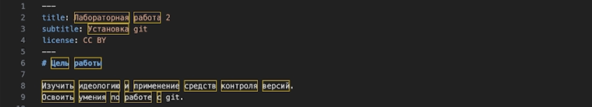

## Титульный слайд

**Дисциплина:** Архитектура компьютеров и операционные системы (раздел «Операционные системы»)  
**Работа:** Лабораторная работа 3 — Markdown

**Студент:** Лебедев Сергей Алексеевич  
**Преподаватель:** Кулябов Дмитрий Сергеевич, д.ф.-м.н., профессор  
**Организация:** Российский университет дружбы народов (РУДН)

---

## Содержание

1. Актуальность и постановка задачи  
2. Цель, гипотеза, задачи  
3. Материалы и инструменты  
4. Ход выполнения  
5. Обработка Markdown с помощью Pandoc  
6. Выводы и результаты

---

## Информация о докладчике

:::::::::::::: {.columns align=center}
::: {.column width="65%"}
- **Лебедев Сергей Алексеевич**
- студент направления **02.03.00 Компьютерные и информационные науки**
- РУДН, 1 курс
- ЛР №3: оформление отчётов в формате Markdown
:::

::: {.column width="35%"}

:::
::::::::::::::

---

## Актуальность темы

- Markdown широко используется для написания документации и технических отчётов  
- формат удобен для хранения текста в системах контроля версий  
- позволяет быстро преобразовывать документы в различные форматы (PDF, DOCX, HTML)

Использование Markdown позволяет автоматизировать процесс подготовки отчётов.

---

## Объект, предмет, новизна, практическая значимость

**Объект:** система подготовки технической документации.

**Предмет:** язык разметки **Markdown** и его использование для оформления отчётов.

**Научная новизна (в рамках работы):**
- освоение использования Markdown для подготовки научно-технической документации.

**Практическая значимость:**
- возможность быстро создавать и конвертировать отчёты в различные форматы.

---

## Цель, гипотеза, задачи

**Цель:** освоить оформление отчётов с использованием языка разметки Markdown.

**Гипотеза:** использование Markdown позволяет значительно упростить подготовку и оформление технических отчётов.

**Задачи:**

1. Изучить основные элементы синтаксиса Markdown  
2. Освоить форматирование текста, списков, ссылок и блоков кода  
3. Научиться использовать формулы и цитаты  
4. Подготовить отчёт по лабораторной работе в формате Markdown  
5. Конвертировать документ в **PDF** и **DOCX** с помощью Pandoc

---

## Материалы, методы и инструменты

- **Язык разметки:** Markdown  
- **Конвертация документов:** Pandoc  
- **Среда разработки:** текстовый редактор / IDE  
- **Система контроля версий:** Git / GitHub  
- **Форматы вывода:** PDF, DOCX

---

## Ход выполнения (основные этапы)

1) Изучение синтаксиса Markdown  
2) Создание структуры отчёта  
3) Добавление заголовков, списков и ссылок  
4) Добавление блоков кода и формул  
5) Подготовка иллюстраций  
6) Конвертация документа с помощью Pandoc

---

## Иллюстрации выполнения

**Создание структуры отчёта и формулировка задания:**

**Процесс оформления отчёта в Markdown:**

---

## Обработка Markdown файлов

Для преобразования Markdown документов использовалась программа **Pandoc**.

Также можно использовать **Makefile** для автоматической сборки документа.

---

## Итог и выводы

**Результаты:**

- изучен синтаксис Markdown  
- подготовлен отчёт лабораторной работы в формате Markdown  
- выполнено преобразование документа в форматы **PDF** и **DOCX**

**Вывод:**

Markdown является удобным инструментом для подготовки технической документации и отчётов, а использование Pandoc позволяет быстро конвертировать документы в различные форматы.

---

## Ресурсы

- Markdown Guide: https://www.markdownguide.org  
- Pandoc: https://pandoc.org  
- Pandoc Crossref: https://github.com/lierdakil/pandoc-crossref  