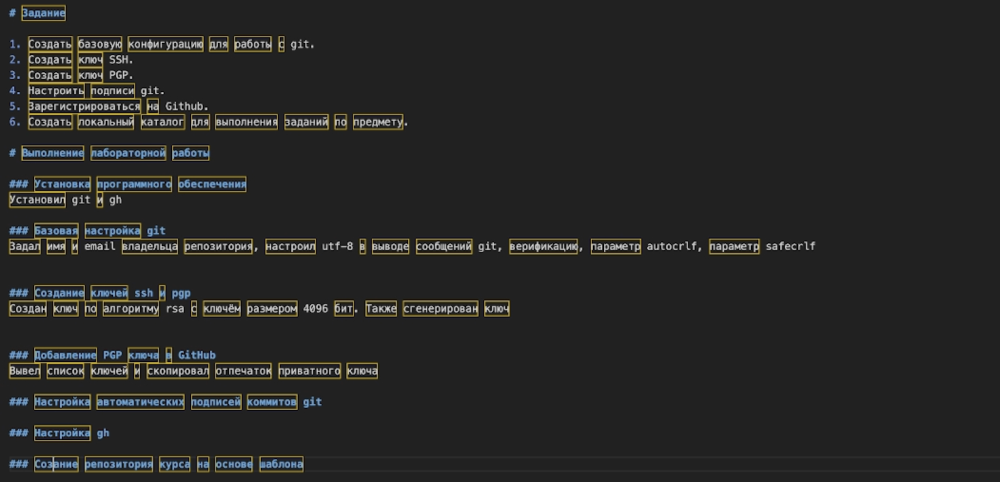

---
## Front matter
title: "Лабораторная работа №3"
subtitle: "Markdown"
author: "Лебедев Сергей Алексеевич."

## Generic options
lang: ru-RU\
toc-title: "Содержание"

## Bibliography
bibliography: bib/cite.bib
csl: pandoc/csl/gost-r-7-0-5-2008-numeric.csl

## Pdf output format
toc: true
toc-depth: 2
lof: true
lot: true
fontsize: 12pt
linestretch: 1.5
papersize: a4
documentclass: scrreprt

## I18n polyglossia
polyglossia-lang:
  name: russian
  options:
  - spelling=modern
  - babelshorthands=true
polyglossia-otherlangs:
  name: english

## I18n babel
babel-lang: russian
babel-otherlangs: english

## Fonts
mainfont: IBM Plex Serif
romanfont: IBM Plex Serif
sansfont: IBM Plex Sans
monofont: IBM Plex Mono
mathfont: STIX Two Math
mainfontoptions: Ligatures=Common,Ligatures=TeX,Scale=0.94
romanfontoptions: Ligatures=Common,Ligatures=TeX,Scale=0.94
sansfontoptions: Ligatures=Common,Ligatures=TeX,Scale=MatchLowercase,Scale=0.94
monofontoptions: Scale=MatchLowercase,Scale=0.94,FakeStretch=0.9

## Biblatex
biblatex: true
biblio-style: "gost-numeric"
biblatexoptions:
  - parentracker=true
  - backend=biber
  - hyperref=auto
  - language=auto
  - autolang=other*
  - citestyle=gost-numeric

## Pandoc-crossref
figureTitle: "Рис."
tableTitle: "Таблица"
listingTitle: "Листинг"
lofTitle: "Список иллюстраций"
lotTitle: "Список таблиц"
lolTitle: "Листинги"

## Misc options
indent: true
header-includes:
  - \usepackage{indentfirst}
  - \usepackage{float}
  - \floatplacement{figure}{H}
---

# Цель работы

Целью данной лабораторной работы является изучение возможностей легковесного языка разметки **Markdown** и получение практических навыков оформления отчётов с его использованием.

# Задание

1. Изучить базовые элементы синтаксиса Markdown.
2. Ознакомиться со способами форматирования текста, создания списков, ссылок и блоков кода.
3. Освоить создание формул, цитат и других элементов оформления.
4. Создать отчёт по лабораторной работе в формате Markdown.
5. С помощью Pandoc преобразовать отчёт в форматы **PDF**, **DOCX** и **MD**.

# Теоретическое введение

**Markdown** — это легковесный язык разметки, предназначенный для удобного форматирования текста. Он широко используется для написания документации, научных отчётов и технических описаний.

Основными преимуществами Markdown являются простота синтаксиса и возможность быстрого преобразования текста в различные форматы, такие как PDF, HTML и DOCX.

Для обработки файлов Markdown используется программа **Pandoc**, которая позволяет конвертировать документы между различными форматами.

Markdown поддерживает следующие основные элементы форматирования:

- заголовки различных уровней;
- выделение текста (жирный, курсив);
- списки;
- ссылки;
- блоки кода;
- формулы;
- цитаты.

# Выполнение лабораторной работы

### Подготовка структуры отчёта

На первом этапе была создана структура отчёта лабораторной работы в формате Markdown. Были оформлены заголовки, цели и задачи лабораторной работы (рис. -@fig:001).

{#fig:001 width=70%}

### Оформление отчёта

Далее был подготовлен основной текст отчёта, включающий описание выполнения лабораторной работы, настройку структуры документа и использование различных элементов разметки Markdown (рис. -@fig:002).

{#fig:002 width=70%}

### Обработка Markdown файла

Для преобразования Markdown файла в другие форматы была использована программа **Pandoc**. С её помощью отчёт был преобразован в форматы **PDF** и **DOCX**, что позволяет использовать его для дальнейшей сдачи и редактирования.

# Выводы

В ходе выполнения лабораторной работы были изучены основные возможности языка разметки Markdown. Освоены базовые элементы форматирования текста, создание списков, ссылок, блоков кода и формул.

Также были получены практические навыки подготовки отчётов и преобразования Markdown документов в различные форматы с помощью программы Pandoc.

# Список литературы{.unnumbered}

::: {#refs}
:::