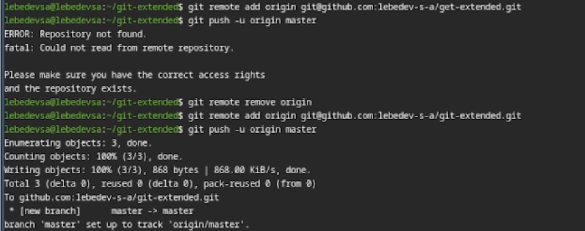
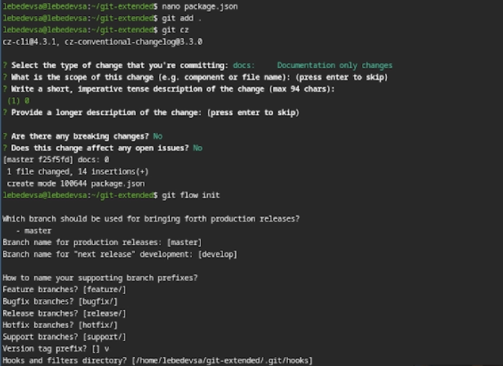
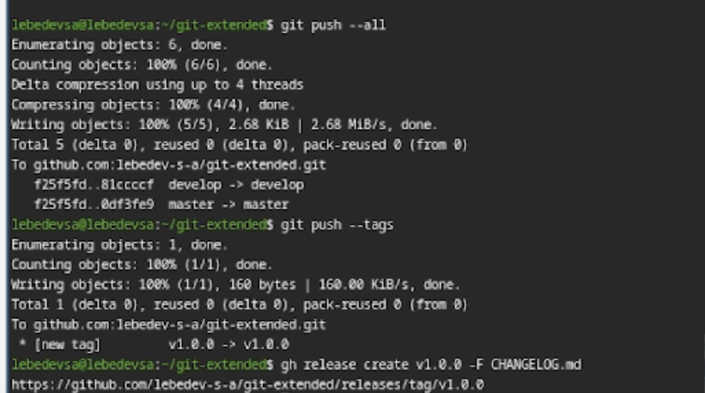
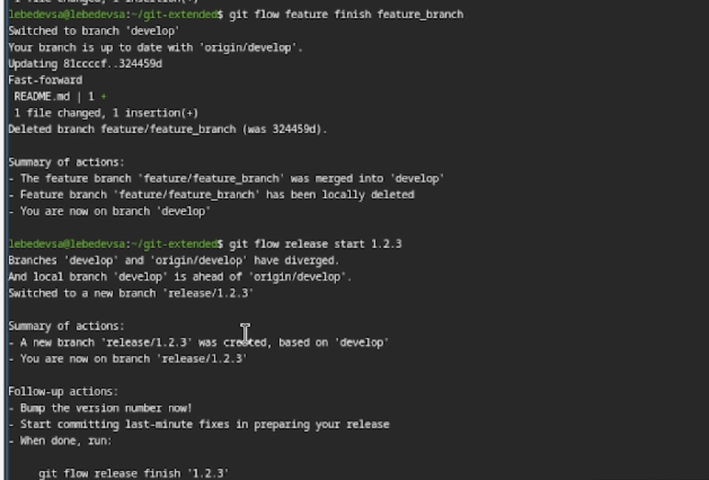
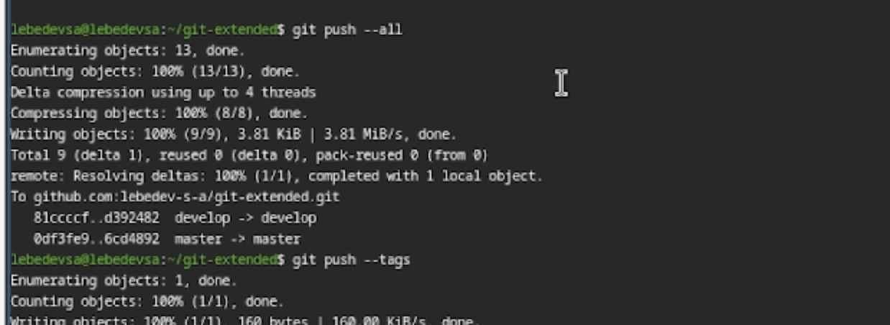

## Титульный слайд
**Дисциплина:** Архитектура компьютеров и операционные системы (раздел «Операционные системы»)  
**Работа:** Лабораторная работа 4 — Продвинутое использование git  
**Студент:** Лебедев Сергей Алексеевич  
**Преподаватель:** Кулябов Дмитрий Сергеевич, д.ф.-м.н., профессор  
**Организация:** Российский университет дружбы народов (РУДН)
---
## Содержание
1. Актуальность и постановка задачи  
2. Цель, гипотеза, задачи  
3. Материалы и инструменты  
4. Ход выполнения  
5. Демонстрация результатов  
6. Выводы и результаты
---
## Информация о докладчике
:::::::::::::: {.columns align=center}
::: {.column width="65%"}
- **Лебедев Сергей Алексеевич**
- студент направления **02.03.00 Компьютерные и информационные науки**
- РУДН, 1 курс
- ЛР №4: продвинутое использование git (Gitflow + Conventional Commits)
:::
::: {.column width="35%"}

:::
::::::::::::::
---
## Актуальность темы
- Контроль версий — основа современной разработки программного обеспечения
- Git используется в подавляющем большинстве коммерческих и открытых проектов
- Базовые навыки git недостаточны для командной работы — важно уметь:
  - организовать структурированную модель ветвления (Gitflow)
  - писать стандартизированные сообщения коммитов (Conventional Commits)
  - автоматически генерировать журнал изменений (CHANGELOG)
  - публиковать релизы на GitHub
---
## Объект, предмет, новизна, практическая значимость
**Объект:** система контроля версий git и инструменты расширенной работы с ней  
**Предмет:** настройка Gitflow Workflow и Conventional Commits в репозитории

**Научная новизна (в рамках работы):**
- освоение профессиональных практик организации репозитория с поддержкой автоматического версионирования

**Практическая значимость:**
- готовый репозиторий с Gitflow и Conventional Commits для применения в реальных и учебных проектах
---
## Цель, гипотеза, задачи
**Цель:** получить навыки правильной работы с репозиториями git.

**Гипотеза:** использование Gitflow и Conventional Commits позволяет стандартизировать процесс разработки и автоматизировать создание журнала изменений и релизов.

**Задачи:**
1. Установить и настроить git-flow, Node.js, pnpm, commitizen, standard-changelog
2. Создать тестовый репозиторий и подключить его к GitHub
3. Настроить Conventional Commits через `package.json`
4. Инициализировать git-flow и выполнить работу с ветками
5. Создать релизы v1.0.0 и v1.2.3 с автоматически сгенерированным CHANGELOG
---
## Материалы, методы и инструменты
- **ОС:** Fedora Linux
- **Система контроля версий:** git + git-flow
- **Менеджер пакетов:** pnpm
- **Стандартизация коммитов:** commitizen + cz-conventional-changelog
- **Генерация changelog:** standard-changelog
- **Публикация релизов:** GitHub CLI (`gh`)
- **Хостинг репозитория:** GitHub
- **Отчётность:** Markdown → `pandoc` (pdf/docx)
---
## Ход выполнения (основные этапы)
1) Установка git-flow из репозитория Copr  
2) Установка Node.js и pnpm  
3) Настройка pnpm (добавление в PATH)  
4) Создание Git-репозитория и первый коммит  
5) Подключение удалённого репозитория GitHub  
6) Инициализация проекта Node.js, настройка commitizen  
7) Инициализация git-flow, работа с ветками feature/release  
8) Генерация CHANGELOG и создание релизов на GitHub
---
## Установка инструментов
**Установка git-flow:**

```bash
sudo dnf copr enable elegos/gitflow
sudo dnf install gitflow
```

**Установка Node.js и pnpm:**

```bash
sudo dnf install nodejs pnpm
```

**Настройка pnpm:**

```bash
pnpm setup
source ~/.bashrc
```


---
## Создание репозитория и подключение к GitHub
```bash
mkdir git-extended && cd git-extended
touch README.md
git init && git add . && git commit -m "first commit"
git remote add origin git@github.com:lebedev-s-a/git-extended.git
git push -u origin master
```



---
## Настройка Conventional Commits
Инициализация проекта Node.js и добавление конфигурации commitizen в `package.json`:

```json
"config": {
  "commitizen": {
    "path": "cz-conventional-changelog"
  }
}
```

Коммит через интерактивное меню:

```bash
git cz
```


---
## Инициализация git-flow
```bash
git flow init
```

Настраиваются ветки: `master`, `develop`, `feature/`, `release/`, `hotfix/`  
Префикс для ярлыков версий: **v**


---
## Создание релиза v1.0.0 и CHANGELOG
```bash
git flow release start 1.0.0
standard-changelog --first-release
git add CHANGELOG.md
git commit -am "chore(site): add changelog"
git flow release finish 1.0.0
```


---
## Работа с feature-веткой и релиз v1.2.3
```bash
git flow feature start feature_branch
# ... разработка ...
git flow feature finish feature_branch
git flow release start 1.2.3
standard-changelog
git add CHANGELOG.md
git commit -am "chore(site): update changelog"
git flow release finish 1.2.3
```


---
## Публикация на GitHub
**Отправка всех веток и тегов:**

```bash
git push --all
git push --tags
```

**Создание релизов на GitHub:**

```bash
gh release create v1.0.0 -F CHANGELOG.md
gh release create v1.2.3 -F CHANGELOG.md
```




---
## Итог и выводы
**Результаты:**
- Установлены и настроены git-flow, commitizen, standard-changelog
- Создан тестовый репозиторий с подключением к GitHub
- Настроены Conventional Commits через `package.json`
- Выполнена работа с ветками feature и release в рамках Gitflow
- Сгенерирован `CHANGELOG.md` и опубликованы релизы v1.0.0 и v1.2.3 на GitHub

**Вывод:**  
получены практические навыки организации профессионального рабочего процесса с git на основе Gitflow Workflow и Conventional Commits
---
## Ресурсы
- Gitflow: https://nvie.com/posts/a-successful-git-branching-model/
- git-flow (Copr): https://copr.fedorainfracloud.org/coprs/elegos/gitflow/
- Conventional Commits: https://www.conventionalcommits.org/
- Semantic Versioning: https://semver.org/
- Conventional Changelog: https://github.com/conventional-changelog/conventional-changelog
- GitHub CLI: https://cli.github.com/
