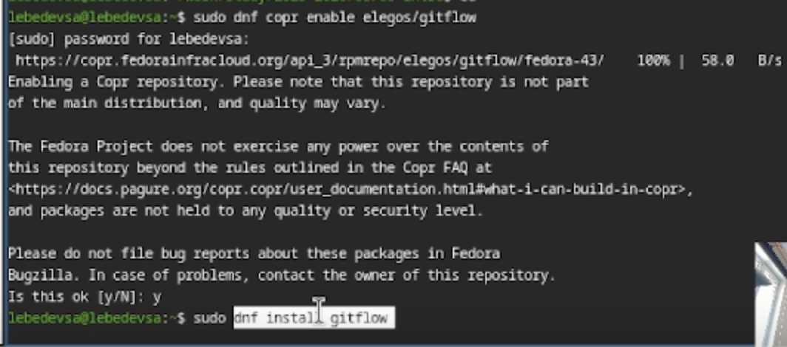
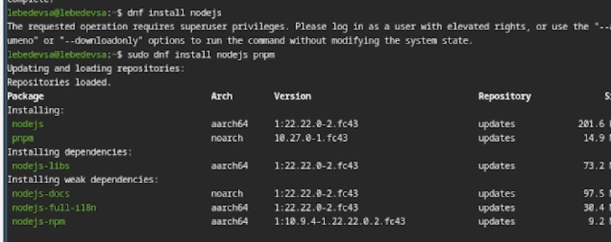
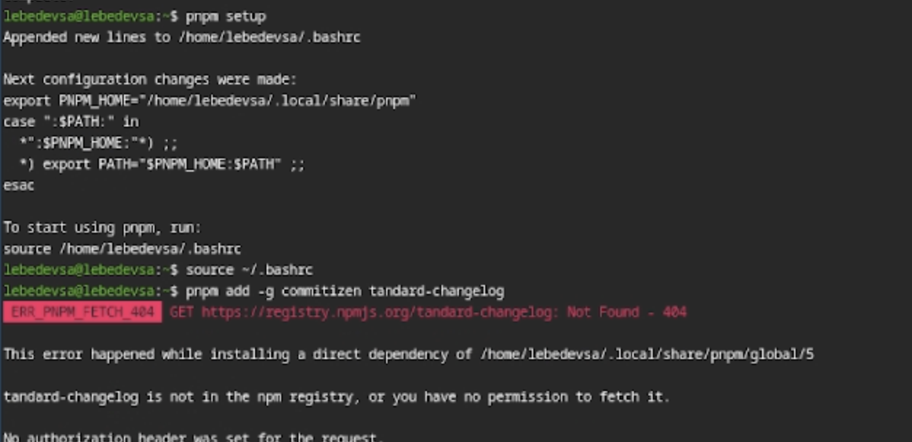
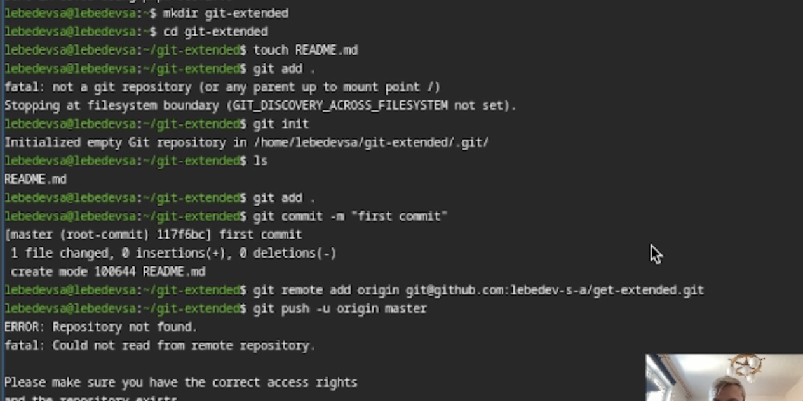
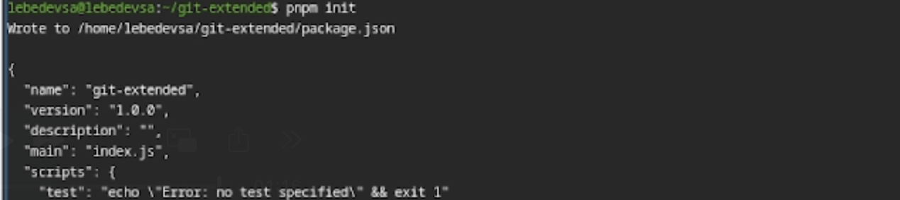
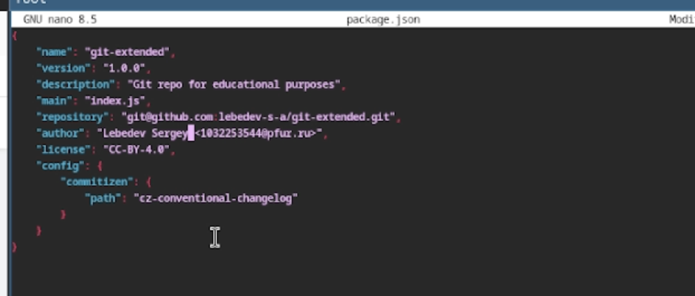
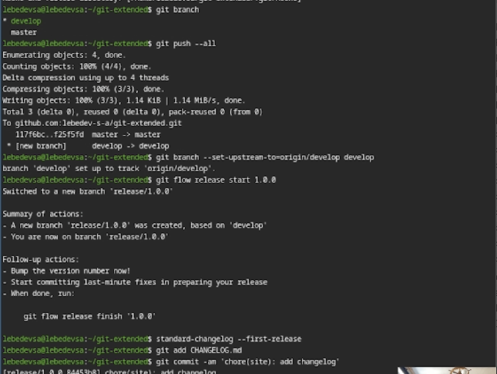
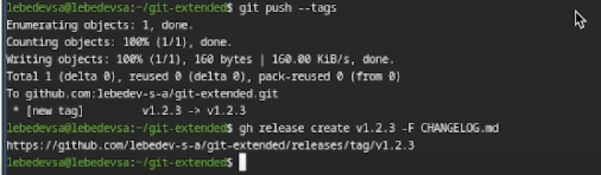

---
## Front matter
title: "Лабораторная работа №4"
subtitle: "Продвинутое использование git"
author: "Лебедев С. А."

## Generic options
lang: ru-RU
toc-title: "Содержание"

## Bibliography
bibliography: bib/cite.bib
csl: pandoc/csl/gost-r-7-0-5-2008-numeric.csl

## Pdf output format
toc: true # Table of contents
toc-depth: 2
lof: true # List of figures
lot: true # List of tables
fontsize: 12pt
linestretch: 1.5
papersize: a4
documentclass: scrreprt

## I18n polyglossia
polyglossia-lang:
  name: russian
  options:
  - spelling=modern
  - babelshorthands=true
polyglossia-otherlangs:
  name: english

## I18n babel
babel-lang: russian
babel-otherlangs: english

## Fonts
mainfont: IBM Plex Serif
romanfont: IBM Plex Serif
sansfont: IBM Plex Sans
monofont: IBM Plex Mono
mathfont: STIX Two Math
mainfontoptions: Ligatures=Common,Ligatures=TeX,Scale=0.94
romanfontoptions: Ligatures=Common,Ligatures=TeX,Scale=0.94
sansfontoptions: Ligatures=Common,Ligatures=TeX,Scale=MatchLowercase,Scale=0.94
monofontoptions: Scale=MatchLowercase,Scale=0.94,FakeStretch=0.9
mathfontoptions:

## Biblatex
biblatex: true
biblio-style: "gost-numeric"
biblatexoptions:
  - parentracker=true
  - backend=biber
  - hyperref=auto
  - language=auto
  - autolang=other*
  - citestyle=gost-numeric

## Pandoc-crossref LaTeX customization
figureTitle: "Рис."
tableTitle: "Таблица"
listingTitle: "Листинг"
lofTitle: "Список иллюстраций"
lotTitle: "Список таблиц"
lolTitle: "Листинги"

## Misc options
indent: true
header-includes:
  - \usepackage{indentfirst}
  - \usepackage{float} # keep figures where there are in the text
  - \floatplacement{figure}{H} # keep figures where there are in the text
---

# Цель работы

Целью данной работы является получение навыков правильной работы с репозиториями git.

# Задание

1. Выполнить работу для тестового репозитория.
2. Преобразовать рабочий репозиторий в репозиторий с git-flow и conventional commits.

# Теоретическое введение

**Gitflow Workflow** — модель ветвления для git, опубликованная и популяризованная Винсентом Дриссеном. Предполагает выстраивание строгой модели ветвления с учётом выпуска проекта и отлично подходит для организации рабочего процесса на основе релизов.

**Семантическое версионирование** задаёт версию в виде кортежа `МАЖОРНАЯ.МИНОРНАЯ.ПАТЧ`, где каждый компонент увеличивается при соответствующем типе изменений: обратно несовместимых, новой функциональности и исправлений соответственно.

**Conventional Commits** — спецификация соглашений о написании сообщений коммитов. Совместима с SemVer и регламентирует структуру и основные типы коммитов (`feat:`, `fix:`, `docs:`, `chore:` и др.).

# Выполнение лабораторной работы

## Установка программного обеспечения

### Установка git-flow

Для установки инструмента git-flow подключён дополнительный репозиторий Copr и выполнена установка пакета `gitflow` (рис. -@fig:001).

```bash
sudo dnf copr enable elegos/gitflow
sudo dnf install gitflow
```

{#fig:001 width=70%}

### Установка Node.js и pnpm

Установлены среда Node.js и менеджер пакетов pnpm, необходимые для работы инструментов conventional commits и генерации changelog (рис. -@fig:002).

```bash
sudo dnf install nodejs pnpm
```

{#fig:002 width=70%}

### Настройка pnpm

Выполнена настройка pnpm: добавлен путь к исполняемым файлам в переменную среды `PATH` (рис. -@fig:003).

```bash
pnpm setup
source ~/.bashrc
```

{#fig:003 width=70%}

## Создание репозитория git

### Инициализация локального репозитория

Создан тестовый Git-репозиторий и выполнен первый коммит (рис. -@fig:004).

```bash
mkdir git-extended
cd git-extended
touch README.md
git init
git add .
git commit -m "first commit"
```

{#fig:004 width=70%}

### Подключение удалённого репозитория

Репозиторий подключён к GitHub и выполнена первичная отправка изменений (рис. -@fig:005).

```bash
git remote add origin git@github.com:lebedev-s-a/git-extended.git
git push -u origin master
```

{#fig:005 width=70%}

## Конфигурация общепринятых коммитов

### Инициализация проекта Node.js

Выполнена инициализация проекта Node.js, создан файл `package.json` с информацией о проекте (рис. -@fig:006).

```bash
pnpm init
```

{#fig:006 width=70%}

### Настройка commitizen

В файл `package.json` добавлена конфигурация для commitizen, позволяющая использовать стандартизированные сообщения коммитов (рис. -@fig:007).

```json
"config": {
  "commitizen": {
    "path": "cz-conventional-changelog"
  }
}
```

{#fig:007 width=70%}

### Создание коммита с использованием commitizen

Выполнен коммит с помощью интерактивного инструмента `git cz`. Выбран тип коммита `docs` (рис. -@fig:008).

```bash
git cz
```

{#fig:008 width=70%}

## Конфигурация git-flow

### Инициализация git-flow

Выполнена инициализация git-flow с настройкой основных веток (`master`, `develop`) и префиксов для `feature/`, `release/`, `hotfix/`. Префикс для ярлыков установлен в `v` (рис. -@fig:009).

```bash
git flow init
```

{#fig:009 width=70%}

### Создание первого релиза

Создана ветка `release/1.0.0`, сгенерирован файл `CHANGELOG.md` и выполнен соответствующий коммит (рис. -@fig:010).

```bash
git flow release start 1.0.0
standard-changelog --first-release
git add CHANGELOG.md
git commit -am "chore(site): add changelog"
```

{#fig:010 width=70%}

## Работа с репозиторием git

### Завершение работы с функциональной веткой

Функциональная ветка `feature/feature_branch` слита с веткой `develop` и удалена. После этого создана новая релизная ветка `release/1.2.3` (рис. -@fig:011).

```bash
git flow feature finish feature_branch
git flow release start 1.2.3
```

{#fig:011 width=70%}

### Отправка изменений в удалённый репозиторий

Все ветки и теги отправлены в удалённый репозиторий на GitHub (рис. -@fig:012).

```bash
git push --all
git push --tags
```

{#fig:012 width=70%}

### Создание релиза на GitHub

С помощью утилиты `gh` создан релиз `v1.2.3` на GitHub. Описание релиза сформировано из файла `CHANGELOG.md` (рис. -@fig:013).

```bash
gh release create v1.2.3 -F CHANGELOG.md
```

{#fig:013 width=70%}

# Контрольные вопросы

**1. Что такое Gitflow Workflow?**
Gitflow Workflow — модель ветвления для git, предполагающая строгую структуру веток: `master` для официальных релизов, `develop` для текущей разработки, `feature/*` для новых функций, `release/*` для подготовки выпуска, `hotfix/*` для экстренных исправлений.

**2. В чём суть семантического версионирования?**
Семантическое версионирование задаёт номер версии в формате `МАЖОРНАЯ.МИНОРНАЯ.ПАТЧ`. Мажорная версия увеличивается при несовместимых изменениях API, минорная — при добавлении новой функциональности без нарушения совместимости, патч — при обратно совместимых исправлениях ошибок.

**3. Что такое Conventional Commits?**
Conventional Commits — спецификация соглашений о написании сообщений коммитов. Каждый коммит имеет тип (`feat`, `fix`, `docs`, `chore` и др.), необязательную область действия и краткое описание. Спецификация тесно связана с семантическим версионированием: тип `feat` соответствует MINOR, `fix` — PATCH, а `BREAKING CHANGE` — MAJOR.

**4. Для чего используется инструмент commitizen?**
Commitizen — интерактивный инструмент для формирования стандартизированных сообщений коммитов. Запускается командой `git cz` и предлагает пользователю выбрать тип коммита, область действия и описание изменений через удобное меню.

**5. Для чего используется standard-changelog?**
Standard-changelog — утилита для автоматической генерации файла `CHANGELOG.md` на основе истории коммитов, написанных по спецификации Conventional Commits. Позволяет автоматически формировать журнал изменений при подготовке каждого релиза.

# Выводы

В ходе выполнения лабораторной работы были получены навыки работы с расширенными возможностями git: освоена модель ветвления Gitflow, настроены инструменты для создания стандартизированных коммитов (commitizen) и автоматической генерации журнала изменений (standard-changelog). Рабочий репозиторий преобразован в репозиторий с поддержкой git-flow и conventional commits, выполнена публикация релизов на GitHub.

# Список литературы{.unnumbered}

::: {#refs}
:::
