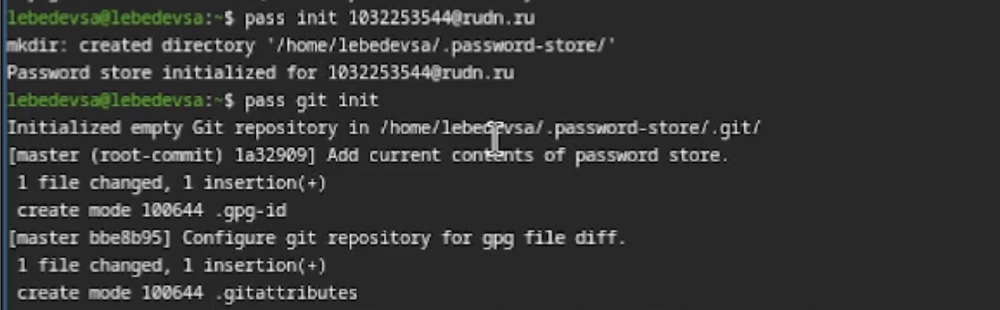
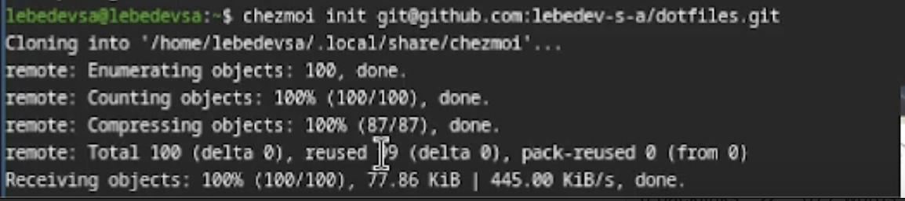
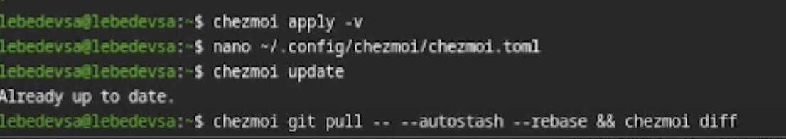

## Титульный слайд

**Дисциплина:** Архитектура компьютеров и операционные системы (раздел «Операционные системы»)  
**Работа:** Лабораторная работа №5 — Менеджер паролей pass

**Студент:** Лебедев Сергей Алексеевич  
**Преподаватель:** Кулябов Дмитрий Сергеевич, д.ф.-м.н., профессор  
**Организация:** Российский университет дружбы народов (РУДН)

---

## Содержание

1. Цель и задачи работы
2. Менеджер паролей pass — установка и настройка
3. GPG-ключ и инициализация хранилища
4. Синхронизация с GitHub
5. Browserpass — интерфейс для браузера
6. Управление конфигурацией с chezmoi
7. Выводы

---

## Информация о докладчике

:::::::::::::: {.columns align=center}
::: {.column width="65%"}
- **Лебедев Сергей Алексеевич**
- студент направления **02.03.00 Компьютерные и информационные науки**
- РУДН, 1 курс
- ЛР №5: менеджер паролей pass и chezmoi
:::

::: {.column width="35%"}

:::
::::::::::::::

---

## Цель работы

Настроить менеджер паролей `pass` с GPG-шифрованием и синхронизацией через git, а также настроить управление конфигурационными файлами домашнего каталога с помощью утилиты `chezmoi`.

---

## Задачи

1. Установить и настроить менеджер паролей `pass` и `gopass`
2. Настроить синхронизацию хранилища паролей с репозиторием на GitHub
3. Настроить интерфейс взаимодействия с браузером (`browserpass`)
4. Установить дополнительное программное обеспечение и шрифты
5. Установить `chezmoi` и создать репозиторий `dotfiles`
6. Подключить репозиторий к системе и освоить ежедневные операции

---

## Установка pass и gopass

Установлены пакеты `pass`, `pass-otp` и `gopass`:

```bash
sudo dnf install pass pass-otp
sudo dnf install gopass
```


---

## Настройка GPG-ключа

Проверка существующих ключей и создание нового:

```bash
gpg --list-secret-keys
gpg --full-generate-key
```


---

## Инициализация хранилища pass

Инициализация хранилища и настройка git-репозитория:

```bash
pass init 1032253544@rudn.ru
pass git init
pass git remote add origin git@github.com:lebedev-s-a/password-store.git
```



---

## Добавление паролей и синхронизация

Добавлен тестовый пароль, выполнена отправка в репозиторий:

```bash
pass insert email/test@example.com
pass git push -u origin master
pass git status
```


---

## Настройка browserpass

Установка интерфейса native messaging для браузера:

```bash
sudo dnf copr enable maximbaz/browserpass
sudo dnf install browserpass
```


---

## Установка дополнительного ПО

Установка пакетов для рабочей среды и шрифтов Iosevka:

```bash
sudo dnf -y install dunst fontawesome-fonts kitty waybar ...
sudo dnf copr enable peterwu/iosevka
sudo dnf install iosevka-fonts iosevka-term-fonts ...
```


---

## Установка chezmoi и создание dotfiles

Установка chezmoi и создание приватного репозитория на GitHub:

```bash
sh -c "$(wget -qO- chezmoi.io/get)"
gh repo create dotfiles \
  --template="yamadharma/dotfiles-template" --private
```


---

## Подключение и применение конфигурации

Инициализация chezmoi и применение конфигурации:

```bash
chezmoi init git@github.com:lebedev-s-a/dotfiles.git
chezmoi diff
chezmoi apply -v
```



---

## Ежедневные операции с chezmoi

Автообновление включается в `~/.config/chezmoi/chezmoi.toml`:

```toml
[git]
    autoCommit = true
    autoPush = true
```

Обновление конфигурации одной командой:

```bash
chezmoi update
```



---

## Выводы

- Установлен и настроен менеджер паролей **pass** с GPG-шифрованием
- Хранилище паролей синхронизировано с **GitHub**
- Настроен **browserpass** для интеграции с браузером
- Установлено дополнительное ПО и шрифты **Iosevka**
- Настроен **chezmoi** для управления конфигурационными файлами между машинами

---

## Ресурсы

- pass: https://www.passwordstore.org
- gopass: https://www.gopass.pw
- browserpass: https://github.com/browserpass/browserpass-extension
- chezmoi: https://www.chezmoi.io
- GitHub: https://github.com/lebedev-s-a
