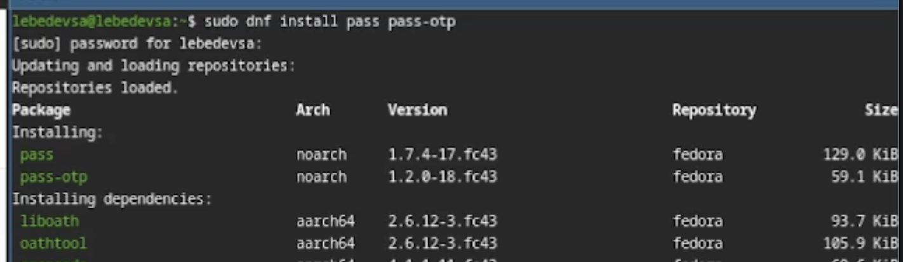
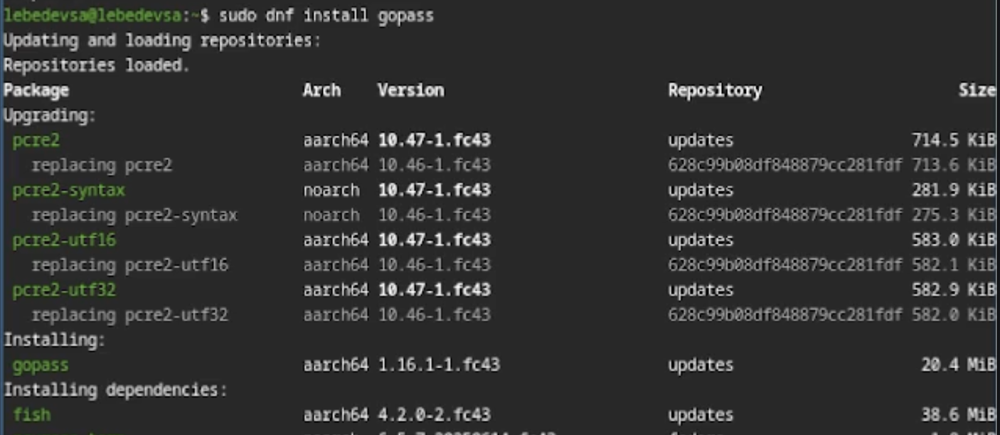
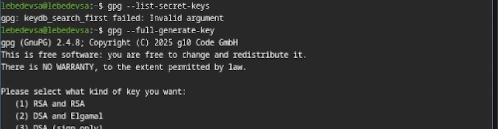
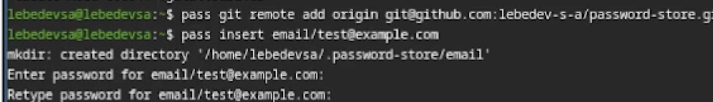
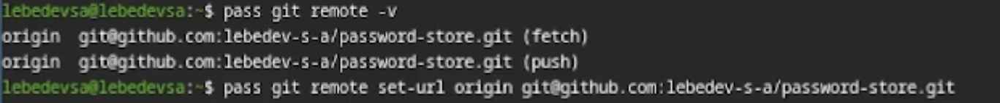
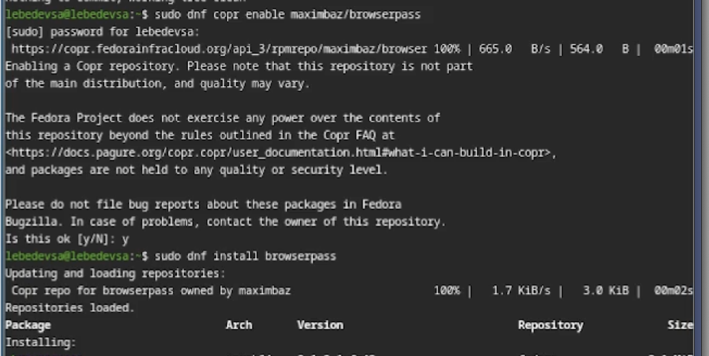
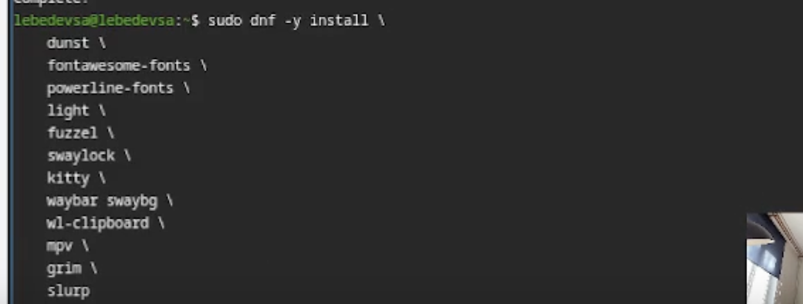
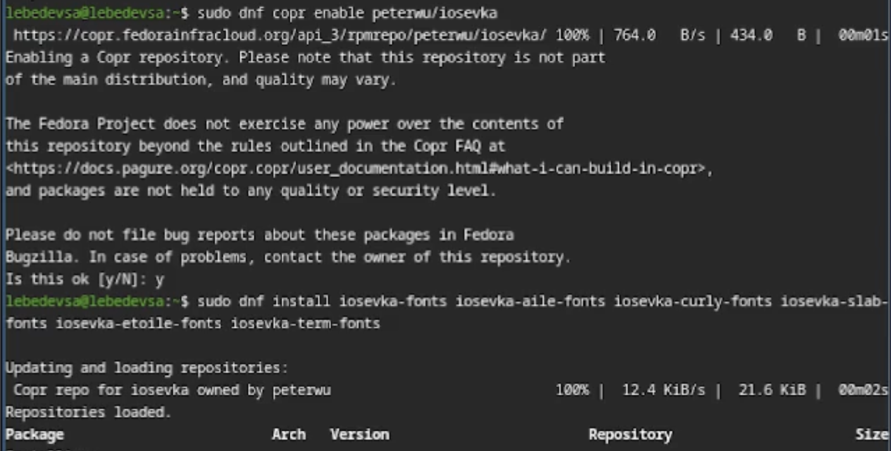
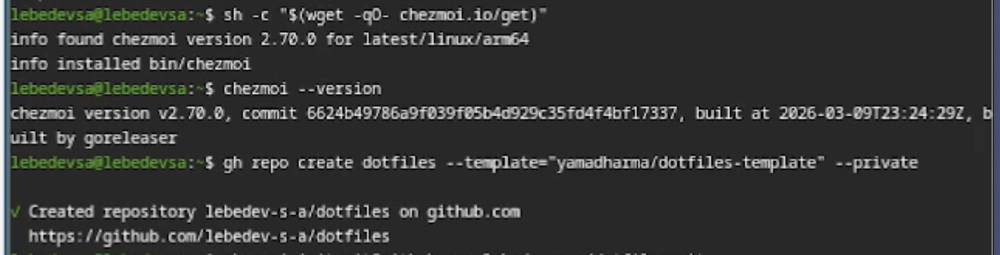

---
## Front matter
title: "Лабораторная работа №5"
subtitle: "Менеджер паролей pass"
author: "Лебедев С. А."

## Generic options
lang: ru-RU
toc-title: "Содержание"

## Bibliography
bibliography: bib/cite.bib
csl: pandoc/csl/gost-r-7-0-5-2008-numeric.csl

## Pdf output format
toc: true # Table of contents
toc-depth: 2
lof: true # List of figures
lot: true # List of tables
fontsize: 12pt
linestretch: 1.5
papersize: a4
documentclass: scrreprt

## I18n polyglossia
polyglossia-lang:
  name: russian
  options:
  - spelling=modern
  - babelshorthands=true
polyglossia-otherlangs:
  name: english

## I18n babel
babel-lang: russian
babel-otherlangs: english

## Fonts
mainfont: IBM Plex Serif
romanfont: IBM Plex Serif
sansfont: IBM Plex Sans
monofont: IBM Plex Mono
mathfont: STIX Two Math
mainfontoptions: Ligatures=Common,Ligatures=TeX,Scale=0.94
romanfontoptions: Ligatures=Common,Ligatures=TeX,Scale=0.94
sansfontoptions: Ligatures=Common,Ligatures=TeX,Scale=MatchLowercase,Scale=0.94
monofontoptions: Scale=MatchLowercase,Scale=0.94,FakeStretch=0.9
mathfontoptions:

## Biblatex
biblatex: true
biblio-style: "gost-numeric"
biblatexoptions:
  - parentracker=true
  - backend=biber
  - hyperref=auto
  - language=auto
  - autolang=other*
  - citestyle=gost-numeric

## Pandoc-crossref LaTeX customization
figureTitle: "Рис."
tableTitle: "Таблица"
listingTitle: "Листинг"
lofTitle: "Список иллюстраций"
lotTitle: "Список таблиц"
lolTitle: "Листинги"

## Misc options
indent: true
header-includes:
  - \usepackage{indentfirst}
  - \usepackage{float} # keep figures where there are in the text
  - \floatplacement{figure}{H} # keep figures where there are in the text
---

# Цель работы

Целью данной работы является настройка менеджера паролей `pass` с GPG-шифрованием и синхронизацией через git, а также настройка управления конфигурационными файлами домашнего каталога с помощью утилиты `chezmoi`.

# Задание

1. Установить и настроить менеджер паролей `pass` и `gopass`.
2. Настроить синхронизацию хранилища паролей с репозиторием на GitHub.
3. Настроить интерфейс взаимодействия с браузером (`browserpass`).
4. Установить дополнительное программное обеспечение и шрифты.
5. Установить `chezmoi` и создать репозиторий `dotfiles`.
6. Подключить репозиторий к системе и освоить ежедневные операции с `chezmoi`.

# Теоретическое введение

**pass** — стандартный менеджер паролей для Unix. Данные хранятся в файловой системе в виде каталогов и файлов, зашифрованных с помощью GPG-ключа.

**chezmoi** — инструмент для управления файлами конфигурации домашнего каталога пользователя. Состояние файлов сохраняется в каталоге `~/.local/share/chezmoi`, который является клоном репозитория `dotfiles`. Файлы, одинаковые на всех машинах, копируются дословно; файлы, зависящие от машины, выполняются как шаблоны с использованием синтаксиса Go.

# Выполнение лабораторной работы

## Менеджер паролей pass

### Установка pass и gopass

Установлены пакеты `pass`, `pass-otp` для работы с менеджером паролей, а также `gopass` — реализация менеджера паролей на Go с дополнительными функциями (рис. -@fig:001, -@fig:002).

```bash
sudo dnf install pass pass-otp
sudo dnf install gopass
```

{#fig:001 width=70%}

{#fig:002 width=70%}

### Настройка GPG-ключа

Выполнена проверка наличия GPG-ключей и создан новый ключ для шифрования хранилища паролей (рис. -@fig:003).

```bash
gpg --list-secret-keys
gpg --full-generate-key
```

{#fig:003 width=70%}

### Инициализация хранилища и настройка git

Инициализировано хранилище паролей с использованием GPG-ключа, создана git-структура и подключён удалённый репозиторий на GitHub (рис. -@fig:004).

```bash
pass init 1032253544@rudn.ru
pass git init
pass git remote add origin git@github.com:lebedev-s-a/password-store.git
```

{#fig:004 width=70%}

### Добавление пароля и синхронизация

Добавлен тестовый пароль в хранилище, выполнена синхронизация с удалённым репозиторием на GitHub (рис. -@fig:005, -@fig:006).

```bash
pass insert email/test@example.com
pass git push -u origin master
pass git status
```

{#fig:005 width=70%}

{#fig:006 width=70%}

### Настройка browserpass

Для взаимодействия с браузером подключён репозиторий Copr и установлен пакет `browserpass`, обеспечивающий интерфейс native messaging (рис. -@fig:007).

```bash
sudo dnf copr enable maximbaz/browserpass
sudo dnf install browserpass
```

{#fig:007 width=70%}

## Управление файлами конфигурации

### Установка дополнительного программного обеспечения

Установлены дополнительные пакеты, необходимые для работы рабочей среды (рис. -@fig:008).

```bash
sudo dnf -y install \
    dunst \
    fontawesome-fonts \
    powerline-fonts \
    light \
    fuzzel \
    swaylock \
    kitty \
    waybar swaybg \
    wl-clipboard \
    mpv \
    grim \
    slurp
```

{#fig:008 width=70%}

### Установка шрифтов Iosevka

Подключён репозиторий Copr и установлены шрифты семейства Iosevka (рис. -@fig:009).

```bash
sudo dnf copr enable peterwu/iosevka
sudo dnf install iosevka-fonts iosevka-aile-fonts iosevka-curly-fonts \
    iosevka-slab-fonts iosevka-etoile-fonts iosevka-term-fonts
```

{#fig:009 width=70%}

### Установка chezmoi и создание репозитория dotfiles

Установлен бинарный файл `chezmoi` с помощью скрипта, а также создан приватный репозиторий `dotfiles` на GitHub на основе шаблона (рис. -@fig:010).

```bash
sh -c "$(wget -qO- chezmoi.io/get)"
chezmoi --version
gh repo create dotfiles --template="yamadharma/dotfiles-template" --private
```

{#fig:010 width=70%}

### Подключение репозитория к системе

Выполнена инициализация chezmoi с репозиторием `dotfiles` и применены изменения в домашнем каталоге (рис. -@fig:011).

```bash
chezmoi init git@github.com:lebedev-s-a/dotfiles.git
chezmoi diff
chezmoi apply -v
```

{#fig:011 width=70%}

### Ежедневные операции с chezmoi

Настроена автоматическая фиксация и отправка изменений. Выполнена проверка синхронизации: получены последние изменения из репозитория и применены к домашнему каталогу (рис. -@fig:012).

```bash
chezmoi apply -v
nano ~/.config/chezmoi/chezmoi.toml
chezmoi update
chezmoi git pull -- --autostash --rebase && chezmoi diff
```

```toml
[git]
    autoCommit = true
    autoPush = true
```

{#fig:012 width=70%}

# Контрольные вопросы

**1. Что такое менеджер паролей pass?**
Pass — стандартный менеджер паролей для Unix, реализованный в виде shell-скриптов. Данные хранятся в файловой системе в виде каталогов и файлов, каждый из которых зашифрован с помощью GPG-ключа. Поддерживает синхронизацию через git и взаимодействие с браузером через native messaging.

**2. Что такое chezmoi?**
Chezmoi — инструмент для управления файлами конфигурации домашнего каталога пользователя между несколькими машинами. Использует git-репозиторий (`dotfiles`) для хранения состояния конфигурационных файлов. Поддерживает шаблоны на синтаксисе Go для создания конфигураций, специфичных для конкретной машины.

**3. Что хранится в файле конфигурации `~/.config/chezmoi/chezmoi.toml`?**
В этом файле хранятся локальные настройки chezmoi, специфичные для конкретной машины: данные шаблонов (раздел `data`), настройки git (автокоммит, автопуш), а также другие параметры, которые не должны быть одинаковыми на всех машинах.

**4. Для чего нужен параметр `autoPush` в конфигурации chezmoi?**
Параметр `autoPush = true` включает автоматическую отправку изменений в удалённый репозиторий каждый раз, когда chezmoi фиксирует изменения в исходном каталоге. Используется совместно с `autoCommit = true`. Следует соблюдать осторожность при использовании с публичными репозиториями, чтобы не отправить секреты в открытый доступ.

**5. Как можно протестировать шаблон chezmoi без его применения?**
Для тестирования шаблонов используется подкоманда `execute-template`. Небольшие фрагменты проверяются непосредственно в командной строке, а целые файлы — через перенаправление стандартного ввода:

```bash
chezmoi execute-template '{{ .chezmoi.hostname }}'
chezmoi cd
chezmoi execute-template < dot_zshrc.tmpl
```

**6. Что такое файлы шаблонов в chezmoi и как они создаются?**
Шаблоны — это файлы конфигурации, содержимое которых изменяется в зависимости от среды (имя хоста, ОС, пользовательские данные). Используется синтаксис шаблонов Go. Файл становится шаблоном, если имеет суффикс `.tmpl` или находится в каталоге `.chezmoitemplates`. Создать шаблон можно при добавлении файла (`chezmoi add --template`), конвертацией существующего файла (`chezmoi chattr +template`) или вручную в исходном каталоге.

# Выводы

В ходе выполнения лабораторной работы был установлен и настроен менеджер паролей `pass` с GPG-шифрованием и синхронизацией через git-репозиторий на GitHub. Настроен интерфейс взаимодействия с браузером через `browserpass`. Установлено дополнительное программное обеспечение и шрифты Iosevka. Освоена работа с утилитой `chezmoi` для управления конфигурационными файлами: создан репозиторий `dotfiles`, выполнено подключение к системе и настроены ежедневные операции по синхронизации конфигурации между машинами.

# Список литературы{.unnumbered}

::: {#refs}
:::
