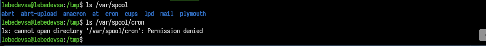
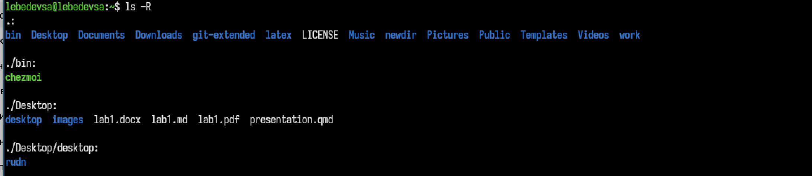
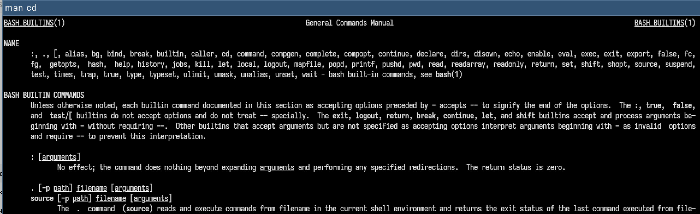

## Титульный слайд

**Дисциплина:** Архитектура компьютеров и операционные системы (раздел «Операционные системы»)  
**Работа:** Лабораторная работа №6 — Основы командной строки Unix

**Студент:** Лебедев Сергей Алексеевич  
**Преподаватель:** Кулябов Дмитрий Сергеевич, д.ф.-м.н., профессор  
**Организация:** Российский университет дружбы народов (РУДН)

---

## Содержание

1. Цель и задачи работы
2. Навигация по файловой системе
3. Просмотр содержимого каталогов
4. Создание и удаление каталогов
5. Справочная система man
6. История команд
7. Выводы

---

## Информация о докладчике

:::::::::::::: {.columns align=center}
::: {.column width="65%"}
- **Лебедев Сергей Алексеевич**
- студент направления **02.03.00 Компьютерные и информационные науки**
- РУДН, 1 курс
- ЛР №6: основы командной строки Unix
:::

::: {.column width="35%"}

:::
::::::::::::::

---

## Цель работы

Приобретение практических навыков взаимодействия пользователя с системой посредством командной строки.

---

## Задачи

1. Освоить навигацию по файловой системе (`cd`, `pwd`)
2. Изучить команду `ls` с различными опциями
3. Создавать и удалять каталоги командами `mkdir` и `rm`
4. Просматривать справочные страницы командой `man`
5. Работать с историей команд (`history`) и выполнять их модификацию

---

## Навигация: cd и pwd

Переход в каталог `/tmp` и определение текущего каталога:

```bash
cd /tmp
pwd
```

Возврат в домашний каталог и просмотр его содержимого:

```bash
cd
pwd
ls
```


---

## Просмотр содержимого: ls

Команда `ls` с основными опциями:

| Команда | Что выводит |
|---------|-------------|
| `ls` | Базовый список файлов |
| `ls -a` | Включая скрытые файлы |
| `ls -l` | Подробный вывод (права, владелец, размер) |
| `ls -al` | Подробный + скрытые |


---

## Проверка прав доступа

При попытке просмотреть каталог `/var/spool/cron` без прав суперпользователя система вернула ошибку доступа:

```bash
ls /var/spool
ls /var/spool/cron
# Permission denied
```



---

## Создание каталогов: mkdir

Создание одного, вложенного и сразу нескольких каталогов:

```bash
mkdir newdir
cd newdir && mkdir morefun
mkdir letters memos misk
```


---

## Удаление каталогов: rm

Попытка удалить каталог без флагов — ошибка. Правильное удаление — с флагом `-r`:

```bash
rm newdir          # ошибка: Is a directory
rm -r letters memos misk      # успешное удаление
rm -r newdir/morefun          # удаление вложенного
```


---

## Расширенные опции ls

Рекурсивный просмотр всей структуры каталогов и сортировка по времени изменения:

```bash
ls -R      # рекурсивный просмотр подкаталогов
ls -lt     # подробный список, сортировка по времени
```



---

## Справочная система: man

Просмотр справки по командам `cd`, `pwd`, `mkdir`, `rmdir`, `rm`:

```bash
man cd
man pwd
man mkdir
man rmdir
man rm
```



---

## История команд: history

Просмотр, повтор и модификация команд из буфера:

```bash
history              # список всех команд с номерами
!303                 # повтор команды №303
!285:s/-1/-F         # замена параметра и выполнение
!305; !300           # выполнение двух команд подряд
```


---

## Выводы

- Освоена навигация по файловой системе с помощью команд **cd**, **pwd**
- Изучены опции команды **ls**: `-a`, `-l`, `-R`, `-lt`
- Отработано создание и удаление каталогов командами **mkdir** и **rm -r**
- Изучена справочная система **man** для пяти основных команд
- Освоена работа с **history**: повтор и модификация команд из буфера

---

## Ресурсы

- Кулябов Д. С. и др. — *Операционные системы*, лабораторный практикум
- GNU Bash Reference Manual: https://www.gnu.org/software/bash/manual/
- Linux man-pages: https://man7.org/linux/man-pages/
- GitHub: https://github.com/lebedev-s-a