---
## Front matter
title: "Лабораторная работа №6"
subtitle: "Основы интерфейса взаимодействия пользователя с системой Unix на уровне командной строки"
author: "Лебедев Сергей Алексеевич"

## Generic options
lang: ru-RU
toc-title: "Содержание"

## Bibliography
bibliography: bib/cite.bib
csl: pandoc/csl/gost-r-7-0-5-2008-numeric.csl

## Pdf output format
toc: true # Table of contents
toc-depth: 2
lof: true # List of figures
lot: true # List of tables
fontsize: 12pt
linestretch: 1.5
papersize: a4
documentclass: scrreprt

## I18n polyglossia
polyglossia-lang:
  name: russian
  options:
  - spelling=modern
  - babelshorthands=true
polyglossia-otherlangs:
  name: english

## I18n babel
babel-lang: russian
babel-otherlangs: english

## Fonts
mainfont: IBM Plex Serif
romanfont: IBM Plex Serif
sansfont: IBM Plex Sans
monofont: IBM Plex Mono
mathfont: STIX Two Math
mainfontoptions: Ligatures=Common,Ligatures=TeX,Scale=0.94
romanfontoptions: Ligatures=Common,Ligatures=TeX,Scale=0.94
sansfontoptions: Ligatures=Common,Ligatures=TeX,Scale=MatchLowercase,Scale=0.94
monofontoptions: Scale=MatchLowercase,Scale=0.94,FakeStretch=0.9
mathfontoptions:

## Biblatex
biblatex: true
biblio-style: "gost-numeric"
biblatexoptions:
  - parentracker=true
  - backend=biber
  - hyperref=auto
  - language=auto
  - autolang=other*
  - citestyle=gost-numeric

## Pandoc-crossref LaTeX customization
figureTitle: "Рис."
tableTitle: "Таблица"
listingTitle: "Листинг"
lofTitle: "Список иллюстраций"
lotTitle: "Список таблиц"
lolTitle: "Листинги"

## Misc options
indent: true
header-includes:
  - \usepackage{indentfirst}
  - \usepackage{float} # keep figures where there are in the text
  - \floatplacement{figure}{H} # keep figures where there are in the text
---

# Цель работы

Приобретение практических навыков взаимодействия пользователя с системой посредством командной строки.

# Задание

1. Определить полное имя домашнего каталога.
2. Выполнить навигацию по файловой системе с помощью команд `cd`, `pwd`, `ls`.
3. Создать и удалить каталоги с помощью команд `mkdir` и `rm`.
4. Изучить опции команды `ls` для просмотра содержимого каталогов и подкаталогов.
5. Просмотреть справочные страницы команд `cd`, `pwd`, `mkdir`, `rmdir`, `rm`.
6. Освоить работу с историей команд (`history`) и выполнить модификацию команд из буфера.

# Теоретическое введение

В операционной системе типа Linux взаимодействие пользователя с системой осуществляется с помощью командной строки посредством построчного ввода команд. При этом используются командные интерпретаторы языка shell.

**Формат команды:** `<имя_команды> <разделитель> <аргументы>`

Основные команды для работы с файловой системой:

- `pwd` — вывод абсолютного пути к текущему каталогу;
- `cd` — смена текущего каталога;
- `ls` — просмотр содержимого каталога;
- `mkdir` — создание каталога;
- `rm` / `rmdir` — удаление файлов и каталогов;
- `man` — просмотр справочного руководства;
- `history` — просмотр истории команд.

# Выполнение лабораторной работы

## Навигация по файловой системе

### Переход в каталог /tmp и определение текущего каталога

Выполнен переход в каталог `/tmp` с помощью команды `cd` и определено текущее местоположение командой `pwd` (рис. -@fig:001).

```bash
cd /tmp
pwd
```

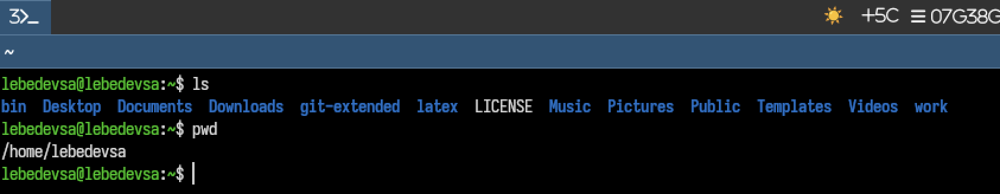{#fig:001 width=70%}

### Просмотр содержимого каталога /tmp

Выведено содержимое каталога `/tmp` с помощью команды `ls` (рис. -@fig:002).

```bash
ls
```

{#fig:002 width=70%}

### Просмотр содержимого домашнего каталога

Выполнен просмотр содержимого домашнего каталога и определён его абсолютный путь с помощью команд `ls` и `pwd` (рис. -@fig:003).

```bash
ls
pwd
```

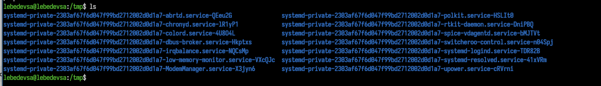{#fig:003 width=70%}

### Просмотр скрытых файлов

Для отображения скрытых файлов в каталоге `/tmp` использована опция `-a` команды `ls` (рис. -@fig:004).

```bash
ls -a
```

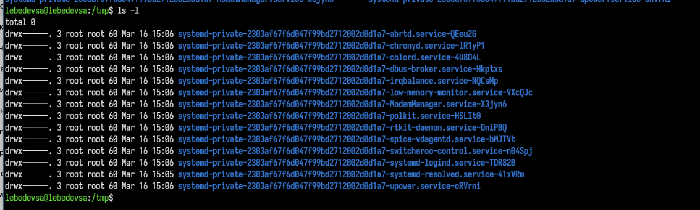{#fig:004 width=70%}

### Подробный вывод информации о файлах

Использована опция `-l` команды `ls` для получения подробной информации о файлах каталога `/tmp`: тип файла, права доступа, количество ссылок, владелец, размер и дата изменения (рис. -@fig:005).

```bash
ls -l
```

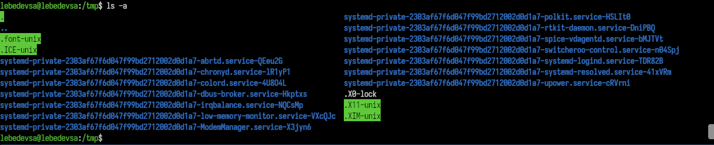{#fig:005 width=70%}

### Объединение опций -a и -l

Применены одновременно опции `-a` и `-l` для отображения всей информации, включая скрытые файлы (рис. -@fig:006).

```bash
ls -al
```

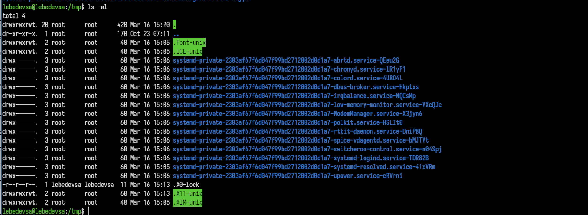{#fig:006 width=70%}

### Проверка наличия подкаталога cron

Проверено наличие подкаталога `cron` в каталоге `/var/spool`. При попытке просмотра содержимого `/var/spool/cron` получена ошибка — отказано в доступе (рис. -@fig:007).

```bash
ls /var/spool
ls /var/spool/cron
```

{#fig:007 width=70%}

### Возврат в домашний каталог

Выполнен переход в домашний каталог и подтверждено текущее местоположение (рис. -@fig:008).

```bash
cd
pwd
```

{#fig:008 width=70%}

### Определение владельцев файлов

Выполнен подробный просмотр содержимого домашнего каталога. Из вывода команды `ls -l` определён владелец файлов и подкаталогов (рис. -@fig:009).

```bash
ls -l
```

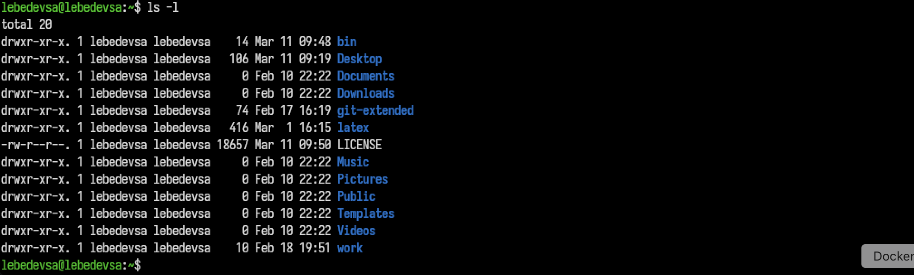{#fig:009 width=70%}

## Создание и удаление каталогов

### Создание каталога newdir

В домашнем каталоге создан новый каталог `newdir` с помощью команды `mkdir`, наличие которого проверено командой `ls` (рис. -@fig:010).

```bash
mkdir newdir
ls
```

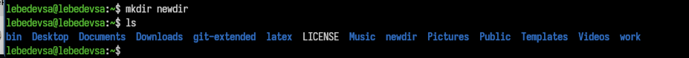{#fig:010 width=70%}

### Создание вложенной директории morefun

Выполнен переход в папку `newdir` и создан вложенный каталог `morefun` (рис. -@fig:011).

```bash
cd newdir
mkdir morefun
```

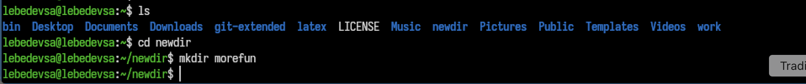{#fig:011 width=70%}

### Массовое создание каталогов

Одной командой созданы три новых каталога: `letters`, `memos`, `misk` (рис. -@fig:012).

```bash
mkdir letters memos misk
```

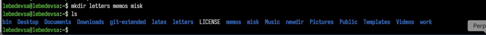{#fig:012 width=70%}

### Рекурсивное удаление каталогов

Созданные ранее каталоги `letters`, `memos` и `misk` удалены одной командой с использованием опции `-r` (рис. -@fig:013).

```bash
rm -r letters memos misk
```

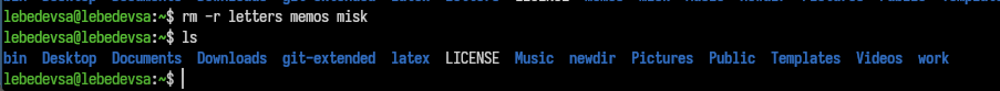{#fig:013 width=70%}

### Попытка удаления каталога без флагов

Попытка удалить каталог `newdir` командой `rm` без дополнительных опций завершилась системным сообщением `Is a directory` — каталог удалён не был (рис. -@fig:014).

```bash
rm newdir
```

{#fig:014 width=70%}

### Удаление поддиректории morefun

Успешно удалена директория `morefun`, находящаяся внутри `newdir`, путём указания относительного пути (рис. -@fig:015).

```bash
rm -r newdir/morefun
```

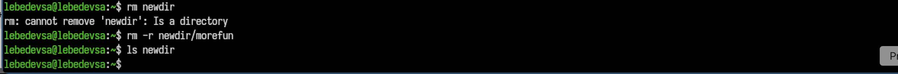{#fig:015 width=70%}

## Просмотр содержимого каталогов с опциями

### Рекурсивный просмотр структуры каталогов

С помощью опции `-R` команды `ls` выведено содержимое текущего каталога и всех его вложенных подкаталогов (рис. -@fig:016).

```bash
ls -R
```

{#fig:016 width=70%}

### Сортировка файлов по времени изменения

Применена команда `ls -lt` для вывода подробного списка файлов, отсортированных по времени последнего изменения (рис. -@fig:017).

```bash
ls -lt
```

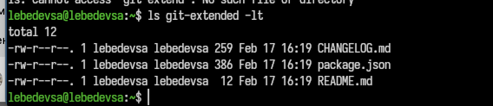{#fig:017 width=70%}

## Просмотр справочных страниц команд

### Справка по команде cd

С помощью команды `man cd` просмотрена справочная страница встроенной команды `cd` из раздела `BASH_BUILTINS` (рис. -@fig:018).

```bash
man cd
```

{#fig:018 width=70%}

### Справка по команде pwd

Просмотрена справочная страница команды `pwd`, предназначенной для отображения полного пути текущего каталога (рис. -@fig:019).

```bash
man pwd
```

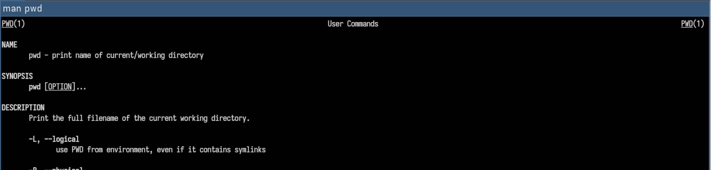{#fig:019 width=70%}

### Справка по команде mkdir

Просмотрена справочная страница команды `mkdir`, содержащая описание синтаксиса и доступных опций (рис. -@fig:020).

```bash
man mkdir
```

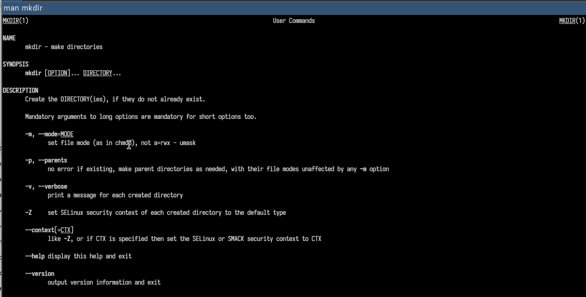{#fig:020 width=70%}

### Справка по команде rmdir

Просмотрена справочная страница команды `rmdir`, предназначенной для удаления пустых каталогов (рис. -@fig:021).

```bash
man rmdir
```

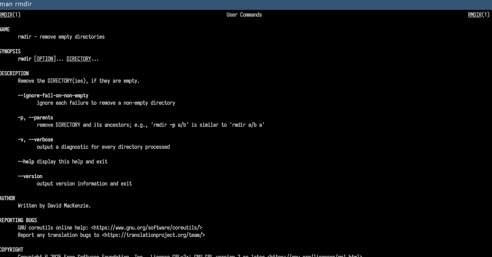{#fig:021 width=70%}

### Справка по команде rm

Просмотрена справочная страница команды `rm`, используемой для удаления файлов и каталогов, включая описание ключей `-r`, `-f` и `-i` (рис. -@fig:022).

```bash
man rm
```

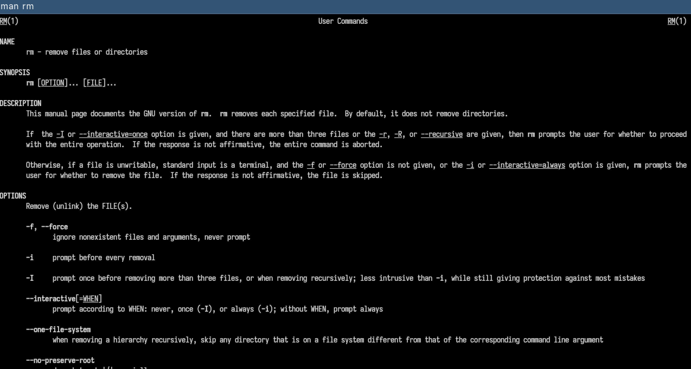{#fig:022 width=70%}

## Работа с историей команд

### Просмотр истории команд

С помощью команды `history` выведен нумерованный список ранее выполненных команд пользователя (рис. -@fig:023).

```bash
history
```

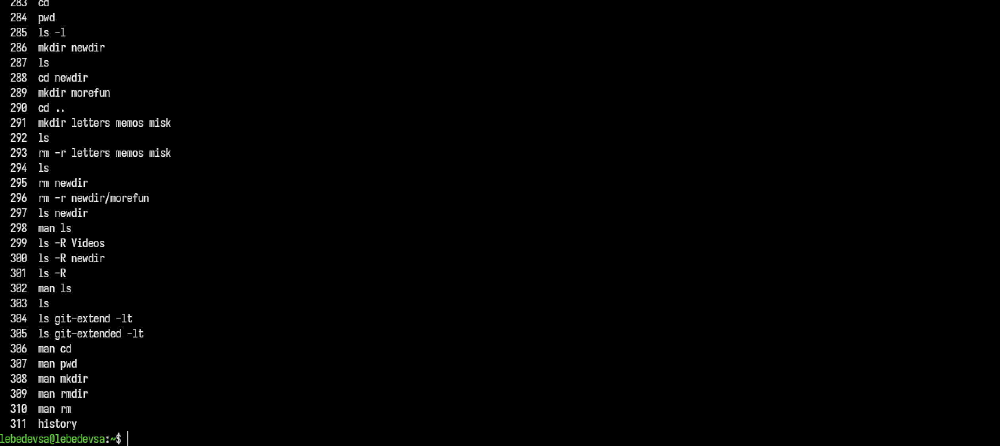{#fig:023 width=70%}

### Повтор команды из истории

С помощью конструкции `!<номер>` выполнена команда под номером 303 из списка истории (рис. -@fig:024).

```bash
!303
```

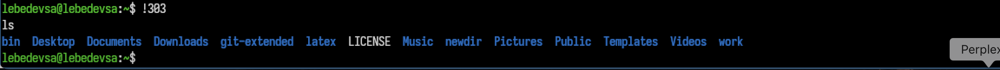{#fig:024 width=70%}

### Модификация команды из истории

С помощью конструкции `!<номер>:s/<что>/<на_что>` выполнена команда № 285 из истории с заменой параметра `-1` на `-F` (рис. -@fig:025).

```bash
!285:s/-1/-F
```

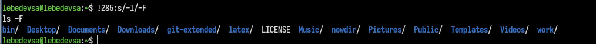{#fig:025 width=70%}

### Выполнение нескольких команд из истории

В одной строке последовательно выполнены команды № 305 и № 300 из истории с использованием оператора `;` (рис. -@fig:026).

```bash
!305; !300
```

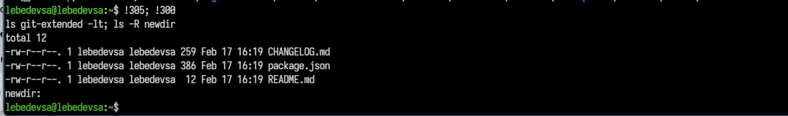{#fig:026 width=70%}

# Контрольные вопросы

**1. Что такое командная строка?**
Командная строка — это текстовый интерфейс взаимодействия пользователя с операционной системой, в котором пользователь вводит команды в построчном режиме, а система их выполняет. В Linux командная строка реализуется через командный интерпретатор (shell), например `/bin/bash`.

**2. При помощи какой команды можно определить абсолютный путь текущего каталога? Приведите пример.**
Для определения абсолютного пути используется команда `pwd` (print working directory):
```bash
pwd
# Пример вывода: /home/user
```

**3. При помощи какой команды и каких опций можно определить только тип файлов и их имена в текущем каталоге? Приведите примеры.**
Для этого используется команда `ls -F`. Символ после имени указывает тип файла: `/` — каталог, `*` — исполняемый файл, `@` — символическая ссылка:
```bash
ls -F
# Пример вывода: bin/  script.sh*  link@  file.txt
```

**4. Каким образом отобразить информацию о скрытых файлах? Приведите примеры.**
Для отображения скрытых файлов (имена которых начинаются с точки) используется опция `-a`:
```bash
ls -a
# Пример вывода: .  ..  .bashrc  .profile  documents/
```

**5. При помощи каких команд можно удалить файл и каталог? Можно ли это сделать одной и той же командой? Приведите примеры.**
Для удаления файлов используется команда `rm`, для удаления пустых каталогов — `rmdir`. Каталог с содержимым можно удалить той же командой `rm` с флагом `-r`:
```bash
rm file.txt          # удалить файл
rmdir emptydir       # удалить пустой каталог
rm -r nonemptydir    # удалить каталог с содержимым
```

**6. Каким образом можно вывести информацию о последних выполненных пользователем командах?**
Для просмотра истории команд используется команда `history`. Она выводит нумерованный список ранее выполненных команд:
```bash
history
```

**7. Как воспользоваться историей команд для их модифицированного выполнения? Приведите примеры.**
Для повторного выполнения команды по номеру используется конструкция `!<номер>`. Для модификации команды из истории применяется конструкция `!<номер>:s/<что_меняем>/<на_что_меняем>`:
```bash
!5               # выполнить команду №5 из истории
!5:s/-l/-la      # выполнить команду №5, заменив -l на -la
```

**8. Приведите примеры запуска нескольких команд в одной строке.**
Для последовательного выполнения нескольких команд используется символ `;`:
```bash
cd /tmp; ls; pwd
mkdir test; cd test; pwd
```

**9. Дайте определение и приведите примеры символов экранирования.**
Символы экранирования позволяют использовать специальные символы как обычные текстовые символы. Для экранирования используется обратный слэш `\`:
```bash
ls file\ with\ spaces.txt   # файл с пробелами в имени
echo \*                     # вывести символ * без раскрытия
```

**10. Охарактеризуйте вывод информации на экран после выполнения команды ls с опцией l.**
Команда `ls -l` выводит подробный список файлов и каталогов. Для каждого объекта отображается: тип файла и права доступа (например, `drwxr-xr-x`), количество жёстких ссылок, имя владельца, имя группы, размер в байтах, дата последнего изменения и имя файла или каталога.

**11. Что такое относительный путь к файлу? Приведите примеры использования относительного и абсолютного пути при выполнении какой-либо команды.**
Относительный путь задаётся относительно текущего рабочего каталога, в отличие от абсолютного, который начинается с корневого каталога `/`:
```bash
cd /home/user/documents     # абсолютный путь
cd ../documents             # относительный путь
ls ./newdir                 # относительный путь к подкаталогу
```

**12. Как получить информацию об интересующей вас команде?**
Для получения справочной информации о команде используется команда `man`:
```bash
man ls       # справка по команде ls
man mkdir    # справка по команде mkdir
```

**13. Какая клавиша или комбинация клавиш служит для автоматического дополнения вводимых команд?**
Для автодополнения команд и путей используется клавиша **Tab**. При однократном нажатии происходит дополнение до уникального варианта, при двукратном — выводится список всех возможных вариантов дополнения.

# Выводы

В ходе выполнения лабораторной работы были приобретены практические навыки взаимодействия пользователя с системой посредством командной строки. Освоены основные команды навигации по файловой системе (`cd`, `pwd`, `ls`) с различными опциями, команды создания и удаления каталогов (`mkdir`, `rm`, `rmdir`). Изучены справочные страницы ключевых команд с помощью `man`. Получены навыки работы с историей команд (`history`) и модификации команд из буфера истории.

# Список литературы{.unnumbered}

::: {#refs}
:::
