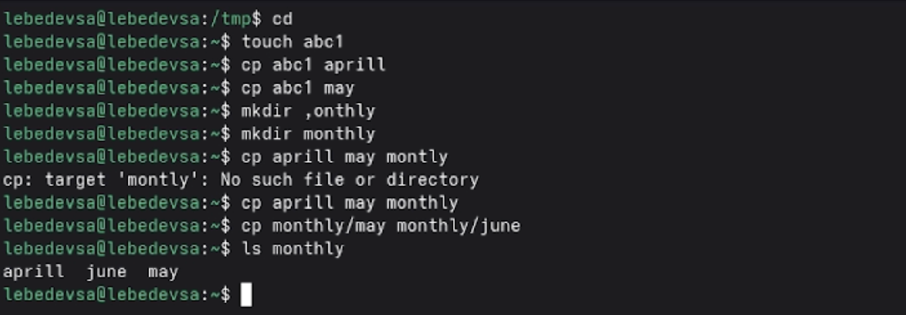
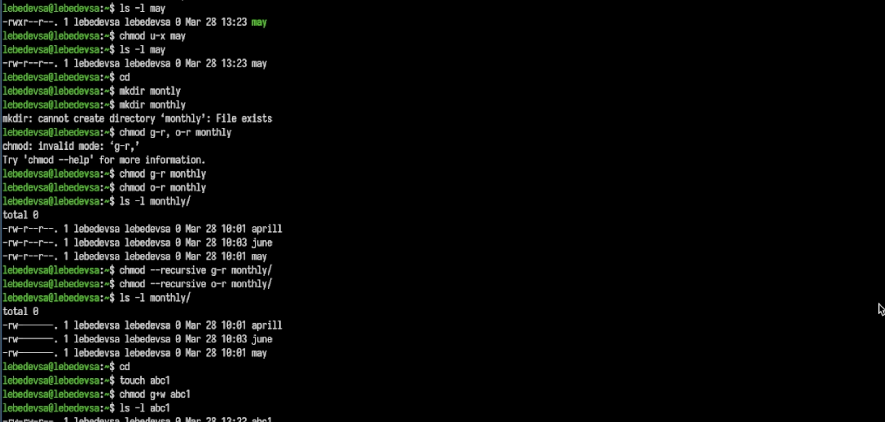
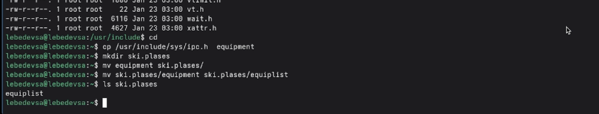
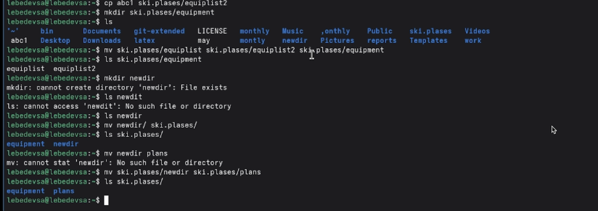
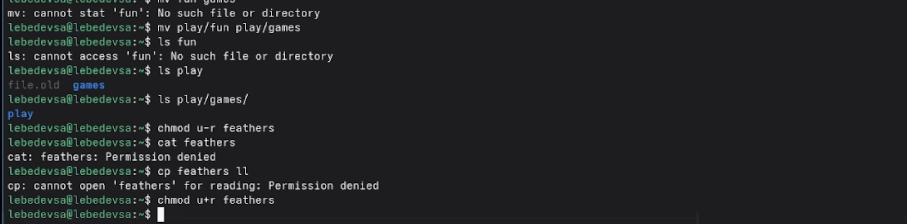

## Титульный слайд

**Дисциплина:** Архитектура компьютеров и операционные системы (раздел «Операционные системы»)  
**Работа:** Лабораторная работа №7 — Анализ файловой системы Linux

**Студент:** Лебедев Сергей Алексеевич  
**Преподаватель:** Кулябов Дмитрий Сергеевич, д.ф.-м.н., профессор  
**Организация:** Российский университет дружбы народов (РУДН)

---

## Содержание

1. Цель и задачи работы
2. Копирование файлов и каталогов
3. Перемещение и переименование
4. Права доступа — символьный формат
5. Права доступа — восьмеричный формат
6. Выполнение заданий 2 и 4
7. Системные команды: mount, fsck, mkfs, kill
8. Выводы

---

## Информация о докладчике

:::::::::::::: {.columns align=center}
::: {.column width="65%"}
- **Лебедев Сергей Алексеевич**
- студент направления **02.03.00 Компьютерные и информационные науки**
- РУДН, 1 курс
- ЛР №7: команды для работы с файлами и каталогами
:::

::: {.column width="35%"}

:::
::::::::::::::

---

## Цель работы

Ознакомление с файловой системой Linux, её структурой, именами и содержанием каталогов.

Приобретение практических навыков по применению команд для работы с файлами и каталогами, по управлению процессами, по проверке использования диска и обслуживанию файловой системы.

---

## Задачи

1. Выполнить примеры копирования, перемещения и переименования файлов и каталогов
2. Скопировать системный файл, создать структуру каталогов `ski.plases`
3. Присвоить файлам заданные права доступа командой `chmod`
4. Провести эксперименты с ограничением прав на чтение и выполнение
5. Изучить справочные страницы команд `mount`, `fsck`, `mkfs`, `kill`

---

## Копирование файлов: cp

Создание файла и его копирование в несколько целей:

```bash
touch abc1
cp abc1 april
cp abc1 may
```

Копирование нескольких файлов в каталог и внутри него:

```bash
mkdir monthly
cp april may monthly
cp monthly/may monthly/june
ls monthly
```


---

## Рекурсивное копирование: cp -r

Копирование каталога `monthly` целиком в новый каталог `monthly.00`:

```bash
cp -r monthly monthly.00
```

Опечатка в имени файла (`aprill` вместо `april`) привела к ошибке при первой попытке переименования — важность точности ввода команд:

```bash
mv april july    # ошибка: No such file or directory
ls               # уточнение имени файла
mv aprill july   # успешное переименование
```


---

## Перемещение и переименование: mv

Перемещение файла и переименование каталогов:

```bash
mv july monthly.00          # переместить файл в каталог
mv monthly.00 monthly.01    # переименовать каталог
mkdir reports
mv monthly.01 reports       # переместить каталог в reports
mv reports/monthly.01 reports/monthly   # переименовать вложенный
```


---

## Изменение прав доступа: chmod

Добавление и снятие права на выполнение для владельца:

```bash
touch may
ls -l may          # -rw-r--r--
chmod u+x may
ls -l may          # -rwxr--r--  (файл стал зелёным)
chmod u-x may
```

Запрет чтения для группы и остальных (рекурсивно):

```bash
chmod g-r monthly
chmod o-r monthly
chmod --recursive g-r monthly/
```


---

## Права доступа: таблица форматов

| Двоичная | Восьмеричная | Символьная |
|----------|--------------|------------|
| 111 | 7 | rwx |
| 110 | 6 | rw- |
| 101 | 5 | r-x |
| 100 | 4 | r-- |
| 010 | 2 | -w- |
| 001 | 1 | --x |
| 000 | 0 | --- |

Пример: `chmod 744 australia/` → `drwxr--r--`



---

## Задание 2.1–2.4: копирование системного файла

Ошибка при использовании относительного пути:

```bash
cp usr/include/sys/io.h equipment   # ошибка!
```

Исправление — абсолютный путь и выбор файла-заменителя:

```bash
cd /usr/include/sys
ls                                   # просмотр доступных файлов
cp /usr/include/sys/ipc.h equipment  # копирование ipc.h
mkdir ski.plases
mv equipment ski.plases/
mv ski.plases/equipment ski.plases/equiplist
```



---

## Задание 2.5–2.8: вложенная структура каталогов

```bash
cp abc1 ski.plases/equiplist2
mkdir ski.plases/equipment
mv ski.plases/equiplist ski.plases/equiplist2 ski.plases/equipment
mkdir newdir
mv newdir/ ski.plases/
mv ski.plases/newdir ski.plases/plans
```



---

## Задание 3: восьмеричные коды прав

| Файл/каталог | Права | Код |
|---|---|---|
| `australia` | `drwxr--r--` | `chmod 744` |
| `play` | `drwx--x--x` | `chmod 711` |
| `my_os` | `-r-xr--r--` | `chmod 544` |
| `feathers` | `-rw-rw-r--` | `chmod 664` |

```bash
mkdir australia && chmod 744 australia/
mkdir play      && chmod 711 play/
touch my_os feathers
chmod 544 my_os
chmod 664 feathers
```


---

## Задание 4: эксперименты с правами

Лишение владельца права на чтение — `cat` и `cp` вернули ошибку:

```bash
chmod u-r feathers
cat feathers       # Permission denied
cp feathers ll     # Permission denied
chmod u+r feathers # восстановление
```

Лишение права на выполнение каталога — вход стал невозможен:

```bash
chmod u-x play/
cd play            # Permission denied
chmod u+x play/    # восстановление
```


---

## Системные команды: краткая характеристика

**`mount`** — подключение файловой системы к дереву каталогов:
```bash
mount /dev/sdb1 /mnt/usb
```

**`fsck`** — проверка и восстановление целостности файловой системы:
```bash
fsck /dev/sda1
```

**`mkfs`** — создание новой файловой системы на разделе:
```bash
mkfs -t ext4 /dev/sdb1
```

**`kill`** — завершение процесса по его PID:
```bash
kill -9 1234
```



---

## Выводы

- Отработаны команды **cp** и **mv** для копирования, перемещения и переименования файлов и каталогов
- Освоено управление правами доступа командой **chmod** в символьном и восьмеричном форматах
- Практически показано, как ограничение прав **u-r** и **u-x** блокирует чтение файла и вход в каталог
- Изучены системные команды **mount**, **fsck**, **mkfs**, **kill**
- Закреплено понимание разницы между абсолютными и относительными путями

---

## Ресурсы

- Кулябов Д. С. и др. — *Операционные системы*, лабораторный практикум
- GNU Coreutils Reference Manual: https://www.gnu.org/software/coreutils/manual/
- Linux man-pages: https://man7.org/linux/man-pages/
- GitHub: https://github.com/lebedev-s-a
