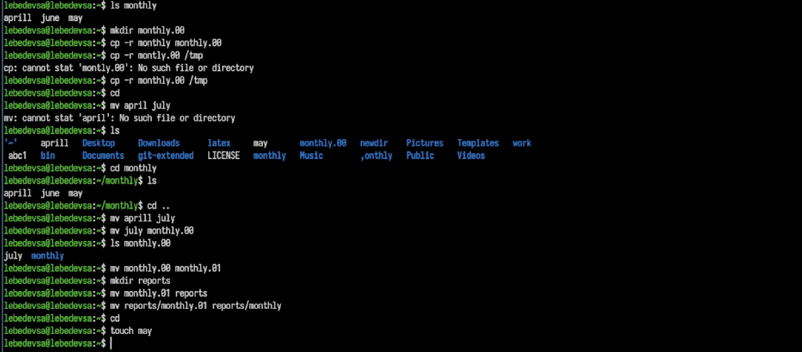
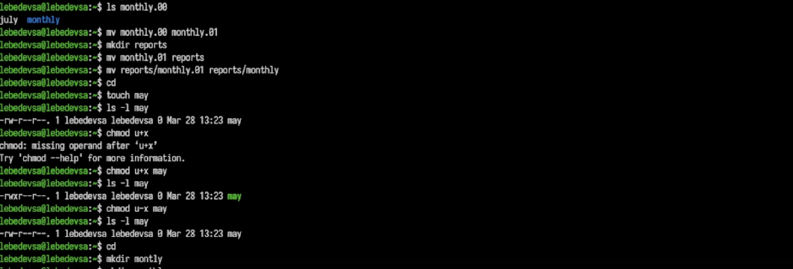
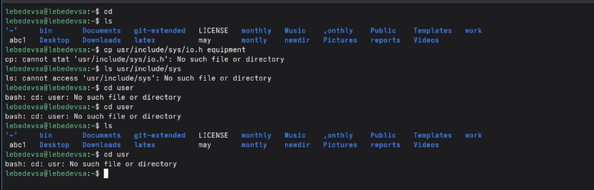
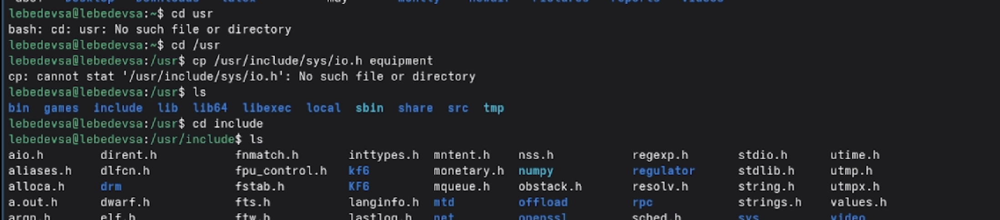
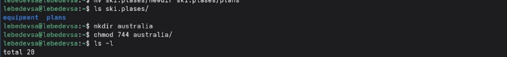
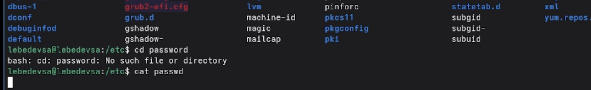
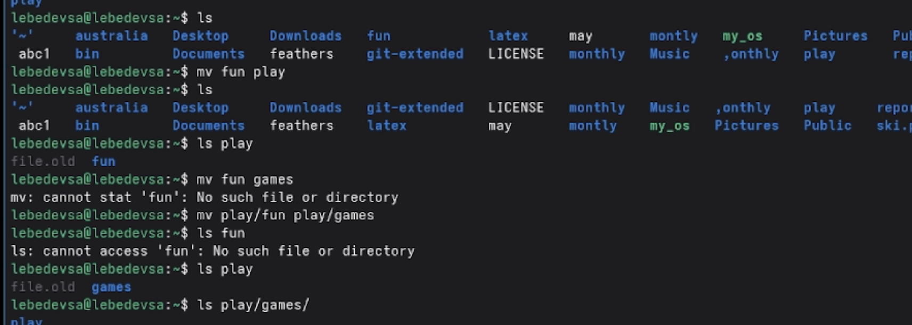

---
## Front matter
title: "Лабораторная работа №7"
subtitle: "Анализ файловой системы Linux. Команды для работы с файлами и каталогами"
author: "Лебедев Сергей Алексеевич"

## Generic options
lang: ru-RU
toc-title: "Содержание"

## Bibliography
bibliography: bib/cite.bib
csl: pandoc/csl/gost-r-7-0-5-2008-numeric.csl

## Pdf output format
toc: true # Table of contents
toc-depth: 2
lof: true # List of figures
lot: true # List of tables
fontsize: 12pt
linestretch: 1.5
papersize: a4
documentclass: scrreprt

## I18n polyglossia
polyglossia-lang:
  name: russian
  options:
  - spelling=modern
  - babelshorthands=true
polyglossia-otherlangs:
  name: english

## I18n babel
babel-lang: russian
babel-otherlangs: english

## Fonts
mainfont: IBM Plex Serif
romanfont: IBM Plex Serif
sansfont: IBM Plex Sans
monofont: IBM Plex Mono
mathfont: STIX Two Math
mainfontoptions: Ligatures=Common,Ligatures=TeX,Scale=0.94
romanfontoptions: Ligatures=Common,Ligatures=TeX,Scale=0.94
sansfontoptions: Ligatures=Common,Ligatures=TeX,Scale=MatchLowercase,Scale=0.94
monofontoptions: Scale=MatchLowercase,Scale=0.94,FakeStretch=0.9
mathfontoptions:

## Biblatex
biblatex: true
biblio-style: "gost-numeric"
biblatexoptions:
  - parentracker=true
  - backend=biber
  - hyperref=auto
  - language=auto
  - autolang=other*
  - citestyle=gost-numeric

## Pandoc-crossref LaTeX customization
figureTitle: "Рис."
tableTitle: "Таблица"
listingTitle: "Листинг"
lofTitle: "Список иллюстраций"
lotTitle: "Список таблиц"
lolTitle: "Листинги"

## Misc options
indent: true
header-includes:
  - \usepackage{indentfirst}
  - \usepackage{float} # keep figures where there are in the text
  - \floatplacement{figure}{H} # keep figures where there are in the text
---

# Цель работы

Ознакомление с файловой системой Linux, её структурой, именами и содержанием каталогов. Приобретение практических навыков по применению команд для работы с файлами и каталогами, по управлению процессами (и работами), по проверке использования диска и обслуживанию файловой системы.

# Задание

1. Выполнить все примеры из раздела 5.2 описания лабораторной работы (копирование, перемещение, переименование файлов и каталогов, изменение прав доступа).
2. Выполнить действия по копированию, перемещению и переименованию файлов и каталогов согласно пунктам 2.1–2.8.
3. Определить опции команды `chmod` для присвоения файлам заданных прав доступа (пункты 3.1–3.4).
4. Выполнить упражнения с правами доступа и навигацией (пункты 4.1–4.12).
5. Прочитать `man` по командам `mount`, `fsck`, `mkfs`, `kill` и кратко их охарактеризовать.

# Теоретическое введение

Файловая система Linux имеет иерархическую структуру. Основные команды для работы с файлами и каталогами:

- `touch` — создание пустого файла;
- `cp` — копирование файлов и каталогов (с опцией `-r` — рекурсивное копирование);
- `mv` — перемещение и переименование файлов и каталогов;
- `mkdir` — создание каталога;
- `ls` — просмотр содержимого каталога;
- `chmod` — изменение прав доступа к файлу или каталогу.

Права доступа задаются для трёх категорий: владельца (`u`), группы (`g`) и остальных (`o`). Символьная запись прав (`rwx`) может быть заменена восьмеричной: `r=4`, `w=2`, `x=1`.

# Выполнение лабораторной работы

## Раздел 5.2.2. Копирование файлов и каталогов

### Создание файлов и копирование в текущем каталоге

Создан пустой файл `abc1` командой `touch`. Затем он скопирован в файлы `aprill` и `may` с помощью команды `cp`. Обратите внимание: в имени первого файла была допущена опечатка — `aprill` (двойная «l»), что создало трудности на последующих шагах (рис. -@fig:001).

```bash
touch abc1
cp abc1 aprill
cp abc1 may
```

{#fig:001 width=70%}

### Копирование нескольких файлов в каталог и работа внутри него

Создан каталог `monthly`. При первой попытке скопировать файлы в него была допущена опечатка в имени каталога (`montly`), из-за чего команда завершилась ошибкой «No such file or directory». После исправления файлы `aprill` и `may` успешно скопированы в `monthly`. Затем внутри каталога создана копия файла `may` под именем `june`, и командой `ls monthly` проверено содержимое — присутствуют три файла: `aprill`, `june`, `may` (рис. -@fig:002).

```bash
mkdir monthly
cp aprill may monthly
cp monthly/may monthly/june
ls monthly
```

{#fig:002 width=70%}

## Раздел 5.2.3. Перемещение и переименование файлов и каталогов

### Рекурсивное копирование каталога и переименование файлов

Каталог `monthly` рекурсивно скопирован в новый каталог `monthly.00`. При попытке переименовать файл `april` в `july` возникла ошибка, поскольку файл изначально был создан с именем `aprill`. После уточнения имени через `ls` команда `mv aprill july` выполнена успешно. Затем файл `july` перемещён в папку `monthly.00` (рис. -@fig:002).

```bash
cp -r monthly monthly.00
mv aprill july
mv july monthly.00
```

### Переименование каталогов и создание вложенной структуры

Каталог `monthly.00` переименован в `monthly.01`. Создана папка `reports`, в которую перемещён каталог `monthly.01`. Затем вложенный каталог переименован из `monthly.01` в `monthly` (рис. -@fig:002).

```bash
mv monthly.00 monthly.01
mkdir reports
mv monthly.01 reports
mv reports/monthly.01 reports/monthly
```

## Раздел 5.2.5. Изменение прав доступа

### Добавление и снятие права на выполнение для владельца

Создан файл `may`. С помощью `ls -l` просмотрены его текущие права (`-rw-r--r--`). Командой `chmod u+x may` владельцу добавлено право на выполнение — права изменились на `-rwxr--r--`, файл подсветился зелёным. Затем право на выполнение снято командой `chmod u-x may` (рис. -@fig:003).

```bash
touch may
ls -l may
chmod u+x may
ls -l may
chmod u-x may
```

{#fig:003 width=70%}

### Запрет чтения для группы и остальных, добавление записи группе

При первой попытке выполнить `chmod g-r, o-r monthly` возникла ошибка из-за лишнего пробела после запятой. Команды выполнены раздельно. Затем применено рекурсивное изменение прав для всего содержимого каталога `monthly`, после чего файлы внутри получили права `-rw-------`. Файлу `abc1` добавлено право на запись для группы (рис. -@fig:004).

```bash
chmod g-r monthly
chmod o-r monthly
chmod --recursive g-r monthly/
chmod g+w abc1
```

{#fig:004 width=70%}

## Пункты 2.1–2.4 задания

### Копирование системного файла в домашний каталог

При первой попытке скопировать файл `/usr/include/sys/io.h` использован относительный путь (`usr/...`), из-за чего система искала папку `usr` внутри домашнего каталога и выдала ошибку (рис. -@fig:005).

```bash
cp usr/include/sys/io.h equipment
```

{#fig:005 width=70%}

### Исправление пути и копирование файла

Выполнен успешный переход в `/usr` через абсолютный путь. Поскольку файла `io.h` в системе не оказалось, просмотрено содержимое каталога `/usr/include/sys/` и выбран файл-заменитель `ipc.h` (рис. -@fig:006).

```bash
cd /usr
cd include
ls
```

{#fig:006 width=70%}

### Создание директории и перемещение файла

Файл `ipc.h` скопирован в домашний каталог под именем `equipment`. Создана директория `ski.plases`. Файл `equipment` перемещён в неё, а затем переименован в `equiplist` (рис. -@fig:007).

```bash
cp /usr/include/sys/ipc.h equipment
mkdir ski.plases
mv equipment ski.plases/
mv ski.plases/equipment ski.plases/equiplist
```

{#fig:007 width=70%}

## Пункты 2.5–2.8 задания

### Создание файла, вложенного каталога и перемещение

Файл `abc1` скопирован в каталог `ski.plases` под именем `equiplist2`. Создан вложенный каталог `equipment`. Файлы `equiplist` и `equiplist2` одновременно перемещены в него. Создан каталог `newdir`, перемещён в `ski.plases` и переименован в `plans` (рис. -@fig:008).

```bash
cp abc1 ski.plases/equiplist2
mkdir ski.plases/equipment
mv ski.plases/equiplist ski.plases/equiplist2 ski.plases/equipment
mkdir newdir
mv newdir/ ski.plases/
mv ski.plases/newdir ski.plases/plans
```

{#fig:008 width=70%}

## Пункт 3.1 задания. Права доступа — восьмеричные коды

### Установка прав drwxr--r-- для каталога australia

Создан каталог `australia`. С помощью восьмеричного кода `744` установлены права `drwxr--r--`: владелец имеет полные права, группа и остальные — только чтение (рис. -@fig:009).

```bash
mkdir australia
chmod 744 australia/
```

{#fig:009 width=70%}

## Пункты 3.2–3.4 задания

### Установка прав drwx--x--x для каталога play

Создан каталог `play`. Командой `chmod 711 play/` установлены права `drwx--x--x`: полные права для владельца, только выполнение для группы и остальных. Корректность прав проверена командой `ls -l` (рис. -@fig:010).

```bash
mkdir play
chmod 711 play/
ls -l
```

{#fig:010 width=70%}

### Установка прав для файлов my_os и feathers

Созданы файлы `my_os` и `feathers`. Файлу `my_os` присвоены права `r-xr--r--` командой `chmod 544 my_os`. Файлу `feathers` — права `rw-rw-r--` командой `chmod 664 feathers`. Корректность установленных прав подтверждена командой `ls -l` (рис. -@fig:011).

```bash
touch my_os feathers
chmod 544 my_os
chmod 664 feathers
ls -l
```

{#fig:011 width=70%}

## Пункт 4.1 задания. Просмотр файла /etc/passwd

При попытке перейти в `password` как в каталог возникла ошибка «No such file or directory». После исправления команда `cat /etc/passwd` выполнена успешно — на экране отображено содержимое системного файла (рис. -@fig:012).

```bash
cat /etc/passwd
```

{#fig:012 width=70%}

## Пункты 4.2–4.4 задания

### Копирование и перемещение файлов, рекурсивное копирование каталога

Файл `feathers` скопирован в `file.old`. Копия перемещена в каталог `play`. Создан каталог `fun`. Каталог `play` со всем содержимым рекурсивно скопирован в `fun`. Командой `ls fun` подтверждено наличие папки `play` внутри `fun` (рис. -@fig:013).

```bash
cp feathers file.old
mv file.old play/
mkdir fun
cp -r play/ fun/
ls fun
```

{#fig:013 width=70%}

## Пункты 4.5–4.12 задания. Эксперименты с правами доступа

### Перемещение, переименование каталога и лишение прав на чтение

Каталог `fun` перемещён в `play`, а затем переименован в `games` (пункт 4.5). Владелец лишён права на чтение файла `feathers` (пункт 4.6). Попытка прочитать файл командой `cat feathers` завершилась ошибкой «Permission denied» (пункт 4.7). Аналогично попытка скопировать файл командой `cp feathers ll` также завершилась отказом (пункт 4.8). Право на чтение восстановлено (пункт 4.9) (рис. -@fig:014).

```bash
mv fun play
mv play/fun play/games
chmod u-r feathers
cat feathers
cp feathers ll
chmod u+r feathers
```

{#fig:014 width=70%}

### Лишение права на выполнение каталога и попытка входа

Владелец лишён права на выполнение (вход) каталога `play` (пункт 4.10). Попытка перейти в него командой `cd play` завершилась ошибкой «Permission denied» — войти в каталог без права `x` невозможно (пункт 4.11). Право на выполнение восстановлено (пункт 4.12) (рис. -@fig:015).

```bash
chmod u-x play/
cd play
chmod u+x play/
```

{#fig:015 width=70%}

## Пункт 5. Изучение команд mount, fsck, mkfs, kill

Просмотрена справочная страница команды `kill`, предназначенной для завершения процессов. Изучены разделы NAME, SYNOPSIS и DESCRIPTION (рис. -@fig:016).

```bash
man kill
man mount
man fsck
man mkfs
```

{#fig:016 width=70%}

# Контрольные вопросы

**1. Дайте характеристику каждой файловой системе, существующей на жёстком диске компьютера, на котором вы выполняли лабораторную работу.**

Просмотреть смонтированные файловые системы можно командой `mount` или `cat /etc/fstab`. На большинстве современных систем используется `ext4` — журналируемая файловая система четвёртого поколения, поддерживающая тома до 1 Эбайт и файлы до 16 Тбайт. Также может присутствовать `tmpfs` (временное хранилище в оперативной памяти) и `proc` (псевдофайловая система для доступа к информации о процессах ядра).

**2. Приведите общую структуру файловой системы и дайте характеристику каждой директории первого уровня.**

Файловая система Linux начинается с корневого каталога `/`. Основные директории первого уровня: `/bin` — основные исполняемые файлы; `/etc` — конфигурационные файлы системы; `/home` — домашние каталоги пользователей; `/usr` — вторичные программы и библиотеки; `/var` — переменные данные (логи, почта); `/tmp` — временные файлы; `/dev` — файлы устройств; `/proc` — псевдофайловая система процессов; `/root` — домашний каталог суперпользователя.

**3. Какая операция должна быть выполнена, чтобы содержимое некоторой файловой системы было доступно операционной системе?**

Файловая система должна быть смонтирована с помощью команды `mount`. При монтировании она подключается к определённой точке монтирования (каталогу) в общем дереве каталогов. Пример: `mount /dev/sdb1 /mnt/usb`.

**4. Назовите основные причины нарушения целостности файловой системы. Как устранить повреждения?**

Основные причины: внезапное отключение питания, аппаратные сбои накопителя, программные ошибки ядра. Для проверки и восстановления целостности используется команда `fsck`:
```bash
fsck /dev/sda1
```
Файловая система при этом должна быть размонтирована или смонтирована в режиме только для чтения.

**5. Как создаётся файловая система?**

Файловая система создаётся утилитой `mkfs`. Формат команды: `mkfs -t тип_фс устройство`. Пример:
```bash
mkfs -t ext4 /dev/sdb1
```
Перед этим раздел должен быть создан, например, с помощью `fdisk` или `parted`.

**6. Дайте характеристику командам для просмотра текстовых файлов.**

- `cat` — выводит содержимое файла целиком на экран;
- `less` — постраничный просмотр с возможностью навигации (Space — вперёд, `b` — назад, `q` — выход);
- `head` — выводит первые 10 строк файла (опция `-n` задаёт количество строк);
- `tail` — выводит последние 10 строк файла (опция `-n` задаёт количество строк).

**7. Приведите основные возможности команды cp в Linux.**

Команда `cp` копирует файлы и каталоги. Основные опции: `-r` — рекурсивное копирование каталогов; `-i` — запрос подтверждения перед перезаписью; `-p` — сохранение атрибутов файла (права, метки времени). Примеры:
```bash
cp file1 file2          # копировать файл
cp -r dir1 dir2         # скопировать каталог рекурсивно
cp file1 file2 /tmp/    # скопировать несколько файлов в каталог
```

**8. Приведите основные возможности команды mv в Linux.**

Команда `mv` перемещает или переименовывает файлы и каталоги. Основные опции: `-i` — запрос подтверждения перед перезаписью; `-f` — принудительное перемещение без запросов. Примеры:
```bash
mv file1 file2          # переименовать файл
mv file1 /tmp/          # переместить файл в каталог
mv dir1 dir2            # переименовать каталог
```

**9. Что такое права доступа? Как они могут быть изменены?**

Права доступа определяют, какие операции (чтение `r`, запись `w`, выполнение `x`) разрешены для владельца файла (`u`), его группы (`g`) и остальных пользователей (`o`). Права изменяются командой `chmod` в символьном или восьмеричном формате. Примеры:
```bash
chmod u+x file      # добавить владельцу право выполнения
chmod g-r file      # убрать у группы право чтения
chmod 755 file      # установить rwxr-xr-x в восьмеричной записи
```

# Выводы

В ходе выполнения лабораторной работы были изучены основные команды для работы с файловой системой Linux. Отработаны навыки копирования файлов и каталогов командой `cp`, перемещения и переименования командой `mv`, а также создания файлов и каталогов командами `touch` и `mkdir`. Освоено управление правами доступа командой `chmod` как в символьном, так и в восьмеричном формате. Изучены справочные страницы системных команд `mount`, `fsck`, `mkfs` и `kill`. Практически продемонстрировано влияние прав доступа на возможность чтения, записи и навигации по каталогам.

# Список литературы{.unnumbered}

::: {#refs}
:::
