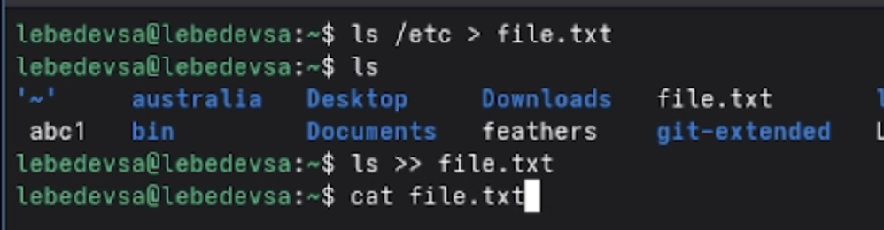
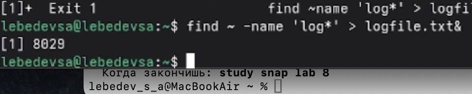
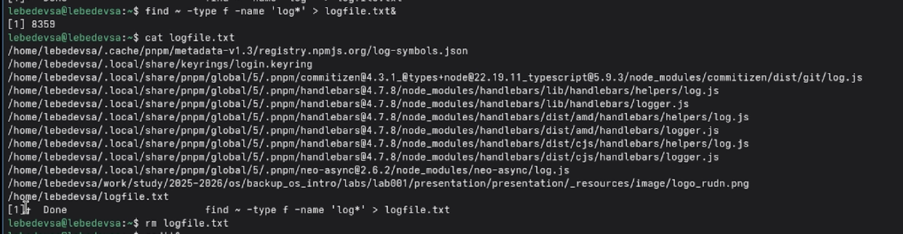
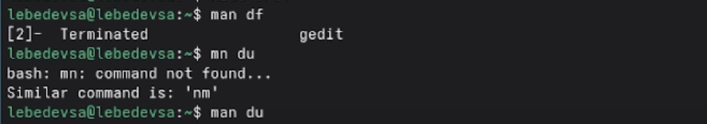

## Титульный слайд

**Дисциплина:** Архитектура компьютеров и операционные системы (раздел «Операционные системы»)  
**Работа:** Лабораторная работа №8 — Поиск файлов. Перенаправление ввода-вывода. Просмотр запущенных процессов

**Студент:** Лебедев Сергей Алексеевич  
**Преподаватель:** Кулябов Дмитрий Сергеевич, д.ф.-м.н., профессор  
**Организация:** Российский университет дружбы народов (РУДН)

---

## Содержание

1. Цель и задачи работы
2. Перенаправление ввода-вывода
3. Фильтрация текста и конвейер
4. Поиск файлов командой find
5. Управление фоновыми процессами
6. Проверка использования диска
7. Выводы

---

## Информация о докладчике

:::::::::::::: {.columns align=center}
::: {.column width="65%"}
- **Лебедев Сергей Алексеевич**
- студент направления **02.03.00 Компьютерные и информационные науки**
- РУДН, 1 курс
- ЛР №8: поиск файлов и управление процессами
:::

::: {.column width="35%"}

:::
::::::::::::::

---

## Цель работы

Ознакомление с инструментами поиска файлов и фильтрации текстовых данных. Приобретение практических навыков по управлению процессами (и заданиями), по проверке использования диска и обслуживанию файловых систем.

---

## Задачи

1. Освоить перенаправление ввода-вывода (`>`, `>>`)
2. Изучить конвейер (`|`) и фильтрацию командой `grep`
3. Научиться искать файлы командой `find`
4. Запускать процессы в фоновом режиме (`&`) и управлять ими
5. Изучить команды проверки диска `df` и `du`

---

## Перенаправление ввода-вывода

Стандартные потоки Linux:

| Поток | Описание | Дескриптор |
|-------|----------|------------|
| `stdin` | Стандартный ввод (клавиатура) | 0 |
| `stdout` | Стандартный вывод (консоль) | 1 |
| `stderr` | Поток ошибок (консоль) | 2 |

- `>` — запись в файл (перезапись)
- `>>` — запись в файл (добавление в конец)

---

## Запись содержимого каталогов в файл

Список файлов `/etc` записан в `file.txt`, затем дописан список домашнего каталога:

```bash
ls /etc > file.txt
ls
ls >> file.txt
cat file.txt
```


---

## Фильтрация текста: grep и конвейер

Конвейер передаёт вывод одной команды на вход другой. Фильтрация через `grep`:

```bash
ls | grep c*
```

Поиск строк с `.conf` в файле и запись в новый файл:

```bash
grep .conf file.txt > conf.txt
cat conf.txt
```


---

## Запись файлов .conf в conf.txt

Результат выполнения `grep .conf file.txt > conf.txt` — файл содержит только строки с расширением `.conf`:


---

## Поиск файлов: find

Команда `find` — поиск по имени, типу, расширению и другим критериям:

```bash
find путь [-опции]
```

| Опция | Назначение |
|-------|-----------|
| `-name "шаблон"` | Поиск по имени файла |
| `-type f` | Только обычные файлы |
| `-type d` | Только каталоги |

---

## Поиск файлов на букву c

Файлы домашнего каталога, начинающиеся с `c`, двумя способами:

```bash
ls | grep c*
find ~ -type f -name 'c*'
```


---

## Поиск файлов на букву h в /etc

```bash
find /etc -name "h*"
```


---

## Фоновые процессы: запуск и logfile

Символ `&` переводит процесс в фоновый режим:

```bash
find ~ -name 'log*' > logfile.txt&
cat logfile.txt
```



---

## Уточнённый поиск и удаление logfile

Поиск только обычных файлов (без каталогов), затем удаление:

```bash
find ~ -type f -name 'log*' > logfile.txt&
cat logfile.txt
rm logfile.txt
```



---

## Управление процессами: gedit и kill

Запуск редактора в фоне, определение PID и завершение процесса:

```bash
gedit&
ps | grep gedit
kill 9751
```


---

## Проверка использования диска

Справка и применение команд `df` и `du`:

```bash
man df
man du
```

- `df` — размер каждого смонтированного раздела диска
- `du` — число килобайт, занимаемых файлами и каталогами



---

## Вывод всех директорий домашнего каталога

Команда `find` с опцией `-type d` выводит только каталоги:

```bash
find ~ -type d
```


---

## Выводы

- Освоено перенаправление ввода-вывода с помощью операторов **>** и **>>**
- Изучена работа с конвейером **|** и фильтрацией текста командой **grep**
- Отработан поиск файлов командой **find** по имени и типу
- Освоен запуск процессов в фоновом режиме (**&**) и их завершение командой **kill**
- Изучены команды проверки дискового пространства **df** и **du**

---

## Ресурсы

- Кулябов Д. С. и др. — *Операционные системы*, лабораторный практикум
- GNU Bash Reference Manual: https://www.gnu.org/software/bash/manual/
- Linux man-pages: https://man7.org/linux/man-pages/
- GitHub: https://github.com/lebedev-s-a
