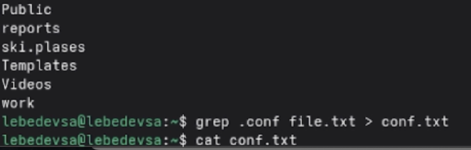
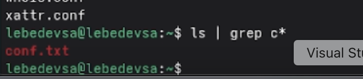
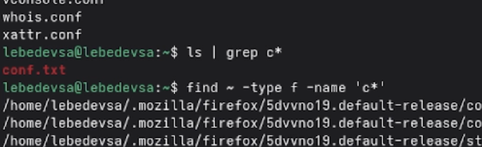
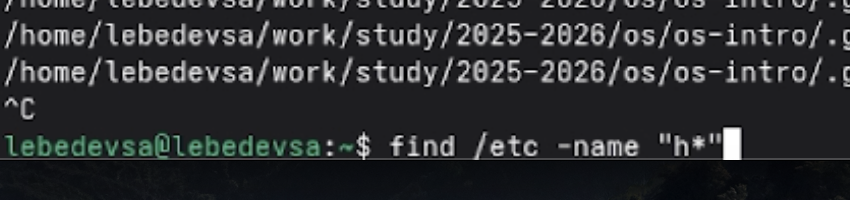
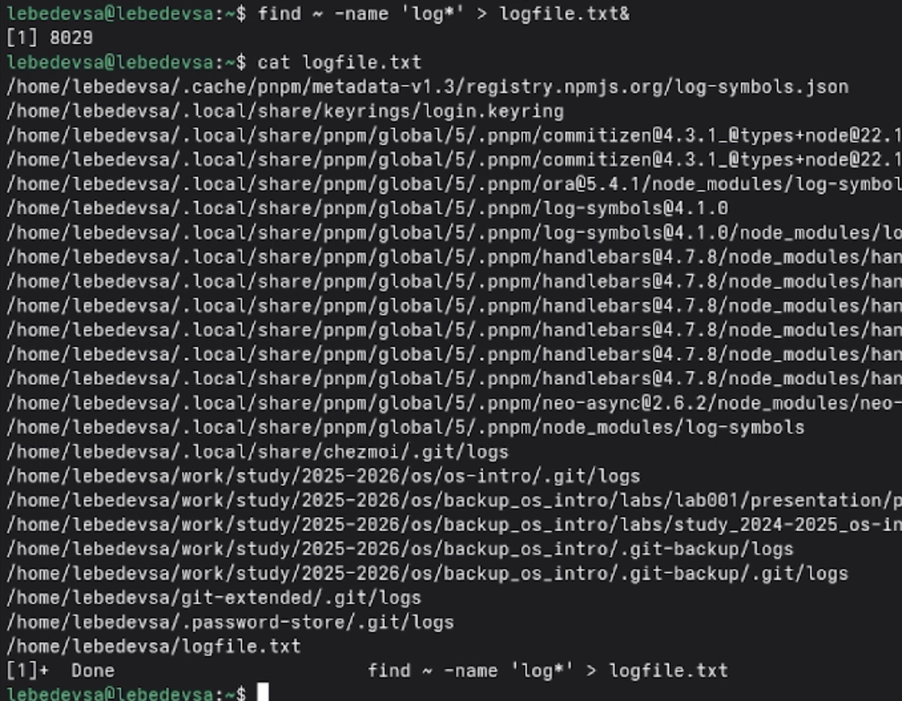
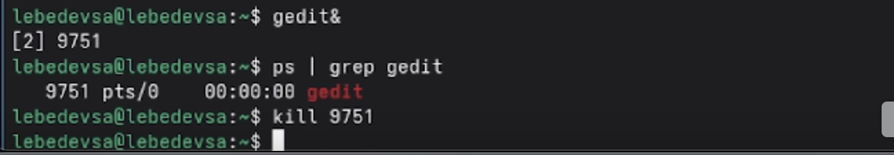

---
## Front matter
title: "Лабораторная работа №8"
subtitle: "Поиск файлов. Перенаправление ввода-вывода. Просмотр запущенных процессов"
author: "Лебедев Сергей Алексеевич"

## Generic options
lang: ru-RU
toc-title: "Содержание"

## Bibliography
bibliography: bib/cite.bib
csl: pandoc/csl/gost-r-7-0-5-2008-numeric.csl

## Pdf output format
toc: true # Table of contents
toc-depth: 2
lof: true # List of figures
lot: true # List of tables
fontsize: 12pt
linestretch: 1.5
papersize: a4
documentclass: scrreprt

## I18n polyglossia
polyglossia-lang:
  name: russian
  options:
  - spelling=modern
  - babelshorthands=true
polyglossia-otherlangs:
  name: english

## I18n babel
babel-lang: russian
babel-otherlangs: english

## Fonts
mainfont: IBM Plex Serif
romanfont: IBM Plex Serif
sansfont: IBM Plex Sans
monofont: IBM Plex Mono
mathfont: STIX Two Math
mainfontoptions: Ligatures=Common,Ligatures=TeX,Scale=0.94
romanfontoptions: Ligatures=Common,Ligatures=TeX,Scale=0.94
sansfontoptions: Ligatures=Common,Ligatures=TeX,Scale=MatchLowercase,Scale=0.94
monofontoptions: Scale=MatchLowercase,Scale=0.94,FakeStretch=0.9
mathfontoptions:

## Biblatex
biblatex: true
biblio-style: "gost-numeric"
biblatexoptions:
  - parentracker=true
  - backend=biber
  - hyperref=auto
  - language=auto
  - autolang=other*
  - citestyle=gost-numeric

## Pandoc-crossref LaTeX customization
figureTitle: "Рис."
tableTitle: "Таблица"
listingTitle: "Листинг"
lofTitle: "Список иллюстраций"
lotTitle: "Список таблиц"
lolTitle: "Листинги"

## Misc options
indent: true
header-includes:
  - \usepackage{indentfirst}
  - \usepackage{float} # keep figures where there are in the text
  - \floatplacement{figure}{H} # keep figures where there are in the text
---

# Цель работы

Ознакомление с инструментами поиска файлов и фильтрации текстовых данных. Приобретение практических навыков по управлению процессами (и заданиями), по проверке использования диска и обслуживанию файловых систем.

# Задание

1. Записать в файл `file.txt` названия файлов из каталога `/etc`, дописать туда же файлы домашнего каталога.
2. Вывести имена файлов с расширением `.conf` из `file.txt` и записать их в `conf.txt`.
3. Определить файлы домашнего каталога, начинающиеся с символа `c`.
4. Вывести постранично имена файлов из `/etc`, начинающихся с `h`.
5. Запустить в фоновом режиме запись файлов с именами на `log` в `~/logfile`.
6. Удалить файл `~/logfile`.
7. Запустить редактор `gedit` в фоновом режиме, найти его PID и завершить процесс.
8. Выполнить команды `df` и `du`, изучив их справку.
9. Вывести имена всех директорий домашнего каталога.

# Теоретическое введение

В операционной системе Linux предусмотрено три стандартных потока ввода-вывода: **stdin** (стандартный ввод, дескриптор 0), **stdout** (стандартный вывод, дескриптор 1) и **stderr** (стандартный поток ошибок, дескриптор 2). Потоки можно перенаправлять с помощью символов `>`, `>>`, `<`.

Основные команды, изучаемые в данной работе:

- `find` — поиск файлов по заданным критериям;
- `grep` — фильтрация строк текста по шаблону;
- `df` — отображение использования дискового пространства смонтированных разделов;
- `du` — отображение объёма, занимаемого файлами и каталогами;
- `ps` — получение информации о процессах;
- `kill` — завершение процесса по его идентификатору (PID);
- `man` — просмотр справочных страниц команд.

# Выполнение лабораторной работы

## Перенаправление ввода-вывода

### Запись содержимого каталога /etc в файл и дозапись домашнего каталога

Выполнена команда `ls /etc > file.txt`, которая записывает список файлов из каталога `/etc` в файл `file.txt`. Затем выполнена команда `ls`, чтобы убедиться, что файл `file.txt` создан. После этого с помощью команды `ls >> file.txt` в файл дописан список файлов из текущего (домашнего) каталога. В конце содержимое файла просмотрено командой `cat file.txt` (рис. -@fig:001).

```bash
ls /etc > file.txt
ls
ls >> file.txt
cat file.txt
```

{#fig:001 width=70%}

## Фильтрация текста и работа с конвейером

### Фильтрация файлов с расширением .conf с помощью конвейера

Выполнена команда `ls | grep c*`, которая использует конвейер и фильтрацию вывода. В результате на экран выведено имя файла `conf.txt` (рис. -@fig:002).

```bash
ls | grep c*
```

{#fig:002 width=70%}

### Запись файлов с расширением .conf в новый файл conf.txt

Выполнена команда `grep .conf file.txt > conf.txt`, которая ищет в файле `file.txt` строки, содержащие `.conf`, и записывает найденные результаты в новый файл `conf.txt`. Затем выполнена команда `cat conf.txt` для просмотра содержимого этого файла (рис. -@fig:003).

```bash
grep .conf file.txt > conf.txt
cat conf.txt
```

{#fig:003 width=70%}

## Поиск файлов

### Определение файлов домашнего каталога, начинающихся с символа c

Сначала выполнена команда `ls | grep c*`, которая выводит имя файла `conf.txt`. После этого выполнена команда `find ~ -type f -name 'c*'`, которая ищет в домашнем каталоге все обычные файлы, имена которых начинаются с буквы `c` (рис. -@fig:004).

```bash
ls | grep c*
find ~ -type f -name 'c*'
```

{#fig:004 width=70%}

### Вывод файлов каталога /etc, начинающихся с символа h

Выполнена команда `find /etc -name "h*"`, которая ищет в каталоге `/etc` файлы, имена которых начинаются с буквы `h` (рис. -@fig:005).

```bash
find /etc -name "h*"
```

{#fig:005 width=70%}

## Управление задачами и фоновые процессы

### Запуск фонового процесса записи файлов в logfile

Выполнена команда `find ~ -name 'log*' > logfile.txt&`, которая запускает поиск файлов в домашнем каталоге, имена которых начинаются с `log`, записывает результат в файл `logfile.txt` и переводит процесс в фоновый режим с помощью символа `&` (рис. -@fig:006).

```bash
find ~ -name 'log*' > logfile.txt&
```

{#fig:006 width=70%}

### Просмотр содержимого logfile.txt

Выполнена команда `cat logfile.txt`, которая выводит на экран содержимое файла `logfile.txt` с найденными путями к файлам и каталогам, имена которых начинаются с `log` (рис. -@fig:007).

```bash
cat logfile.txt
```

{#fig:007 width=70%}

### Поиск только обычных файлов и удаление logfile.txt

Выполнена команда `find ~ -type f -name 'log*' > logfile.txt&`, которая ищет в домашнем каталоге только обычные файлы (без каталогов), имена которых начинаются с `log`, и записывает результат в `logfile.txt` в фоновом режиме. Затем выполнена команда `cat logfile.txt` для просмотра, после чего файл удалён командой `rm logfile.txt` (рис. -@fig:008).

```bash
find ~ -type f -name 'log*' > logfile.txt&
cat logfile.txt
rm logfile.txt
```

{#fig:008 width=70%}

## Управление процессами

### Запуск gedit в фоновом режиме и завершение процесса

Выполнена команда `gedit&`, которая запускает текстовый редактор `gedit` в фоновом режиме. Затем выполнена команда `ps | grep gedit`, позволяющая найти процесс `gedit` и определить его идентификатор. После этого выполнена команда `kill 9751`, завершающая данный процесс (рис. -@fig:009).

```bash
gedit&
ps | grep gedit
kill 9751
```

{#fig:009 width=70%}

## Проверка использования диска

### Просмотр справки по командам df и du

Выполнена команда `man df` для просмотра справки по команде `df`. Затем по ошибке введена команда `mn du`, которая не была распознана системой. После этого выполнена правильная команда `man du` для просмотра справки по команде `du` (рис. -@fig:010).

```bash
man df
man du
```

{#fig:010 width=70%}

## Вывод списка директорий домашнего каталога

### Поиск всех директорий в домашнем каталоге

Выполнена команда `find ~ -type d`, которая выводит список всех директорий домашнего каталога и его подкаталогов (рис. -@fig:011).

```bash
find ~ -type d
```

{#fig:011 width=70%}

# Контрольные вопросы

**1. Какие потоки ввода-вывода вы знаете?**
В системе Linux по умолчанию открыто три стандартных потока: `stdin` (стандартный поток ввода, дескриптор 0 — по умолчанию клавиатура), `stdout` (стандартный поток вывода, дескриптор 1 — по умолчанию консоль) и `stderr` (стандартный поток вывода сообщений об ошибках, дескриптор 2 — по умолчанию консоль).

**2. Объясните разницу между операцией > и >>.**
Оператор `>` перенаправляет стандартный вывод в файл, при этом если файл уже существует — он перезаписывается заново. Оператор `>>` также перенаправляет вывод в файл, но открывает его в режиме добавления: новые данные дописываются в конец файла, не затрагивая уже имеющееся содержимое.

**3. Что такое конвейер?**
Конвейер (pipe, символ `|`) — механизм, позволяющий объединить несколько команд в цепочку, где стандартный вывод одной команды автоматически передаётся на стандартный ввод следующей. Например: `ls -la | sort > sorted_list` — вывод `ls` передаётся команде `sort`, которая записывает отсортированный результат в файл.

**4. Что такое процесс? Чем это понятие отличается от программы?**
Программа — это статический набор инструкций, хранящийся на диске в виде исполняемого файла. Процесс — это активный экземпляр программы, выполняющийся в оперативной памяти и управляемый операционной системой. Одна программа может порождать несколько одновременно работающих процессов, каждый из которых имеет свой уникальный идентификатор (PID).

**5. Что такое PID и GID?**
PID (Process ID) — уникальный числовой идентификатор процесса, присваиваемый операционной системой при его запуске. GID (Group ID) — идентификатор группы пользователей, к которой принадлежит владелец процесса. Оба идентификатора используются для управления процессами и разграничения прав доступа.

**6. Что такое задачи и какая команда позволяет ими управлять?**
Задачи (jobs) — это процессы, запущенные из текущего сеанса командного интерпретатора, в том числе в фоновом режиме (с помощью `&`). Для управления задачами используется команда `jobs`, которая выводит их список с номерами. Завершить конкретную задачу можно командой `kill %номер_задачи`.

**7. Найдите информацию об утилитах top и htop. Каковы их функции?**
`top` — стандартная утилита для интерактивного мониторинга системных процессов в реальном времени. Отображает загрузку процессора, использование памяти, список активных процессов с их PID и потреблением ресурсов. `htop` — расширенная альтернатива `top` с более удобным интерфейсом: поддерживает цветной вывод, прокрутку списка процессов, управление ими непосредственно из интерфейса (завершение, изменение приоритета) без ввода дополнительных команд.

**8. Назовите и дайте характеристику команде поиска файлов. Приведите примеры использования этой команды.**
Команда `find` используется для поиска файлов и каталогов по заданным критериям (имя, тип, размер, дата изменения и др.). Формат: `find путь [опции]`. Примеры:
```bash
find ~ -name "f*"            # файлы домашнего каталога, начинающиеся с f
find /etc -name "p*" -print  # файлы в /etc, начинающиеся с p
find ~ -type d               # только каталоги в домашнем каталоге
find ~ -name "*~" -exec rm "{}" \;  # найти и удалить временные файлы
```

**9. Можно ли по контексту (содержанию) найти файл? Если да, то как?**
Да, для поиска файлов по содержимому используется команда `grep`. Она позволяет найти строки, соответствующие заданному шаблону, как в конкретном файле, так и рекурсивно по каталогу:
```bash
grep "искомая строка" file.txt      # поиск в файле
grep -r "искомая строка" ~/         # рекурсивный поиск по каталогу
```

**10. Как определить объём свободной памяти на жёстком диске?**
Для определения объёма свободного дискового пространства используется команда `df`. Опция `-h` выводит информацию в удобочитаемом формате (килобайты, мегабайты, гигабайты):
```bash
df -h
```

**11. Как определить объём вашего домашнего каталога?**
Для определения объёма, занимаемого домашним каталогом, используется команда `du`. Опция `-s` выводит суммарный объём, `-h` — в удобочитаемом формате:
```bash
du -sh ~/
```

**12. Как удалить зависший процесс?**
Для завершения зависшего процесса используется команда `kill`. Сначала необходимо определить PID процесса с помощью `ps` или `ps | grep <имя>`, затем отправить сигнал завершения:
```bash
ps | grep gedit       # найти PID процесса gedit
kill 9751             # завершить процесс с PID 9751
kill -9 9751          # принудительное завершение (SIGKILL)
```

# Выводы

В ходе выполнения лабораторной работы были получены практические навыки работы с инструментами поиска файлов и фильтрации текстовых данных. Освоены команды перенаправления ввода-вывода (`>`, `>>`), использование конвейеров (`|`), поиск файлов с помощью `find` по различным критериям, фильтрация текста командой `grep`. Приобретены навыки управления фоновыми процессами и задачами: запуск в фоновом режиме с помощью `&`, получение информации о процессах командой `ps`, завершение процессов командой `kill`. Изучены команды проверки использования дискового пространства `df` и `du`.

# Список литературы{.unnumbered}

::: {#refs}
:::
