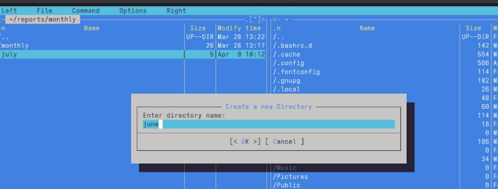
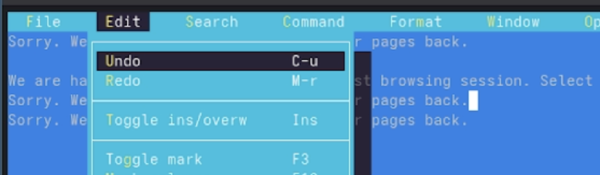
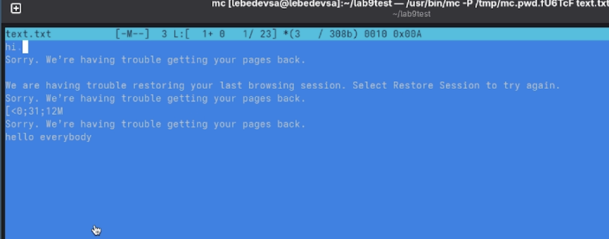

---
## Front matter
title: "Лабораторная работа №9"
subtitle: "Командная оболочка Midnight Commander"
author: "Лебедев Сергей Алексеевич"

## Generic options
lang: ru-RU
toc-title: "Содержание"

## Bibliography
bibliography: bib/cite.bib
csl: pandoc/csl/gost-r-7-0-5-2008-numeric.csl

## Pdf output format
toc: true # Table of contents
toc-depth: 2
lof: true # List of figures
lot: true # List of tables
fontsize: 12pt
linestretch: 1.5
papersize: a4
documentclass: scrreprt

## I18n polyglossia
polyglossia-lang:
  name: russian
  options:
  - spelling=modern
  - babelshorthands=true
polyglossia-otherlangs:
  name: english

## I18n babel
babel-lang: russian
babel-otherlangs: english

## Fonts
mainfont: IBM Plex Serif
romanfont: IBM Plex Serif
sansfont: IBM Plex Sans
monofont: IBM Plex Mono
mathfont: STIX Two Math
mainfontoptions: Ligatures=Common,Ligatures=TeX,Scale=0.94
romanfontoptions: Ligatures=Common,Ligatures=TeX,Scale=0.94
sansfontoptions: Ligatures=Common,Ligatures=TeX,Scale=MatchLowercase,Scale=0.94
monofontoptions: Scale=MatchLowercase,Scale=0.94,FakeStretch=0.9
mathfontoptions:

## Biblatex
biblatex: true
biblio-style: "gost-numeric"
biblatexoptions:
  - parentracker=true
  - backend=biber
  - hyperref=auto
  - language=auto
  - autolang=other*
  - citestyle=gost-numeric

## Pandoc-crossref LaTeX customization
figureTitle: "Рис."
tableTitle: "Таблица"
listingTitle: "Листинг"
lofTitle: "Список иллюстраций"
lotTitle: "Список таблиц"
lolTitle: "Листинги"

## Misc options
indent: true
header-includes:
  - \usepackage{indentfirst}
  - \usepackage{float} # keep figures where there are in the text
  - \floatplacement{figure}{H} # keep figures where there are in the text
---

# Цель работы

Освоение основных возможностей командной оболочки Midnight Commander. Приобретение навыков практической работы по просмотру каталогов и файлов; манипуляций с ними.

# Задание

1. Изучить информацию о mc, вызвав в командной строке `man mc`.
2. Запустить из командной строки mc, изучить его структуру и меню.
3. Выполнить несколько операций в mc, используя управляющие клавиши (операции с панелями; выделение/отмена выделения файлов, копирование/перемещение файлов, получение информации о размере и правах доступа на файлы и/или каталоги).
4. Выполнить основные команды меню левой (или правой) панели. Оценить степень подробности вывода информации о файлах.
5. Используя возможности подменю **Файл**, выполнить: просмотр содержимого текстового файла; редактирование содержимого текстового файла (без сохранения результатов редактирования); создание каталога; копирование файлов в созданный каталог.
6. С помощью подменю **Команда** осуществить: поиск в файловой системе файла с заданными условиями; выбор и повторение одной из предыдущих команд; переход в домашний каталог; анализ файла меню и файла расширений.
7. Вызвать подменю **Настройки**. Освоить операции, определяющие структуру экрана mc.
8. Создать текстовой файл `text.txt` и выполнить с его содержимым заданные операции во встроенном редакторе mc.
9. Открыть файл с исходным текстом на языке программирования и изучить режим подсветки синтаксиса.

# Теоретическое введение

Командная оболочка — интерфейс взаимодействия пользователя с операционной системой и программным обеспечением посредством команд.

**Midnight Commander** (или mc) — псевдографическая командная оболочка для UNIX/Linux систем. Рабочее пространство mc имеет две панели, отображающие по умолчанию списки файлов двух каталогов.

Основные функциональные клавиши mc:

- `F1` — контекстно-зависимая подсказка;
- `F3` — просмотр содержимого файла без редактирования;
- `F4` — вызов встроенного редактора;
- `F5` — копирование файлов;
- `F6` — перенос/переименование файлов;
- `F7` — создание подкаталога;
- `F8` — удаление файлов или каталогов;
- `F9` — вызов меню mc;
- `F10` — выход из mc.

# Выполнение лабораторной работы

## Задание по mc

### Изучение справки и запуск Midnight Commander

Изучена справочная страница Midnight Commander командой `man mc`. После ознакомления с документацией mc запущен из командной строки (рис. -@fig:001).

```bash
man mc
mc
```

{#fig:001 width=70%}

### Просмотр содержимого файла (F3)

С помощью подменю **Файл** выбран пункт **Просмотр (F3)**. Выполнен просмотр содержимого текстового файла без возможности его редактирования (рис. -@fig:002).

```
F3 — просмотр содержимого файла
```

{#fig:002 width=70%}

### Создание каталога (F7)

С помощью клавиши **F7** в подменю **Файл** создан новый каталог `june` в директории `~/reports/monthly`. В диалоговом окне введено имя нового каталога (рис. -@fig:003).

```
F7 — создание нового подкаталога
```

{#fig:003 width=70%}

### Редактирование файла (F4)

Через подменю **Файл → Правка (F4)** запущен встроенный редактор Midnight Commander для редактирования выбранного файла. Редактирование выполнено без сохранения результатов (рис. -@fig:004).

```
F4 — открытие файла в редакторе mc
```

{#fig:004 width=70%}

### Создание каталога reports

С помощью диалогового окна **Create a new Directory** создан каталог `reports` в домашнем каталоге. Наличие каталога проверено в панели mc (рис. -@fig:005).

{#fig:005 width=70%}

## Задание по встроенному редактору mc

### Создание файла text.txt

В каталоге `~/lab9test` создан текстовый файл `text.txt`. Файл отображается в активной панели Midnight Commander и готов к открытию (рис. -@fig:006).

{#fig:006 width=70%}

### Вставка фрагмента текста

Файл `text.txt` открыт в редакторе mc с помощью клавиши **F4**. В открытый файл вставлен небольшой фрагмент текста, скопированный из внешнего источника (рис. -@fig:007).

{#fig:007 width=70%}

### Копирование и перемещение фрагментов текста

С помощью горячих клавиш выполнены манипуляции с текстом: выделен фрагмент (**F3**), скопирован на новую строку (**F5**), перемещён на новую строку (**F6**). На экране видны изменения содержимого — добавленные и продублированные строки (рис. -@fig:008).

```
F3 — начало/окончание выделения фрагмента
F5 — копировать выделенный фрагмент
F6 — переместить выделенный фрагмент
```

{#fig:008 width=70%}

### Сохранение и отмена последнего действия

Файл сохранён командой **F2**. Затем с помощью **Ctrl-u** (Undo) через меню **Edit** отменено последнее выполненное действие (рис. -@fig:009).

```
F2     — сохранить файл
Ctrl-u — отменить последнее действие
```

{#fig:009 width=70%}

### Переход в конец и начало файла, итоговое сохранение

Выполнен переход в конец файла и добавлена строка `hello everybody`. Затем выполнен переход в начало файла и добавлен текст `hi.`. Файл сохранён и закрыт (рис. -@fig:010).

```
Ctrl-End  — перейти в конец файла
Ctrl-Home — перейти в начало файла
F2        — сохранить файл
F10       — выйти из редактора
```

{#fig:010 width=70%}

### Открытие файла с исходным кодом

Открыт файл `presentation.html` во встроенном редакторе Midnight Commander. Выполнен просмотр содержимого HTML-файла до включения подсветки синтаксиса (рис. -@fig:011).

{#fig:011 width=70%}

### Включение подсветки синтаксиса

Через меню редактора включена подсветка синтаксиса для HTML-файла. Теги и атрибуты выделяются цветом, что существенно упрощает чтение и редактирование кода (рис. -@fig:012).

{#fig:012 width=70%}

# Контрольные вопросы

**1. Какие режимы работы есть в mc. Охарактеризуйте их.**

Midnight Commander поддерживает несколько режимов отображения панелей. Режим **Список файлов** — стандартный режим, отображающий содержимое каталога. Режим **Информация** выводит подробные сведения о выделенном файле: права доступа, владелец, размер, файловая система. Режим **Дерево** показывает иерархическую структуру каталогов. Режим **Быстрый просмотр** позволяет увидеть содержимое файла прямо в панели. Также поддерживается подключение к удалённым ресурсам через FTP, Shell и SMB.

**2. Какие операции с файлами можно выполнить как с помощью команд shell, так и с помощью меню mc? Приведите несколько примеров.**

Большинство файловых операций доступны в обоих режимах: копирование файлов — `cp` в shell и **F5** в mc; перемещение и переименование — `mv` и **F6**; удаление — `rm` и **F8**; создание каталога — `mkdir` и **F7**; просмотр содержимого — `cat`/`less` и **F3**; изменение прав доступа — `chmod` и **Ctrl-x c** в mc.

**3. Опишите структуру меню левой (или правой) панели mc, дайте характеристику командам.**

Меню левой (или правой) панели содержит: **Список файлов** — стандартное отображение; **Быстрый просмотр** — предпросмотр содержимого файла; **Информация** — подробные сведения о файле и файловой системе; **Дерево** — дерево каталогов; **Формат списка** — выбор формата отображения (стандартный, ускоренный, расширенный, определённый пользователем); **Порядок сортировки** — настройка критерия сортировки; пункты подключения к удалённым ресурсам (FTP, Shell, SMB-соединения).

**4. Опишите структуру меню Файл mc, дайте характеристику командам.**

Меню **Файл** содержит: **Просмотр (F3)** — просмотр без редактирования; **Правка (F4)** — редактирование во встроенном редакторе; **Копирование (F5)** — копирование файла; **Права доступа (Ctrl-x c)** — изменение прав; **Жёсткая ссылка (Ctrl-x l)** — создание жёсткой ссылки; **Символическая ссылка (Ctrl-x s)** — создание символической ссылки; **Владелец/группа (Ctrl-x o)** — изменение владельца; **Переименование (F6)** — переименование или перемещение; **Создание каталога (F7)**; **Удалить (F8)**; **Выход (F10)**.

**5. Опишите структуру меню Команда mc, дайте характеристику командам.**

Меню **Команда** содержит: **Дерево каталогов** — отображение структуры каталогов; **Поиск файла** — поиск по имени и содержимому; **Переставить панели (Ctrl-u)** — смена местами панелей; **Сравнить каталоги (Ctrl-x d)** — сравнение содержимого двух каталогов; **Размеры каталогов** — отображение размеров; **История командной строки (M-h)** — список ранее выполненных команд; **Каталоги быстрого доступа (Ctrl-\\)** — быстрая смена каталога; **Восстановление файлов** — восстановление на ext2/ext3; **Редактировать файл расширений**; **Редактировать файл меню**; **Редактировать файл расцветки имён**.

**6. Опишите структуру меню Настройки mc, дайте характеристику командам.**

Меню **Настройки** содержит: **Конфигурация** — общие параметры работы mc; **Внешний вид** и **Настройки панелей** — элементы интерфейса и геометрия панелей; **Биты символов** — формат обработки информации терминалом; **Подтверждение** — запрос подтверждения при удалении и перезаписи; **Распознание клавиш** — тестирование функциональных клавиш; **Виртуальные ФС** — настройки виртуальной файловой системы.

**7. Назовите и дайте характеристику встроенным командам mc.**

Основные встроенные команды mc: **F1** — помощь; **F2** — пользовательское меню; **F3** — просмотр файла; **F4** — редактирование файла; **F5** — копирование; **F6** — перемещение/переименование; **F7** — создание каталога; **F8** — удаление; **F9** — меню; **F10** — выход. Дополнительно: **Tab** — переключение между панелями; **Ctrl-o** — скрыть/показать панели; **Ctrl-u** — переставить панели местами.

**8. Назовите и дайте характеристику командам встроенного редактора mc.**

Основные команды редактора mc: **Ctrl-y** — удалить строку; **Ctrl-u** — отменить последнее действие; **Ins** — переключение режима вставки/замены; **F7** — поиск (с поддержкой регулярных выражений); **-F7** — повторить последний поиск; **F4** — замена; **F3** — начало/окончание выделения фрагмента; **F5** — копировать выделенный фрагмент; **F6** — переместить выделенный фрагмент; **F8** — удалить выделенный фрагмент; **F2** — сохранить файл; **F10** — выйти из редактора.

**9. Дайте характеристику средствам mc, которые позволяют создавать меню, определяемые пользователем.**

В mc предусмотрена возможность создания пользовательского меню, вызываемого клавишей **F2**. Для его редактирования используется пункт **Команда → Редактировать файл меню**. В файле меню с помощью специального синтаксиса задаются пункты и связанные с ними команды shell. Это позволяет быстро запускать часто используемые операции над выделенными файлами.

**10. Дайте характеристику средствам mc, которые позволяют выполнять действия, определяемые пользователем, над текущим файлом.**

Пункт **Команда → Редактировать файл расширений** позволяет задать действия, выполняемые при открытии файлов с определёнными расширениями. Например, можно настроить автоматический запуск конкретного редактора для `.py`-файлов или просмотровщика для `.pdf`. Дополнительно, команда **Просмотр вывода команды (M-!)** позволяет выполнить произвольную команду с текущим файлом в качестве аргумента и просмотреть результат прямо в mc.

# Выводы

В ходе выполнения лабораторной работы освоены основные возможности командной оболочки Midnight Commander. Изучена справочная страница `man mc`, запущен mc из командной строки и исследована его структура. Отработаны операции с файлами через управляющие клавиши: просмотр (F3), редактирование (F4), создание каталогов (F7), копирование и перемещение. Использованы подменю **Команда** для поиска файлов и работы с историей команд. Создан и отредактирован текстовый файл `text.txt` с применением всех основных горячих клавиш встроенного редактора: вставка, копирование, перемещение фрагментов, отмена действий, навигация и сохранение. Изучена подсветка синтаксиса на примере HTML-файла.

# Список литературы{.unnumbered}

::: {#refs}
:::
