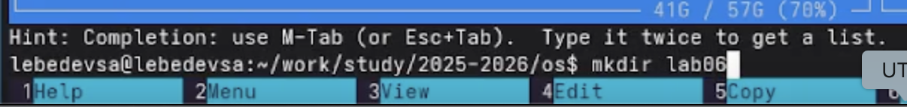
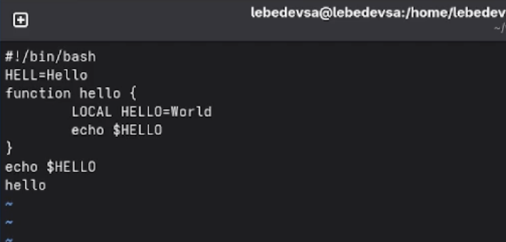
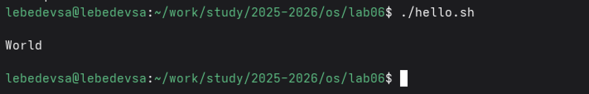

## Титульный слайд

**Дисциплина:** Архитектура компьютеров и операционные системы (раздел «Операционные системы»)  
**Работа:** Лабораторная работа №10 — Текстовой редактор vi

**Студент:** Лебедев Сергей Алексеевич  
**Преподаватель:** Кулябов Дмитрий Сергеевич, д.ф.-м.н., профессор  
**Организация:** Российский университет дружбы народов (РУДН)

---

## Содержание

1. Цель и задачи работы
2. Режимы работы редактора vi
3. Задание 1: создание файла hello.sh
4. Задание 2: редактирование файла hello.sh
5. Запуск скрипта
6. Выводы

---

## Информация о докладчике

:::::::::::::: {.columns align=center}
::: {.column width="65%"}
- **Лебедев Сергей Алексеевич**
- студент направления **02.03.00 Компьютерные и информационные науки**
- РУДН, 1 курс
- ЛР №10: текстовой редактор vi
:::

::: {.column width="35%"}

:::
::::::::::::::

---

## Цель работы

Познакомиться с операционной системой Linux. Получить практические навыки работы с редактором vi, установленным по умолчанию практически во всех дистрибутивах.

---

## Задачи

1. Создать каталог `~/work/os/lab06` и перейти в него
2. Создать файл `hello.sh` с помощью vi и ввести текст программы
3. Сохранить файл и сделать его исполняемым командой `chmod +x`
4. Открыть файл на редактирование и внести изменения: исправить переменную, убрать `LOCAL`, добавить строку
5. Отработать команды отмены изменений `u` и сохранить результат

---

## Режимы работы редактора vi

Редактор vi имеет три режима работы:

| Режим | Назначение | Переход |
|-------|------------|---------|
| Командный | Ввод команд редактирования и навигации | `Esc` |
| Вставки | Ввод содержимого файла | `i`, `a`, `o` и др. |
| Последней строки | Запись изменений, выход из редактора | `:` |

Вызов редактора: `vi <имя_файла>`

---

## Задание 1: создание каталога и вызов vi

Создан каталог `~/work/os/lab06`, выполнен переход в него. Вызван редактор vi для создания файла `hello.sh`:

```bash
mkdir -p ~/work/os/lab06
cd ~/work/os/lab06
vi hello.sh
```


---

## Задание 1: ввод текста и сохранение

После нажатия **i** выполнен переход в режим вставки. Введён текст программы, нажата клавиша **Esc**, выполнено сохранение командой `:wq`:

```bash
#!/bin/bash
HELL=Hello
function hello {
LOCAL HELLO=World
echo $HELLO
}
echo $HELLO
hello
```



---

## Задание 2: редактирование файла hello.sh

Файл открыт на редактирование. Выполнены изменения: `HELL` исправлено на `HELLO`, слово `LOCAL` удалено и заменено на `local`, добавлена строка `echo $HELLO`, лишняя строка удалена (`dd`) и отменена (`u`):

```bash
vi ~/work/os/lab06/hello.sh
```


---

## Запуск скрипта

После сохранения изменений скрипт запущен. Программа вывела значение переменной `HELLO`:

```bash
chmod +x hello.sh
./hello.sh
```

Вывод: `World`



---

## Выводы

- Получены практические навыки работы с редактором **vi**
- Освоены три режима: командный, вставки и последней строки
- Создан bash-скрипт `hello.sh`, введён текст программы
- Отработаны команды редактирования: замена, удаление строки (`dd`), отмена (`u`), вставка (`o`)
- Файл успешно запущен, программа вывела ожидаемый результат `World`

---

## Ресурсы

- Кулябов Д. С. и др. — *Операционные системы*, лабораторный практикум
- GNU Vi / Vim reference: https://vimdoc.sourceforge.net/
- Linux man-pages: https://man7.org/linux/man-pages/
- GitHub: https://github.com/lebedev-s-a
