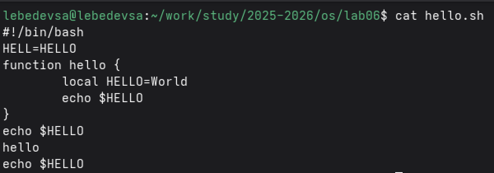

---
## Front matter
title: "Лабораторная работа №10"
subtitle: "Текстовой редактор vi"
author: "Лебедев Сергей Алексеевич"

## Generic options
lang: ru-RU
toc-title: "Содержание"

## Bibliography
bibliography: bib/cite.bib
csl: pandoc/csl/gost-r-7-0-5-2008-numeric.csl

## Pdf output format
toc: true # Table of contents
toc-depth: 2
lof: true # List of figures
lot: true # List of tables
fontsize: 12pt
linestretch: 1.5
papersize: a4
documentclass: scrreprt

## I18n polyglossia
polyglossia-lang:
  name: russian
  options:
  - spelling=modern
  - babelshorthands=true
polyglossia-otherlangs:
  name: english

## I18n babel
babel-lang: russian
babel-otherlangs: english

## Fonts
mainfont: IBM Plex Serif
romanfont: IBM Plex Serif
sansfont: IBM Plex Sans
monofont: IBM Plex Mono
mathfont: STIX Two Math
mainfontoptions: Ligatures=Common,Ligatures=TeX,Scale=0.94
romanfontoptions: Ligatures=Common,Ligatures=TeX,Scale=0.94
sansfontoptions: Ligatures=Common,Ligatures=TeX,Scale=MatchLowercase,Scale=0.94
monofontoptions: Scale=MatchLowercase,Scale=0.94,FakeStretch=0.9
mathfontoptions:

## Biblatex
biblatex: true
biblio-style: "gost-numeric"
biblatexoptions:
  - parentracker=true
  - backend=biber
  - hyperref=auto
  - language=auto
  - autolang=other*
  - citestyle=gost-numeric

## Pandoc-crossref LaTeX customization
figureTitle: "Рис."
tableTitle: "Таблица"
listingTitle: "Листинг"
lofTitle: "Список иллюстраций"
lotTitle: "Список таблиц"
lolTitle: "Листинги"

## Misc options
indent: true
header-includes:
  - \usepackage{indentfirst}
  - \usepackage{float} # keep figures where there are in the text
  - \floatplacement{figure}{H} # keep figures where there are in the text
---

# Цель работы

Познакомиться с операционной системой Linux. Получить практические навыки работы с редактором vi, установленным по умолчанию практически во всех дистрибутивах.

# Задание

1. Создать каталог с именем `~/work/os/lab06` и перейти в него.
2. Вызвать vi и создать файл `hello.sh`, ввести текст программы в режиме вставки.
3. Сохранить файл и сделать его исполняемым командой `chmod +x hello.sh`.
4. Вызвать vi на редактирование файла `hello.sh` и выполнить следующие изменения: исправить переменную `HELL` на `HELLO`, удалить слово `LOCAL` и заменить его на `local`, вставить строку `echo $HELLO` после последней строки файла.
5. Удалить последнюю строку командой `dd`, отменить удаление командой `u`.
6. Записать произведённые изменения и выйти из vi.

# Теоретическое введение

Редактор vi имеет три режима работы:

- **Командный режим** — предназначен для ввода команд редактирования и навигации по редактируемому файлу. Переход осуществляется нажатием клавиши `Esc`.
- **Режим вставки** — предназначен для ввода содержания редактируемого файла. Вход в режим: клавиши `i`, `a`, `o`, `I`, `A`, `O`.
- **Режим последней строки** — используется для записи изменений в файл и выхода из редактора. Вход: клавиша `:` в командном режиме.

Основные команды редактирования: `dd` — удалить строку; `u` — отменить последнее изменение; `o` — вставить строку ниже курсора; `cw` — заменить слово; `dw` — удалить слово; `/текст` — поиск вперёд.

# Выполнение лабораторной работы

## Задание 1. Создание нового файла с использованием vi

### Создание каталога и вызов редактора

Создан каталог `~/work/os/lab06` с помощью команды `mkdir`. Выполнен переход в созданный каталог. Вызван редактор vi для создания нового файла `hello.sh` (рис. -@fig:001).

```bash
mkdir -p ~/work/os/lab06
cd ~/work/os/lab06
vi hello.sh
```

{#fig:001 width=70%}

### Ввод текста программы и сохранение файла

Нажата клавиша **i** для перехода в режим вставки. Введён следующий текст программы (рис. -@fig:002):

```bash
#!/bin/bash
HELL=Hello
function hello {
LOCAL HELLO=World
echo $HELLO
}
echo $HELLO
hello
```

После завершения ввода нажата клавиша **Esc** для возврата в командный режим. Затем введена команда `:wq` для записи файла и выхода из редактора. Файлу присвоены права на выполнение:

```bash
chmod +x hello.sh
```

{#fig:002 width=70%}

## Задание 2. Редактирование существующего файла

### Открытие файла и внесение изменений

Файл `hello.sh` открыт на редактирование командой `vi ~/work/os/lab06/hello.sh`. Курсор установлен в конец слова `HELL` во второй строке. Выполнен переход в режим вставки, слово дополнено до `HELLO`, после чего нажата клавиша **Esc** (рис. -@fig:003).

```bash
vi ~/work/os/lab06/hello.sh
```

Курсор установлен на четвёртую строку. Слово `LOCAL` удалено командой `dw`. Выполнен переход в режим вставки и набран текст `local`, нажата клавиша **Esc**.

Курсор установлен на последней строке файла. Командой `o` вставлена новая строка ниже, введён текст `echo $HELLO`, нажата клавиша **Esc**.

Последняя строка удалена командой `dd`. Удаление отменено командой `u`. Изменения записаны и выполнен выход из редактора командой `:wq`.

{#fig:003 width=70%}

### Запуск скрипта

После сохранения всех изменений скрипт запущен. Программа вывела значение переменной `HELLO` (рис. -@fig:004).

```bash
./hello.sh
```

{#fig:004 width=70%}

# Контрольные вопросы

**1. Дайте краткую характеристику режимам работы редактора vi.**

Редактор vi работает в трёх режимах. **Командный режим** — режим по умолчанию при открытии файла, предназначен для ввода команд навигации и редактирования; переход осуществляется нажатием `Esc`. **Режим вставки** — предназначен для ввода и редактирования текста; вход с помощью клавиш `i` (перед курсором), `a` (после курсора), `o` (новая строка ниже) и других. **Режим последней строки** — используется для сохранения, выхода и задания опций; вход по нажатию `:` в командном режиме.

**2. Как выйти из редактора, не сохраняя произведённые изменения?**

Для выхода без сохранения необходимо перейти в режим последней строки (нажать `:`), затем ввести `q!` и нажать `Enter`. Восклицательный знак принудительно отменяет сохранение даже при наличии несохранённых изменений.

**3. Назовите и дайте краткую характеристику командам позиционирования.**

Команды позиционирования: `0` (ноль) — переход в начало строки; `$` — переход в конец строки; `G` — переход в конец файла; `nG` — переход на строку с номером n; `Ctrl-f` — перейти на страницу вперёд; `Ctrl-b` — перейти на страницу назад; `Ctrl-d` — перейти на пол-экрана вперёд; `Ctrl-u` — перейти на пол-экрана назад.

**4. Что для редактора vi является словом?**

В редакторе vi при использовании строчных команд `w` и `b` словом считается последовательность символов, ограниченная пробелами, знаками пунктуации или специальными символами. При использовании прописных `W` и `B` разделителями считаются только пробел, табуляция и возврат каретки — то есть слово определяется шире.

**5. Каким образом из любого места редактируемого файла перейти в начало (конец) файла?**

Для перехода в начало файла используется команда `1G` или `gg` (в vim). Для перехода в конец файла — команда `G` без числового аргумента. Обе команды вводятся в командном режиме.

**6. Назовите и дайте краткую характеристику основным группам команд редактирования.**

Основные группы команд редактирования: **вставка текста** — `i`, `a`, `o`, `I`, `A`, `O`; **удаление** — `x` (символ), `dw` (слово), `dd` (строка), `ndd` (n строк); **замена** — `cw` (слово), `r` (символ), `R` (текст до Esc); **копирование** — `Y` (строка), `nY` (n строк), `yw` (слово); **вставка из буфера** — `p` (после курсора), `P` (перед курсором); **отмена** — `u` (последнее изменение); **поиск** — `/текст` (вперёд), `?текст` (назад).

**7. Необходимо заполнить строку символами $. Каковы ваши действия?**

Следует перейти в командный режим, установить курсор в начало нужной строки, нажать `i` для перехода в режим вставки и ввести нужное количество символов `$`. Для автоматического повтора можно использовать конструкцию `n i $ Esc` — например, `20i$Esc` вставит 20 символов `$` в позицию курсора.

**8. Как отменить некорректное действие, связанное с процессом редактирования?**

Для отмены последнего действия используется команда `u` в командном режиме. Повторное нажатие `u` отменяет предыдущее изменение. Команда `.` повторяет последнее изменение. В некоторых реализациях vi поддерживается только однократная отмена, тогда как vim поддерживает многоуровневую историю отмен.

**9. Назовите и дайте характеристику основным группам команд режима последней строки.**

В режиме последней строки доступны: **запись файла** — `:w` (сохранить), `:w имя` (сохранить под новым именем); **выход** — `:q` (выйти), `:q!` (выйти без сохранения), `:wq` (сохранить и выйти); **удаление строк** — `:n,md` (удалить строки с n по m); **перемещение строк** — `:i,jmk` (переместить строки i–j после строки k); **копирование** — `:i,jtk` (копировать строки i–j после строки k); **опции** — `:set nu` (показать номера строк), `:set ic` (без учёта регистра при поиске).

**10. Как определить, не перемещая курсора, позицию, в которой заканчивается строка?**

Для определения позиции конца строки без перемещения курсора можно включить отображение номеров строк командой `:set nu` и использовать команду `$` в командном режиме — она перемещает курсор в конец строки и показывает позицию в строке статуса. Также можно использовать опцию `:set list`, которая делает видимыми специальные символы, включая символ конца строки `$`.

**11. Выполните анализ опций редактора vi (сколько их, как узнать их назначение и т.д.).**

Полный список опций редактора vi можно просмотреть командой `:set all` в режиме последней строки. Опций достаточно много — в стандартном vi их несколько десятков, в vim — несколько сотен. Основные из них: `nu` — нумерация строк; `ic` — игнорирование регистра при поиске; `list` — отображение невидимых символов; `wrap` — перенос длинных строк; `hlsearch` — подсветка результатов поиска. Справку по конкретной опции можно получить через `:help имя_опции` в vim.

**12. Как определить режим работы редактора vi?**

Текущий режим работы vi можно определить по нескольким признакам. В **режиме вставки** в нижней части экрана отображается надпись `-- INSERT --`. В **режиме последней строки** в нижней части экрана появляется двоеточие `:` и вводимые символы. В **командном режиме** никаких специальных индикаторов нет — это режим по умолчанию.

**13. Постройте граф взаимосвязи режимов работы редактора vi.**

```
Командный режим
      |  ↑             |  ↑            |  ↑
      i,a,o            :              (по умолчанию)
      ↓  |Esc          ↓  |Esc
Режим вставки    Режим последней строки
```

Из командного режима в режим вставки: клавиши `i`, `a`, `o`, `I`, `A`, `O`. Обратно — клавиша `Esc`. Из командного режима в режим последней строки: клавиша `:`. Обратно — `Esc` или выполнение команды. Прямой переход между режимом вставки и режимом последней строки невозможен — необходим промежуточный переход через командный режим.

# Выводы

В ходе выполнения лабораторной работы получены практические навыки работы с текстовым редактором vi. Освоены три режима работы редактора: командный, вставки и последней строки. Создан bash-скрипт `hello.sh` с использованием vi: введён текст программы в режиме вставки, файл сохранён и сделан исполняемым. Выполнено редактирование файла: исправлена переменная (`HELL` → `HELLO`), удалено слово `LOCAL` и заменено на `local`, добавлена новая строка. Отработаны команды удаления строки (`dd`) и отмены изменений (`u`). Скрипт успешно запущен и вывел ожидаемый результат `World`.

# Список литературы{.unnumbered}

::: {#refs}
:::
