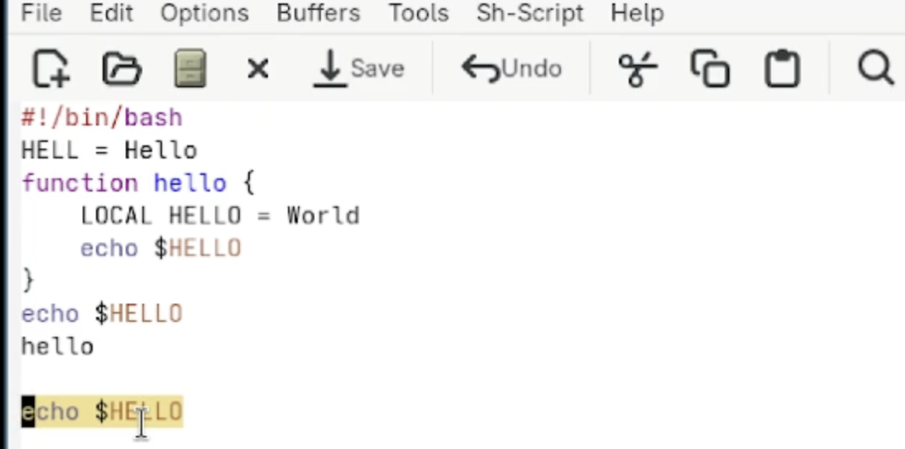

## Титульный слайд

**Дисциплина:** Архитектура компьютеров и операционные системы (раздел «Операционные системы»)  
**Работа:** Лабораторная работа №11 — Текстовой редактор emacs

**Студент:** Лебедев Сергей Алексеевич  
**Преподаватель:** Кулябов Дмитрий Сергеевич, д.ф.-м.н., профессор  
**Организация:** Российский университет дружбы народов (РУДН)

---

## Содержание

1. Цель и задачи работы
2. Основные понятия Emacs
3. Запуск редактора и создание файла
4. Редактирование текста
5. Управление буферами
6. Управление окнами
7. Режимы поиска
8. Выводы

---

## Информация о докладчике

:::::::::::::: {.columns align=center}
::: {.column width="65%"}
- **Лебедев Сергей Алексеевич**
- студент направления **02.03.00 Компьютерные и информационные науки**
- РУДН, 1 курс
- ЛР №11: текстовой редактор emacs
:::

::: {.column width="35%"}

:::
::::::::::::::

---

## Цель работы

Познакомиться с операционной системой Linux. Получить практические навыки работы с редактором Emacs.

---

## Задачи

1. Открыть Emacs, создать файл `lab07.sh` командой `C-x C-f`
2. Набрать текст программы и сохранить файл `C-x C-s`
3. Проделать операции редактирования: вырезать (`C-k`), вставить (`C-y`), выделить (`C-space`), скопировать (`M-w`), отменить (`C-/`)
4. Освоить перемещение курсора: `C-a`, `C-e`, `M-<`, `M->`
5. Управлять буферами: `C-x C-b`, `C-x 0`, `C-x b`
6. Разделить фрейм на 4 части: `C-x 3` и `C-x 2`
7. Освоить режимы поиска: `C-s`, `M-%`, `M-s o`

---

## Основные понятия Emacs

| Термин | Определение |
|--------|-------------|
| Буфер | Объект, представляющий текст в памяти |
| Фрейм | Окно в обычном понимании, содержит окна Emacs |
| Окно | Прямоугольная область фрейма, отображает буфер |
| Минибуфер | Область ввода дополнительной информации |
| Точка вставки | Место вставки/удаления данных в буфере |

Запуск редактора: `emacs` или `emacs &` (фоновый режим)

---

## Запуск Emacs из командной строки

Редактор запущен командой `emacs` в терминале:

```bash
emacs
```


---

## Стартовый экран GNU Emacs

После запуска открылся стартовый экран с обучающими ресурсами:


---

## Создание файла и набор текста

С помощью `C-x C-f` создан файл `lab07.sh`. Введён текст программы, файл сохранён командой `C-x C-s`:

```bash
#!/bin/bash
HELL=Hello
function hello {
LOCAL HELLO=World
echo $HELLO
}
echo $HELLO
hello
```


---

## Редактирование текста

Выполнены стандартные операции редактирования:

| Действие | Комбинация |
|----------|------------|
| Вырезать строку | `C-k` |
| Вставить из буфера | `C-y` |
| Начать выделение | `C-space` |
| Скопировать область | `M-w` |
| Вырезать область | `C-w` |
| Отменить действие | `C-/` |

Перемещение курсора: `C-a` — начало строки, `C-e` — конец строки, `M-<` — начало буфера, `M->` — конец буфера.

---

## Управление буферами

Список активных буферов выведен командой `C-x C-b`:


Переключение между буферами: `C-x b` (без вывода списка). Закрытие окна списка: `C-x 0`.

---

## Управление окнами — разделение фрейма

Фрейм разделён на 4 части: сначала по вертикали (`C-x 3`), затем каждое окно — по горизонтали (`C-x 2`). В каждом окне открыт новый буфер:


---

## Режимы поиска

Освоены три режима поиска:

- **`C-s`** — обычный инкрементный поиск вперёд. Переключение между совпадениями — повторным `C-s`. Выход — `C-g`.
- **`M-%`** — поиск с заменой. Вводится искомый текст, затем текст замены; `!` — заменить все вхождения.
- **`M-s o`** (occur) — выводит в отдельном буфере список **всех строк** с совпадениями и их номерами. Отличается от `C-s` тем, что показывает общую картину сразу, не переходя по вхождениям поочерёдно.



---

## Выводы

- Получены практические навыки работы с редактором **Emacs**
- Освоены ключевые понятия: буфер, окно, фрейм, минибуфер
- Создан и отредактирован bash-скрипт `lab07.sh`
- Отработаны операции редактирования, копирования, вставки и отмены действий
- Освоено управление буферами (`C-x C-b`, `C-x b`) и окнами (`C-x 2`, `C-x 3`)
- Изучены три режима поиска: `C-s`, `M-%` и `M-s o` (occur)

---

## Ресурсы

- Кулябов Д. С. и др. — *Операционные системы*, лабораторный практикум
- GNU Emacs manual: https://www.gnu.org/software/emacs/manual/
- Linux man-pages: https://man7.org/linux/man-pages/
- GitHub: https://github.com/lebedev-s-a
