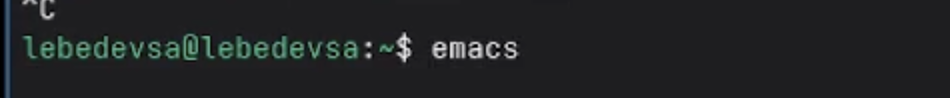
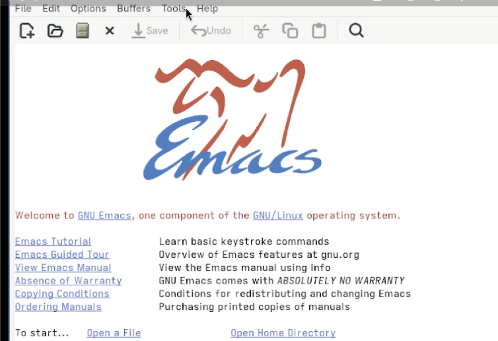
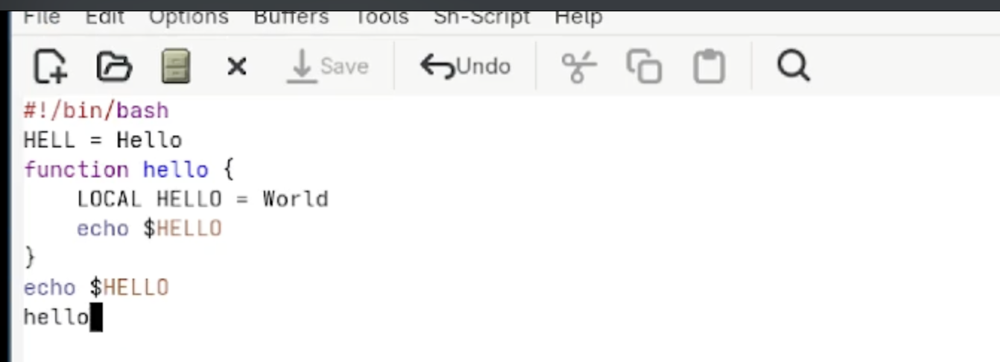
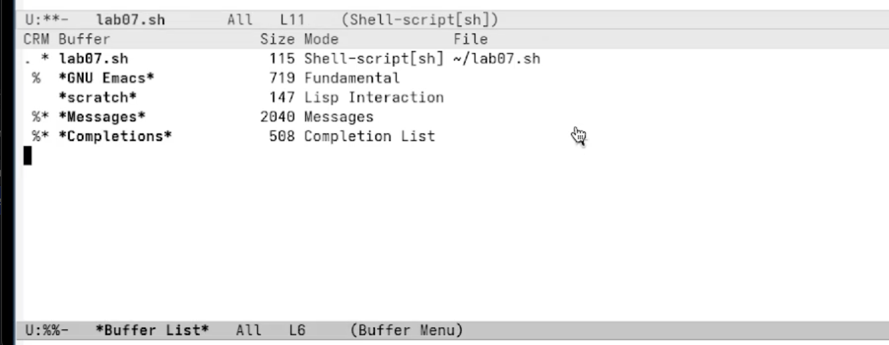
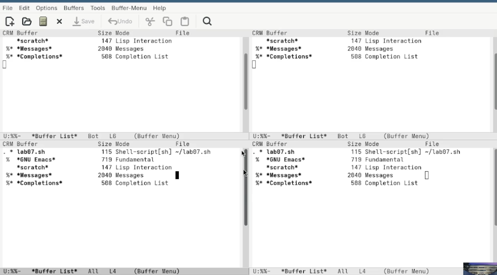

---
## Front matter
title: "Лабораторная работа №11"
subtitle: "Текстовой редактор emacs"
author: "Лебедев Сергей Алексеевич"

## Generic options
lang: ru-RU
toc-title: "Содержание"

## Bibliography
bibliography: bib/cite.bib
csl: pandoc/csl/gost-r-7-0-5-2008-numeric.csl

## Pdf output format
toc: true # Table of contents
toc-depth: 2
lof: true # List of figures
lot: true # List of tables
fontsize: 12pt
linestretch: 1.5
papersize: a4
documentclass: scrreprt

## I18n polyglossia
polyglossia-lang:
  name: russian
  options:
  - spelling=modern
  - babelshorthands=true
polyglossia-otherlangs:
  name: english

## I18n babel
babel-lang: russian
babel-otherlangs: english

## Fonts
mainfont: IBM Plex Serif
romanfont: IBM Plex Serif
sansfont: IBM Plex Sans
monofont: IBM Plex Mono
mathfont: STIX Two Math
mainfontoptions: Ligatures=Common,Ligatures=TeX,Scale=0.94
romanfontoptions: Ligatures=Common,Ligatures=TeX,Scale=0.94
sansfontoptions: Ligatures=Common,Ligatures=TeX,Scale=MatchLowercase,Scale=0.94
monofontoptions: Scale=MatchLowercase,Scale=0.94,FakeStretch=0.9
mathfontoptions:

## Biblatex
biblatex: true
biblio-style: "gost-numeric"
biblatexoptions:
  - parentracker=true
  - backend=biber
  - hyperref=auto
  - language=auto
  - autolang=other*
  - citestyle=gost-numeric

## Pandoc-crossref LaTeX customization
figureTitle: "Рис."
tableTitle: "Таблица"
listingTitle: "Листинг"
lofTitle: "Список иллюстраций"
lotTitle: "Список таблиц"
lolTitle: "Листинги"

## Misc options
indent: true
header-includes:
  - \usepackage{indentfirst}
  - \usepackage{float} # keep figures where there are in the text
  - \floatplacement{figure}{H} # keep figures where there are in the text
---

# Цель работы

Познакомиться с операционной системой Linux. Получить практические навыки работы с редактором Emacs.

# Задание

1. Открыть Emacs и создать файл `lab07.sh` с помощью комбинации `C-x C-f`.
2. Набрать текст программы в созданном файле и сохранить его командой `C-x C-s`.
3. Проделать стандартные процедуры редактирования: вырезать строку (`C-k`), вставить в конец файла (`C-y`), выделить область (`C-space`), скопировать (`M-w`), вставить, вырезать (`C-w`), отменить последнее действие (`C-/`).
4. Освоить команды перемещения курсора: в начало строки (`C-a`), в конец строки (`C-e`), в начало буфера (`M-<`), в конец буфера (`M->`).
5. Управление буферами: вывести список активных буферов (`C-x C-b`), переключиться на другой буфер, закрыть окно со списком (`C-x 0`), переключаться между буферами без вывода списка (`C-x b`).
6. Управление окнами: разделить фрейм на 4 части (`C-x 3`, затем `C-x 2`), в каждом окне открыть новый буфер и ввести текст.
7. Освоить режимы поиска: обычный поиск (`C-s`), выход из поиска (`C-g`), поиск с заменой (`M-%`), поиск с помощью `M-s o`.

# Теоретическое введение

Emacs представляет собой мощный экранный редактор текста, написанный на языке высокого уровня Elisp. Основные понятия:

- **Буфер** — объект, представляющий какой-либо текст. Практически всё взаимодействие с пользователем происходит посредством буферов.
- **Фрейм** — соответствует окну в обычном понимании. Каждый фрейм содержит область вывода и одно или несколько окон Emacs.
- **Окно** — прямоугольная область фрейма, отображающая один из буферов.
- **Минибуфер** — используется для ввода дополнительной информации, всегда отображается в области вывода.
- **Точка вставки** — место вставки (удаления) данных в буфере.

Для запуска Emacs необходимо в командной строке набрать `emacs` (или `emacs &` для работы в фоновом режиме). В командах Emacs используются сочетания с клавишами `Ctrl` (обозначается `C-`) и `Meta` (обозначается `M-`; вместо клавиши Meta можно использовать `Alt` или `Esc`).

# Выполнение лабораторной работы

## Основные команды emacs

### Открытие редактора

Редактор Emacs запущен из командной строки вводом команды `emacs` (рис. -@fig:001).

```bash
emacs
```

{#fig:001 width=70%}

После запуска открылся стартовый экран GNU Emacs с приветственным сообщением и ссылками на обучающие материалы (рис. -@fig:002).

{#fig:002 width=70%}

### Создание файла и набор текста

С помощью комбинации `C-x C-f` создан файл `lab07.sh`. Набран следующий текст программы (рис. -@fig:003):

```bash
#!/bin/bash
HELL=Hello
function hello {
LOCAL HELLO=World
echo $HELLO
}
echo $HELLO
hello
```

Файл сохранён с помощью комбинации `C-x C-s`.

{#fig:003 width=70%}

### Редактирование текста

Проделаны стандартные процедуры редактирования с использованием комбинаций клавиш:

- Вырезана целая строка командой `C-k`.
- Строка вставлена в конец файла командой `C-y`.
- Выделена область текста командой `C-space`.
- Область скопирована в буфер обмена командой `M-w`.
- Область вставлена в конец файла командой `C-y`.
- Область повторно выделена и вырезана командой `C-w`.
- Последнее действие отменено командой `C-/`.

### Перемещение курсора

Освоены команды перемещения курсора: `C-a` — в начало строки; `C-e` — в конец строки; `M-<` — в начало буфера; `M->` — в конец буфера.

## Управление буферами

### Вывод списка буферов

С помощью комбинации `C-x C-b` выведен список активных буферов в новом окне (рис. -@fig:004). В списке отображены буферы `lab07.sh`, `*GNU Emacs*`, `*scratch*`, `*Messages*` и `*Completions*`.

{#fig:004 width=70%}

Выполнено перемещение во вновь открытое окно командой `C-x o`. Произведено переключение на другой буфер. Окно со списком буферов закрыто командой `C-x 0`. Затем выполнялось переключение между буферами без вывода их списка на экран командой `C-x b`.

## Управление окнами

### Разделение фрейма на 4 части

Фрейм разделён на два окна по вертикали командой `C-x 3`, затем каждое из окон разделено по горизонтали командой `C-x 2`. В результате получены четыре окна (рис. -@fig:005). В каждом из четырёх окон открыт новый буфер и введены строки текста.

{#fig:005 width=70%}

## Режим поиска

### Обычный поиск

Выполнено переключение в режим поиска командой `C-s`. Найдено несколько слов, присутствующих в тексте. Переключение между результатами поиска производилось повторным нажатием `C-s`. Выход из режима поиска — нажатием `C-g`.

### Поиск с заменой

Выполнен переход в режим поиска с заменой командой `M-%`. Введён искомый текст, нажат `Enter`, затем введён текст для замены. После подсветки результатов поиска нажата `!` для подтверждения замены.

### Режим M-s o

Опробован режим поиска `M-s o` (occur). В отличие от обычного `C-s`, данный режим выводит в отдельном буфере список всех строк файла, содержащих искомое слово, с указанием номеров строк. Это позволяет получить общую картину всех вхождений сразу, не переходя по ним по одному (рис. -@fig:006).

{#fig:006 width=70%}

# Контрольные вопросы

**1. Кратко охарактеризуйте редактор Emacs.**

Emacs — мощный расширяемый экранный редактор текста, написанный на языке Elisp. Его главная особенность — высокая гибкость и расширяемость: практически любое поведение можно изменить или дополнить с помощью Lisp-кода. Emacs поддерживает множество режимов редактирования для разных языков программирования и форматов файлов, а также включает встроенные инструменты: файловый менеджер, почтовый клиент, органайзер и другие.

**2. Какие особенности данного редактора могут сделать его сложным для освоения новичком?**

Основные трудности для новичка: большое количество нестандартных комбинаций клавиш (`C-x C-f`, `M-%` и т.д.), непривычная терминология (буфер, фрейм, минибуфер, точка вставки), отсутствие интуитивно понятного меню для базовых операций, необходимость знания языка Elisp для тонкой настройки, а также то, что клавиша `Ctrl` используется значительно активнее, чем в большинстве других редакторов.

**3. Своими словами опишите, что такое буфер и окно в терминологии Emacs.**

Буфер в Emacs — это область памяти, в которой хранится текст. Буфер может содержать содержимое файла, результат выполнения команды или служебную информацию. Важно понимать, что буфер — это не файл, а лишь его временное представление в памяти; файл обновляется только при явном сохранении. Окно в Emacs — это прямоугольная область экрана, через которую пользователь видит содержимое одного из буферов. Несколько окон могут отображать один и тот же буфер или разные буферы одновременно.

**4. Можно ли открыть больше 10 буферов в одном окне?**

Да, количество открытых буферов не ограничено. В одном окне единовременно отображается только один буфер, однако между ними можно свободно переключаться командами `C-x b` или через список буферов `C-x C-b`. Все открытые буферы существуют в памяти одновременно независимо от их количества.

**5. Какие буферы создаются по умолчанию при запуске Emacs?**

При запуске Emacs по умолчанию создаются следующие буферы: `*scratch*` — буфер для произвольных заметок и выполнения Lisp-выражений; `*Messages*` — буфер, в котором накапливаются служебные сообщения Emacs; `*GNU Emacs*` — стартовый буфер с приветственным экраном (отображается при первом запуске).

**6. Какие клавиши вы нажмёте, чтобы ввести комбинацию C-c | и C-c C-|?**

Для ввода `C-c |`: удерживая `Ctrl`, нажать `c`, отпустить обе клавиши, затем нажать `|` (без Ctrl). Для ввода `C-c C-|`: удерживая `Ctrl`, нажать `c`, затем, не отпуская `Ctrl`, нажать `|`.

**7. Как поделить текущее окно на две части?**

Для разделения текущего окна по горизонтали используется команда `C-x 2`. Для разделения по вертикали — команда `C-x 3`. После разделения оба окна отображают один и тот же буфер; переключение между окнами выполняется командой `C-x o`.

**8. В каком файле хранятся настройки редактора Emacs?**

Настройки Emacs хранятся в файле `~/.emacs` или в файле `~/.emacs.d/init.el`. В этих файлах на языке Elisp задаются параметры редактора, подключаются пакеты и определяются пользовательские функции и привязки клавиш.

**9. Какую функцию выполняет клавиша и можно ли её переназначить?**

Клавиша `Backspace` в Emacs удаляет символ перед курсором (аналог `C-h` в стандартной конфигурации). Любую клавишу в Emacs можно переназначить с помощью функции `global-set-key` в файле конфигурации, например: `(global-set-key (kbd "C-h") 'backward-delete-char)`.

**10. Какой редактор вам показался удобнее в работе — vi или Emacs? Поясните почему.**

На начальном этапе освоения vi кажется более лаконичным: три чётко разграниченных режима работы и минималистичный интерфейс позволяют быстро понять логику редактора. Emacs предоставляет значительно больше возможностей и расширений, однако требует большего времени на привыкание к комбинациям клавиш. Для профессиональной работы Emacs предпочтительнее благодаря гибкости и интегрированной среде, тогда как vi незаменим при работе на удалённых серверах, где Emacs может быть недоступен.

# Выводы

В ходе выполнения лабораторной работы получены практические навыки работы с текстовым редактором Emacs. Освоены основные понятия редактора: буфер, окно, фрейм, минибуфер, точка вставки. Создан файл `lab07.sh`, в него введён текст программы, выполнены операции редактирования с использованием комбинаций клавиш. Отработаны команды перемещения курсора, управления буферами и окнами. Освоены режимы поиска: обычный (`C-s`), поиск с заменой (`M-%`) и вывод всех вхождений (`M-s o`). Установлено, что режим `M-s o` отличается от обычного поиска выводом полного списка строк с вхождениями в отдельном буфере.

# Список литературы{.unnumbered}

::: {#refs}
:::
