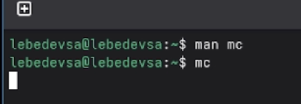
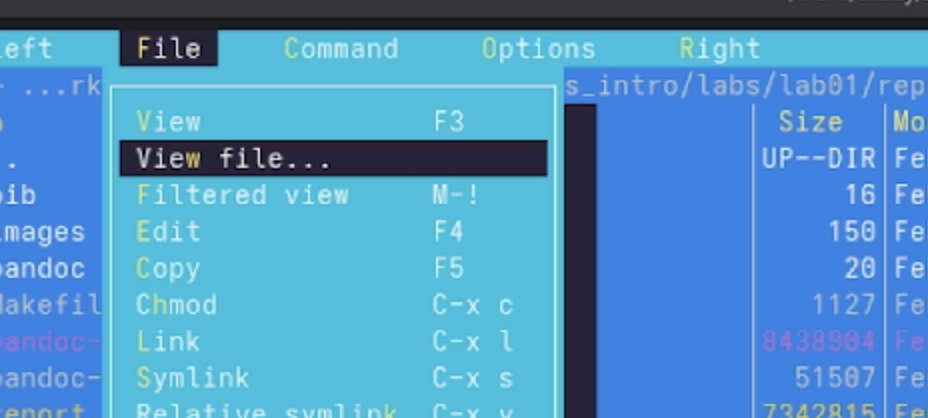
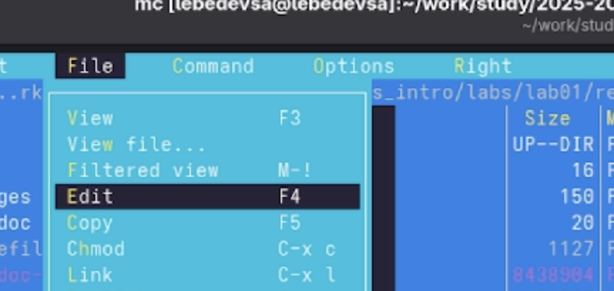
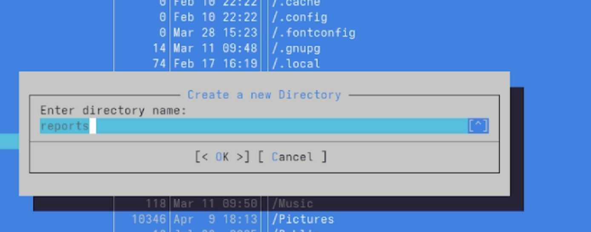
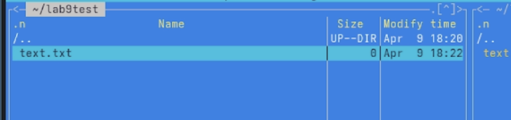
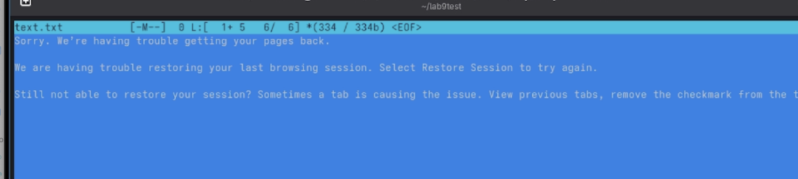
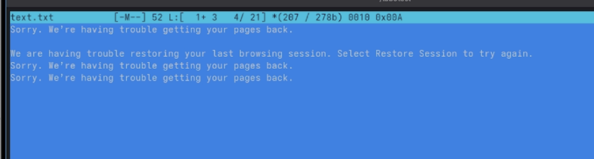
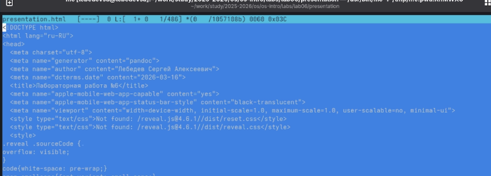
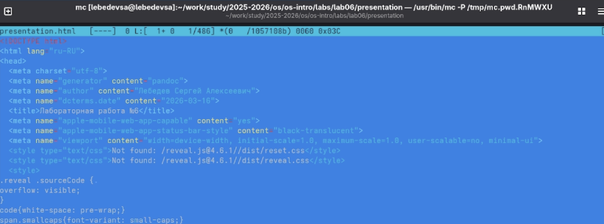

## Титульный слайд

**Дисциплина:** Архитектура компьютеров и операционные системы (раздел «Операционные системы»)  
**Работа:** Лабораторная работа №11 — Программированиевкомандном процессореОСUNIX.

**Студент:** Лебедев Сергей Алексеевич  
**Преподаватель:** Кулябов Дмитрий Сергеевич, д.ф.-м.н., профессор  
**Организация:** Российский университет дружбы народов (РУДН)

---

## Содержание

1. Цель и задачи работы
2. Изучение справки и запуск mc
3. Операции с панелями и файлами
4. Подменю «Файл»: просмотр, редактирование, создание каталога
5. Подменю «Команда»: поиск, история, анализ меню
6. Встроенный редактор mc: создание и редактирование файла
7. Подсветка синтаксиса
8. Выводы

---

## Информация о докладчике

:::::::::::::: {.columns align=center}
::: {.column width="65%"}
- **Лебедев Сергей Алексеевич**
- студент направления **02.03.00 Компьютерные и информационные науки**
- РУДН, 1 курс
- ЛР №9: командная оболочка Midnight Commander
:::

::: {.column width="35%"}

:::
::::::::::::::

---

## Цель работы

Освоение основных возможностей командной оболочки Midnight Commander. Приобретение навыков практической работы по просмотру каталогов и файлов; манипуляций с ними.

---

## Задачи

1. Изучить информацию о mc, вызвав `man mc`, запустить mc из командной строки
2. Выполнить операции с панелями и файлами с помощью управляющих клавиш
3. Использовать подменю **Файл**: просмотр (F3), редактирование (F4), создание каталога (F7)
4. Использовать подменю **Команда**: поиск файла, история команд, анализ меню
5. Создать файл `text.txt` и выполнить манипуляции с текстом во встроенном редакторе
6. Включить/выключить подсветку синтаксиса в редакторе mc

---

## Изучение справки и запуск mc

Изучена справочная страница `man mc`. Затем Midnight Commander запущен из командной строки:

```bash
man mc
mc
```


---

## Подменю «Файл»: просмотр файла (F3)

С помощью подменю **Файл** выбран пункт **Просмотр (F3)**. Выполнен просмотр содержимого текстового файла без возможности редактирования:

```
F3 — просмотр содержимого файла
```


---

## Подменю «Файл»: создание каталога (F7)

С помощью клавиши **F7** создан новый каталог `june` в директории `~/reports/monthly`. В диалоговом окне введено имя нового каталога:

```
F7 — создание нового подкаталога
```



---

## Подменю «Файл»: редактирование (F4)

Через подменю **Файл → Правка (F4)** запущен встроенный редактор Midnight Commander для редактирования выбранного файла:

```
F4 — открыть файл в редакторе mc
```



---

## Создание каталога reports

В домашнем каталоге создан каталог `reports` через диалоговое окно **Create a new Directory**:



---

## Встроенный редактор: создание файла text.txt

В каталоге `~/lab9test` создан текстовый файл `text.txt`. Файл выделен в панели mc и готов к открытию в редакторе:



---

## Встроенный редактор: вставка текста

Файл `text.txt` открыт в редакторе. В открытый файл вставлен небольшой фрагмент текста, скопированный из внешнего источника:



---

## Встроенный редактор: операции с фрагментами текста

Выполнены манипуляции с текстом с помощью горячих клавиш:

| Действие | Клавиша |
|----------|---------|
| Начало/конец выделения | F3 |
| Копировать фрагмент | F5 |
| Переместить фрагмент | F6 |
| Удалить строку | Ctrl-y |
| Сохранить | F2 |



---

## Встроенный редактор: отмена действия

С помощью **Ctrl-u** (Undo) через меню **Edit** отменено последнее выполненное действие:


---

## Встроенный редактор: навигация и итоговое сохранение

Выполнен переход в конец файла, добавлена строка `hello everybody`. Затем переход в начало, добавлен текст `hi.`. Файл сохранён и закрыт:


---

## Открытие файла с исходным кодом

Открыт файл `presentation.html` во встроенном редакторе mc. Выполнен просмотр содержимого HTML-файла:



---

## Подсветка синтаксиса

Через меню редактора включена подсветка синтаксиса HTML-файла — теги и атрибуты выделяются цветом:



---

## Выводы

- Изучена справочная страница `man mc`, запущен Midnight Commander из командной строки
- Освоены операции с файлами через управляющие клавиши: просмотр **F3**, редактирование **F4**, создание каталогов **F7**
- Использовано подменю **Команда**: поиск файлов, история команд, анализ файла меню
- Создан и отредактирован файл `text.txt`: вставка, копирование, перемещение фрагментов, отмена действий, навигация по файлу
- Изучена подсветка синтаксиса во встроенном редакторе на примере HTML-файла

---

## Ресурсы

- Кулябов Д. С. и др. — *Операционные системы*, лабораторный практикум
- GNU Midnight Commander: https://midnight-commander.org/
- Linux man-pages: https://man7.org/linux/man-pages/
- GitHub: https://github.com/lebedev-s-a
