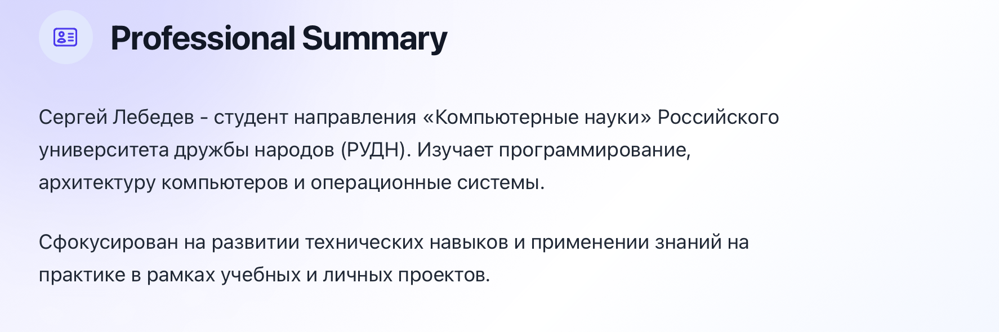
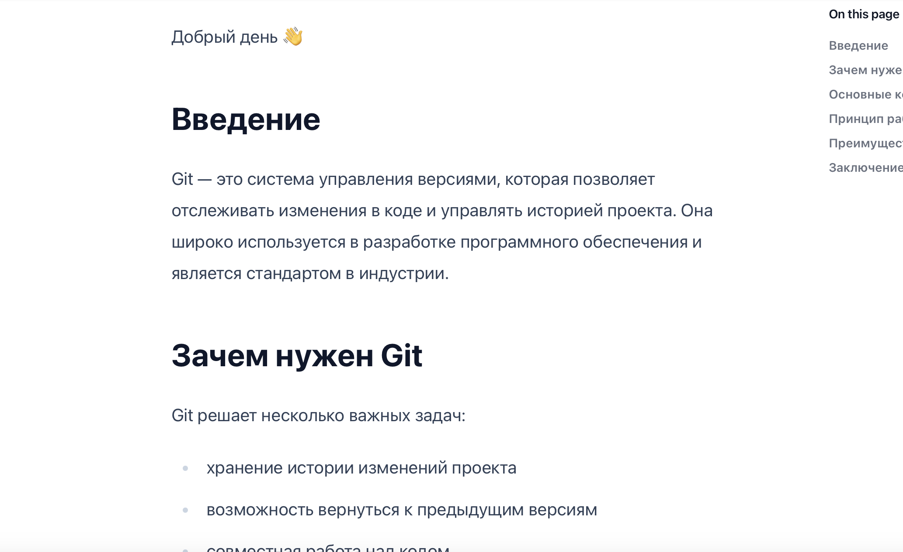

## Титульный слайд

**Дисциплина:** Архитектура компьютеров и операционные системы (раздел «Операционные системы»)  
**Работа:** Индивидуальный проект. Этап 2 — Добавление данных о владельце сайта

**Студент:** Лебедев Сергей Алексеевич  
**Преподаватель:** Кулябов Дмитрий Сергеевич, д.ф.-м.н., профессор  
**Организация:** Российский университет дружбы народов (РУДН)

---

## Содержание

1. Цель и задачи работы
2. Фотография владельца сайта
3. Краткое описание (Biography)
4. Интересы (Interests)
5. Образование (Education)
6. Пост по прошедшей неделе
7. Пост «Управление версиями. Git»
8. Выводы

---

## Цель работы

Наполнить персональный сайт информацией о владельце: разместить фотографию, краткое описание, список интересов и сведения об образовании, а также создать два поста — по прошедшей неделе и на тему управления версиями Git.

---

## Задачи

1. Разместить фотографию владельца сайта
2. Разместить краткое описание владельца сайта (Biography)
3. Добавить информацию об интересах (Interests)
4. Добавить информацию об образовании (Education)
5. Сделать пост по прошедшей неделе
6. Добавить пост на тему **Управление версиями. Git**

---

## Фотография владельца сайта

На главной странице сайта размещена фотография и полное имя владельца — Лебедев Сергей Алексеевич.

---

## Краткое описание (Biography)

В разделе **Professional Summary** добавлено краткое описание: студент направления «Компьютерные науки» РУДН, изучающий программирование, архитектуру компьютеров и операционные системы.

---

## Интересы (Interests)

В разделе **Interests** перечислены интересы владельца сайта:

- Программирование на Python/C++
- Компьютерные технологии
- Веб-разработка
- Изучение иностранных языков

---

## Образование (Education)

В разделе **Education** добавлена информация об образовании: бакалавриат по направлению «Компьютерные науки» в РУДН, с сентября 2025 года по настоящее время.

---

## Пост по прошедшей неделе

Создан пост, описывающий деятельность за прошедшую неделю: работа над лабораторными заданиями по ОС, изучение основ Unix-систем, настройка окружения и работа с командной строкой.

---

## Пост по прошедшей неделе (продолжение)

Пост опубликован 18 марта 2026 года на персональном сайте, построенном на Hugo.

---

## Пост «Управление версиями. Git»

Создан тематический пост. В посте раскрываются разделы: введение, зачем нужен Git, основные концепции, принцип работы, преимущества и заключение.

---

## Выводы

- Размещена фотография и полное имя владельца сайта
- Добавлено краткое профессиональное описание (Professional Summary)
- Заполнен раздел интересов: Python/C++, компьютерные технологии, веб-разработка, изучение языков
- Заполнен раздел образования: бакалавриат РУДН, «Компьютерные науки», с 2025 г.
- Создан еженедельный пост об изучении Unix-систем и работе с командной строкой
- Создан тематический пост «Управление версиями. Git» с полноценной структурой

---

## Ресурсы

- Hugo Academic: https://academic-demo.netlify.app
- GitHub: https://github.com/lebedev-s-a
