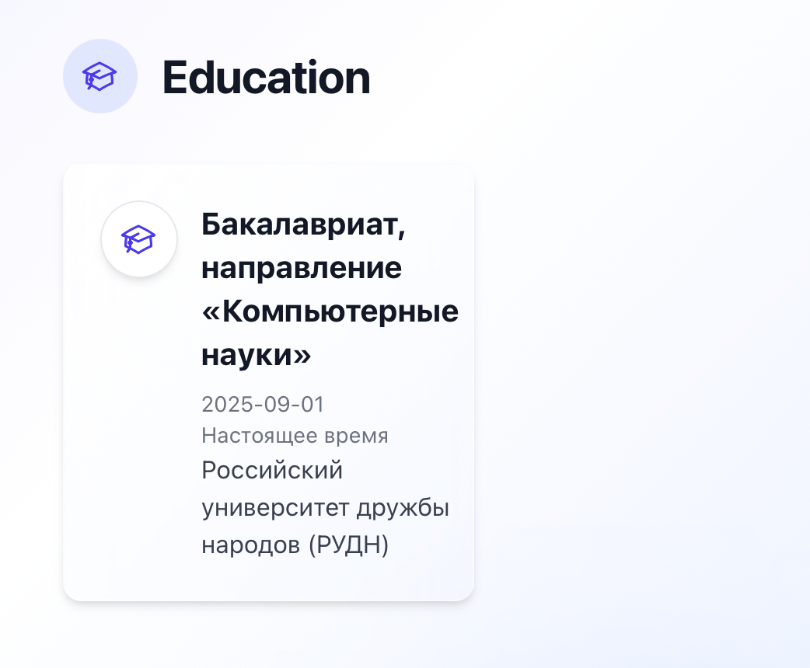
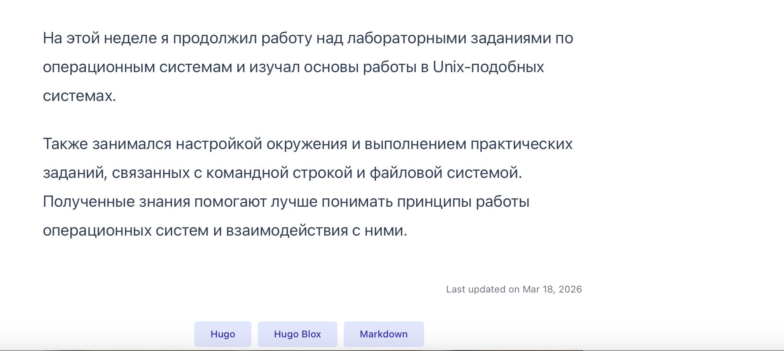

---
## Front matter
title: "Индивидуальный проект. Этап 2"
subtitle: "Добавление данных о владельце сайта"
author: "Лебедев С. А."

## Generic options
lang: ru-RU
toc-title: "Содержание"

## Bibliography
bibliography: bib/cite.bib
csl: pandoc/csl/gost-r-7-0-5-2008-numeric.csl

## Pdf output format
toc: true # Table of contents
toc-depth: 2
lof: true # List of figures
lot: true # List of tables
fontsize: 12pt
linestretch: 1.5
papersize: a4
documentclass: scrreprt

## I18n polyglossia
polyglossia-lang:
  name: russian
  options:
  - spelling=modern
  - babelshorthands=true
polyglossia-otherlangs:
  name: english

## I18n babel
babel-lang: russian
babel-otherlangs: english

## Fonts
mainfont: IBM Plex Serif
romanfont: IBM Plex Serif
sansfont: IBM Plex Sans
monofont: IBM Plex Mono
mathfont: STIX Two Math
mainfontoptions: Ligatures=Common,Ligatures=TeX,Scale=0.94
romanfontoptions: Ligatures=Common,Ligatures=TeX,Scale=0.94
sansfontoptions: Ligatures=Common,Ligatures=TeX,Scale=MatchLowercase,Scale=0.94
monofontoptions: Scale=MatchLowercase,Scale=0.94,FakeStretch=0.9
mathfontoptions:

## Biblatex
biblatex: true
biblio-style: "gost-numeric"
biblatexoptions:
  - parentracker=true
  - backend=biber
  - hyperref=auto
  - language=auto
  - autolang=other*
  - citestyle=gost-numeric

## Pandoc-crossref LaTeX customization
figureTitle: "Рис."
tableTitle: "Таблица"
listingTitle: "Листинг"
lofTitle: "Список иллюстраций"
lotTitle: "Список таблиц"
lolTitle: "Листинги"

## Misc options
indent: true
header-includes:
  - \usepackage{indentfirst}
  - \usepackage{float} # keep figures where there are in the text
  - \floatplacement{figure}{H} # keep figures where there are in the text
---

# Цель работы

Целью данной работы является наполнение персонального сайта информацией о владельце: размещение фотографии, краткого описания, списка интересов и сведений об образовании, а также создание двух постов — по прошедшей неделе и на тему управления версиями Git.

# Задание

1. Добавить к сайту данные о себе:
   - Разместить фотографию владельца сайта.
   - Разместить краткое описание владельца сайта (Biography).
   - Добавить информацию об интересах (Interests).
   - Добавить информацию об образовании (Education).
2. Сделать пост по прошедшей неделе.
3. Добавить пост на тему по выбору: **Управление версиями. Git.**

# Выполнение лабораторной работы

## Добавление данных о себе

### Фотография и имя владельца

На главной странице сайта размещена фотография и полное имя владельца — Лебедев Сергей Алексеевич (рис. -@fig:001).

{#fig:001 width=70%}

### Краткое описание (Biography / Professional Summary)

В разделе **Professional Summary** добавлено краткое описание владельца сайта: студент направления «Компьютерные науки» РУДН, изучающий программирование, архитектуру компьютеров и операционные системы, сфокусированный на развитии технических навыков и применении знаний на практике (рис. -@fig:002).

{#fig:002 width=70%}

### Интересы (Interests)

В раздел **Interests** внесены интересы владельца сайта: программирование на Python/C++, компьютерные технологии, веб-разработка и изучение иностранных языков (рис. -@fig:003).

{#fig:003 width=70%}

### Образование (Education)

В разделе **Education** добавлена информация об образовании: бакалавриат по направлению «Компьютерные науки» в Российском университете дружбы народов (РУДН), начиная с сентября 2025 года по настоящее время (рис. -@fig:004).

{#fig:004 width=70%}

## Пост по прошедшей неделе

Создан пост, описывающий деятельность за прошедшую неделю: продолжение работы над лабораторными заданиями по операционным системам, изучение основ работы в Unix-подобных системах, настройка окружения и выполнение практических заданий, связанных с командной строкой и файловой системой. Пост опубликован 18 марта 2026 года (рис. -@fig:005, -@fig:006).

{#fig:005 width=70%}

{#fig:006 width=70%}

## Пост на тему «Управление версиями. Git»

Создан тематический пост на тему управления версиями с использованием Git. В посте раскрываются следующие разделы: введение, зачем нужен Git, основные концепции, принцип работы, преимущества и заключение. Git представлен как система управления версиями, широко используемая в разработке программного обеспечения и являющаяся стандартом индустрии (рис. -@fig:007).

{#fig:007 width=70%}

# Выводы

В ходе выполнения второго этапа персонального проекта сайт был наполнен информацией о владельце: размещены фотография, краткое профессиональное описание, список интересов (Python/C++, компьютерные технологии, веб-разработка, изучение языков) и сведения об образовании (бакалавриат РУДН, направление «Компьютерные науки»). Созданы два поста: еженедельный отчёт о работе с Unix-системами и тематический пост об управлении версиями с помощью Git.

# Список литературы{.unnumbered}

::: {#refs}
:::
