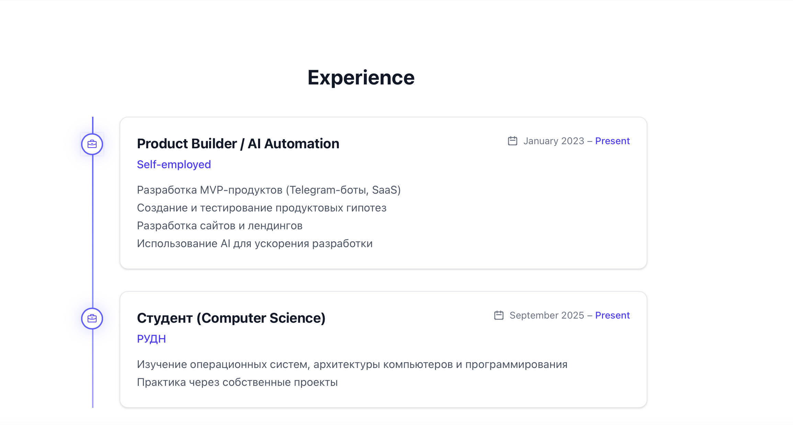
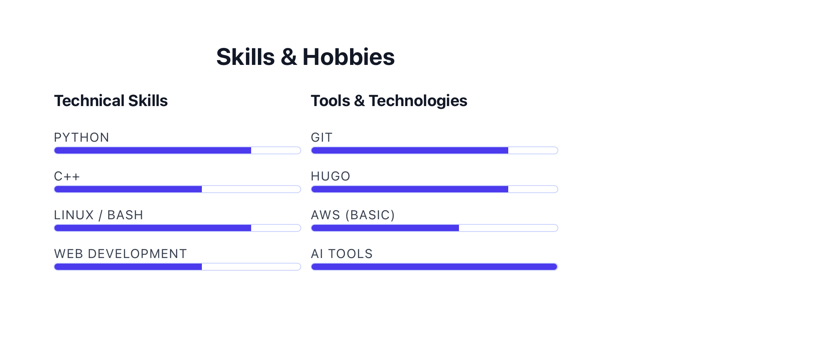
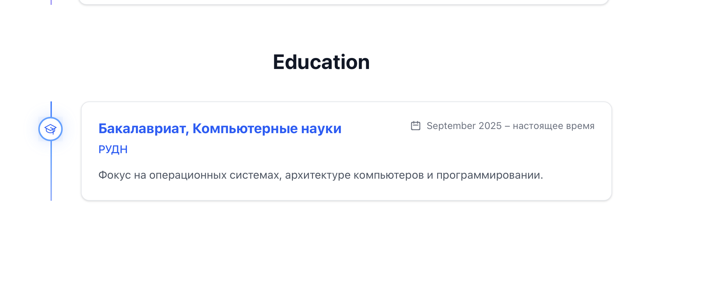
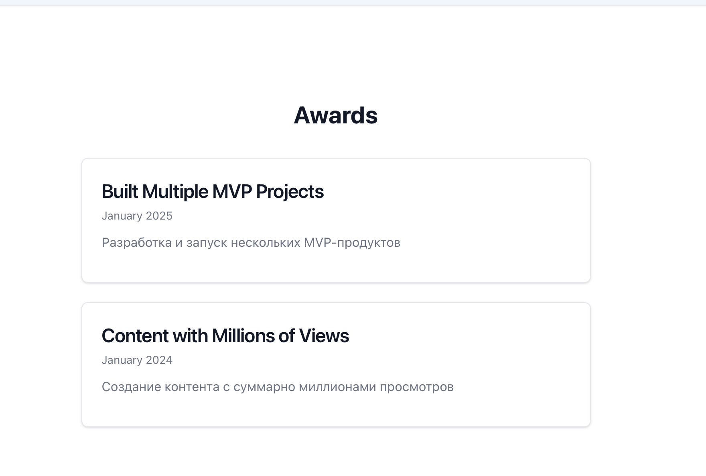
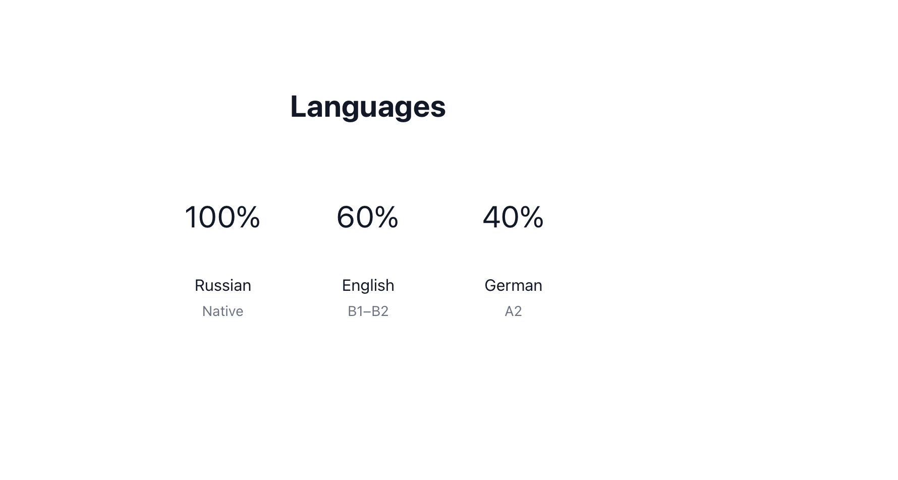
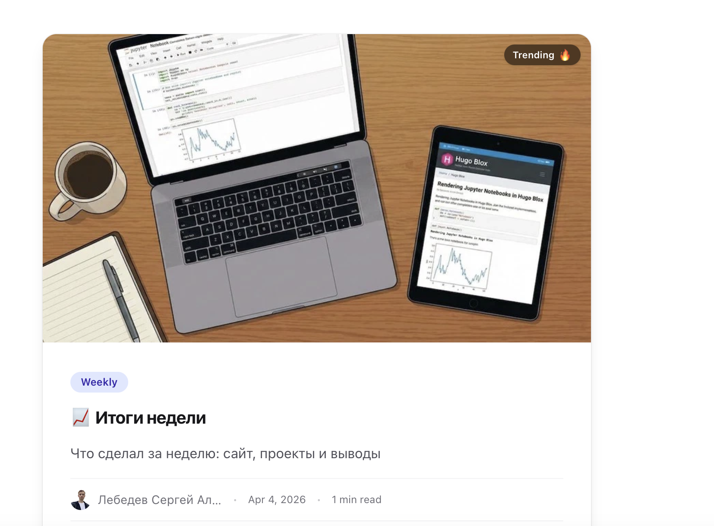
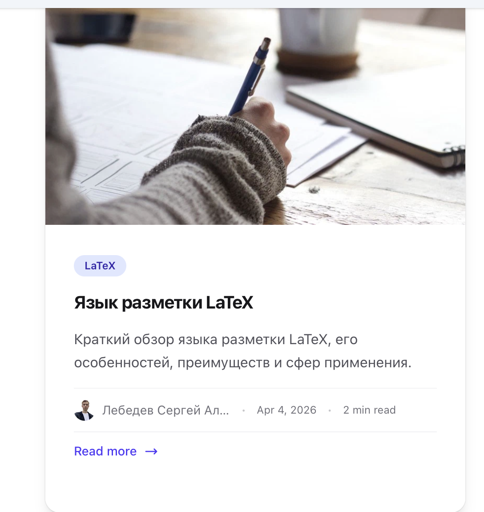

## Титульный слайд

**Дисциплина:** Архитектура компьютеров и операционные системы (раздел «Операционные системы»)  
**Работа:** Индивидуальный проект. Этап 3 — Добавление достижений к сайту

**Студент:** Лебедев Сергей Алексеевич  
**Преподаватель:** Кулябов Дмитрий Сергеевич, д.ф.-м.н., профессор  
**Организация:** Российский университет дружбы народов (РУДН)

---

## Содержание

1. Цель и задачи работы
2. Раздел «Опыт» (Experience)
3. Раздел «Навыки» (Skills)
4. Раздел «Образование» (Education)
5. Раздел «Достижения» (Accomplishments)
6. Раздел «Языки» (Languages)
7. Пост по прошедшей неделе
8. Пост «Язык разметки LaTeX»
9. Выводы

---

## Информация о докладчике

:::::::::::::: {.columns align=center}
::: {.column width="65%"}
- **Лебедев Сергей Алексеевич**
- студент направления **02.03.00 Компьютерные и информационные науки**
- РУДН, 1 курс
- Этап 3: добавление достижений к персональному сайту
:::

::: {.column width="35%"}

:::
::::::::::::::

---

## Цель работы

Добавить к персональному сайту информацию о достижениях владельца: разделы об опыте работы, навыках, образовании и личных достижениях, а также создать два поста — по прошедшей неделе и на тему языка разметки LaTeX.

---

## Задачи

1. Добавить информацию о навыках (Skills)
2. Добавить информацию об опыте (Experience)
3. Добавить информацию о достижениях (Accomplishments)
4. Сделать пост по прошедшей неделе
5. Добавить пост на тему **Язык разметки LaTeX**

---

## Раздел «Опыт» (Experience)

В разделе Experience добавлен вертикальный таймлайн с двумя карточками:

- **Product Builder / AI Automation** (self-employed, Jan 2023 – Present) — разработка MVP, ботов, сайтов и AI-решений
- **Студент** (Computer Science, РУДН, Sep 2025 – Present) — обучение и практика по направлению «Компьютерные науки»

---

## Раздел «Навыки» (Skills)

В разделе Skills & Hobbies добавлены две колонки с прогресс-барами:

| Technical Skills | Tools & Technologies |
|---|---|
| Python | Git |
| C++ | Hugo |
| Linux/Bash | AWS (Basic) |
| Web Development | AI Tools |

---

## Раздел «Образование» (Education)

В разделе Education присутствует карточка:

- **Бакалавриат, Компьютерные науки** (РУДН, Sep 2025 – настоящее время)
- Фокус на операционных системах, архитектуре компьютеров и программировании

---

## Раздел «Достижения» (Accomplishments / Awards)

В разделе Awards добавлены две карточки с личными достижениями:

- **Built Multiple MVP Projects** (Jan 2025) — разработка нескольких продуктов с нуля
- **Content with Millions of Views** (Jan 2024) — создание контента, набравшего миллионы просмотров

---

## Раздел «Языки» (Languages)

В раздел Languages добавлена информация о владении языками:

- **Russian** — 100% (Native)
- **English** — 60% (B1–B2)
- **German** — 40% (A2)

---

## Пост по прошедшей неделе

Создан пост «Итоги недели», описывающий работу над сайтом: настройку Hugo/Hugo Blox, поднятие сервера, заполнение разделов профиля и приведение сайта в рабочий вид.

---

## Пост по прошедшей неделе (продолжение)

Пост содержит список ключевых пунктов:

- Разобрался с Hugo/Hugo Blox
- Поднял сервер
- Заполнил разделы сайта
- Привёл профиль в нормальный вид

---

## Пост «Язык разметки LaTeX»

Создан тематический пост на тему языка разметки LaTeX — профессионального инструмента для подготовки научных и технических документов.

---

## Выводы

- Добавлен раздел **Experience** с таймлайном двух позиций
- Заполнен раздел **Skills**: технические навыки и инструменты с прогресс-барами
- Раздел **Education** дополнен описанием программы обучения
- Добавлен раздел **Awards** с двумя личными достижениями
- Заполнен раздел **Languages**: русский, английский, немецкий
- Создан еженедельный пост «Итоги недели» с описанием работы над сайтом
- Создан тематический пост «Язык разметки LaTeX»

---

## Ресурсы

- Hugo Academic: https://academic-demo.netlify.app
- LaTeX Project: https://www.latex-project.org
- GitHub: https://github.com/lebedev-s-a
