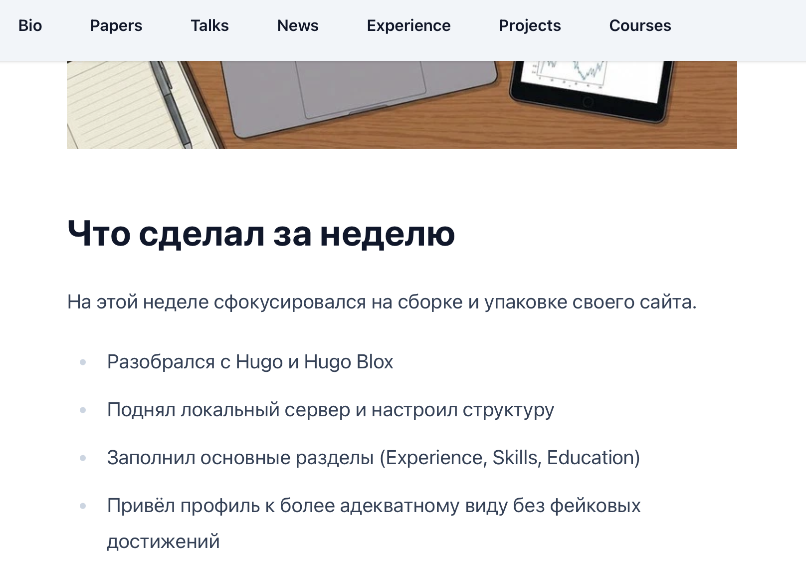

---
## Front matter
title: "Индивидуальный проект. Этап 3"
subtitle: "Добавление достижений к сайту"
author: "Лебедев С. А."

## Generic options
lang: ru-RU
toc-title: "Содержание"

## Bibliography
bibliography: bib/cite.bib
csl: pandoc/csl/gost-r-7-0-5-2008-numeric.csl

## Pdf output format
toc: true # Table of contents
toc-depth: 2
lof: true # List of figures
lot: true # List of tables
fontsize: 12pt
linestretch: 1.5
papersize: a4
documentclass: scrreprt

## I18n polyglossia
polyglossia-lang:
  name: russian
  options:
  - spelling=modern
  - babelshorthands=true
polyglossia-otherlangs:
  name: english

## I18n babel
babel-lang: russian
babel-otherlangs: english

## Fonts
mainfont: IBM Plex Serif
romanfont: IBM Plex Serif
sansfont: IBM Plex Sans
monofont: IBM Plex Mono
mathfont: STIX Two Math
mainfontoptions: Ligatures=Common,Ligatures=TeX,Scale=0.94
romanfontoptions: Ligatures=Common,Ligatures=TeX,Scale=0.94
sansfontoptions: Ligatures=Common,Ligatures=TeX,Scale=MatchLowercase,Scale=0.94
monofontoptions: Scale=MatchLowercase,Scale=0.94,FakeStretch=0.9
mathfontoptions:

## Biblatex
biblatex: true
biblio-style: "gost-numeric"
biblatexoptions:
  - parentracker=true
  - backend=biber
  - hyperref=auto
  - language=auto
  - autolang=other*
  - citestyle=gost-numeric

## Pandoc-crossref LaTeX customization
figureTitle: "Рис."
tableTitle: "Таблица"
listingTitle: "Листинг"
lofTitle: "Список иллюстраций"
lotTitle: "Список таблиц"
lolTitle: "Листинги"

## Misc options
indent: true
header-includes:
  - \usepackage{indentfirst}
  - \usepackage{float} # keep figures where there are in the text
  - \floatplacement{figure}{H} # keep figures where there are in the text
---

# Цель работы

Целью данной работы является добавление к персональному сайту информации о достижениях владельца: заполнение разделов об опыте работы, навыках, образовании и личных достижениях, а также создание двух постов — по прошедшей неделе и на тему языка разметки LaTeX.

# Задание

1. Добавить к сайту достижения:
   - Добавить информацию о навыках (Skills).
   - Добавить информацию об опыте (Experience).
   - Добавить информацию о достижениях (Accomplishments).
2. Сделать пост по прошедшей неделе.
3. Добавить пост на тему по выбору: **Язык разметки LaTeX**.

# Выполнение лабораторной работы

## Добавление информации об опыте (Experience)

В разделе **Experience** персонального сайта добавлен вертикальный таймлайн с двумя карточками. Первая карточка — **Product Builder / AI Automation** (self-employed, Jan 2023 – Present) — описывает самостоятельную деятельность по разработке MVP-продуктов, чат-ботов, сайтов и AI-решений. Вторая карточка — **Студент** (Computer Science, РУДН, Sep 2025 – Present) — отражает текущее обучение по направлению «Компьютерные науки» с упором на практику (рис. -@fig:001).

{#fig:001 width=70%}

## Добавление информации о навыках (Skills)

В разделе **Skills & Hobbies** добавлены две колонки с прогресс-барами, отражающие уровень владения технологиями. В колонке **Technical Skills** перечислены: Python, C++, Linux/Bash, Web Development. В колонке **Tools & Technologies** указаны: Git, Hugo, AWS (Basic), AI Tools. Визуальное представление в виде прогресс-баров даёт наглядное представление об уровне владения каждым инструментом (рис. -@fig:002).

{#fig:002 width=70%}

## Раздел «Образование» (Education)

Раздел **Education** содержит карточку с информацией о текущем обучении: бакалавриат по направлению «Компьютерные науки» в Российском университете дружбы народов (РУДН), начиная с сентября 2025 года по настоящее время. В описании указан фокус программы: операционные системы, архитектура компьютеров и программирование (рис. -@fig:003).

{#fig:003 width=70%}

## Добавление достижений (Accomplishments / Awards)

В разделе **Awards** добавлены две карточки с личными достижениями. Первая — **Built Multiple MVP Projects** (Jan 2025) — фиксирует опыт самостоятельной разработки нескольких продуктов с нуля. Вторая — **Content with Millions of Views** (Jan 2024) — отражает успех в создании контента, набравшего миллионы просмотров (рис. -@fig:004).

{#fig:004 width=70%}

## Добавление информации о языках (Languages)

В раздел **Languages** добавлена информация о владении тремя языками с указанием уровня в процентах: русский — 100% (родной), английский — 60% (B1–B2), немецкий — 40% (A2) (рис. -@fig:005).

{#fig:005 width=70%}

## Пост по прошедшей неделе

Создан еженедельный пост «Итоги недели», описывающий ключевые события прошедшей недели: работу с персональным сайтом, настройку Hugo/Hugo Blox, поднятие сервера, заполнение разделов профиля и приведение сайта в рабочий вид. Карточка поста отображается на главной странице блога с меткой «Trending», подзаголовком и указанием автора и даты публикации (рис. -@fig:006).

{#fig:006 width=70%}

Страница поста содержит заголовок «Что сделал за неделю», краткое описание и список ключевых пунктов: разобрался с Hugo/Hugo Blox, поднял сервер, заполнил разделы сайта, привёл профиль в нормальный вид (рис. -@fig:007).

{#fig:007 width=70%}

## Пост на тему «Язык разметки LaTeX»

Создан тематический пост, посвящённый языку разметки LaTeX. LaTeX — профессиональная система компьютерной вёрстки, широко применяемая для подготовки научных статей, дипломных работ и технической документации. Карточка поста отображается в блоге с меткой «LaTeX», содержит заголовок, краткое описание, имя автора, дату публикации и кнопку «Read more» (рис. -@fig:008).

{#fig:008 width=70%}

# Выводы

В ходе выполнения третьего этапа индивидуального проекта персональный сайт был дополнен информацией о достижениях владельца. Добавлен раздел **Experience** с таймлайном двух позиций: самостоятельная профессиональная деятельность и обучение в РУДН. Заполнен раздел **Skills** с прогресс-барами технических навыков и инструментов. Раздел **Education** дополнен описанием программы обучения. Добавлен раздел **Awards** с двумя личными достижениями. Заполнен раздел **Languages** с информацией о владении тремя языками. Созданы два поста: еженедельный отчёт «Итоги недели» и тематический пост «Язык разметки LaTeX».

# Список литературы{.unnumbered}

::: {#refs}
:::
