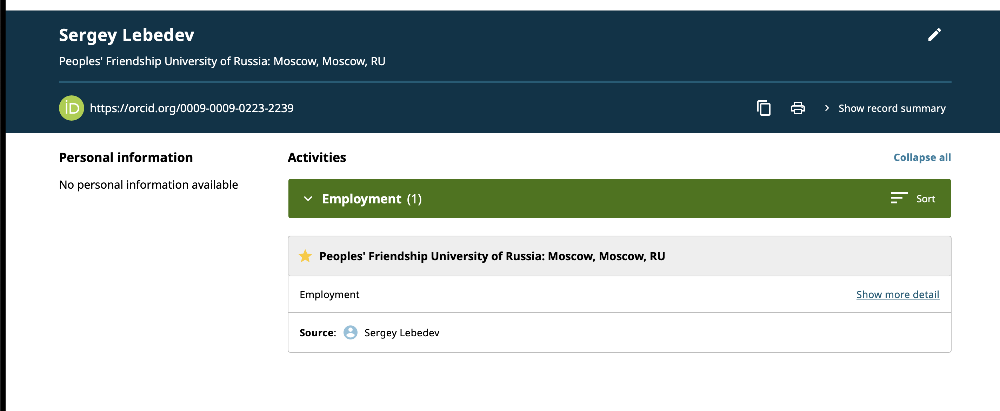
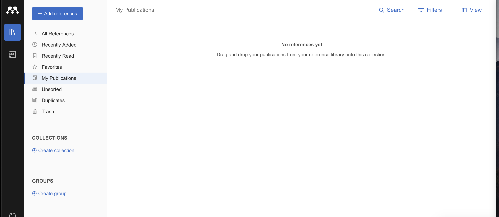
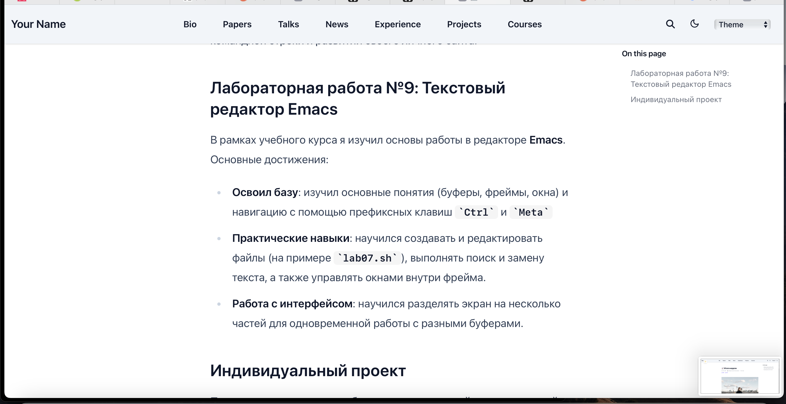
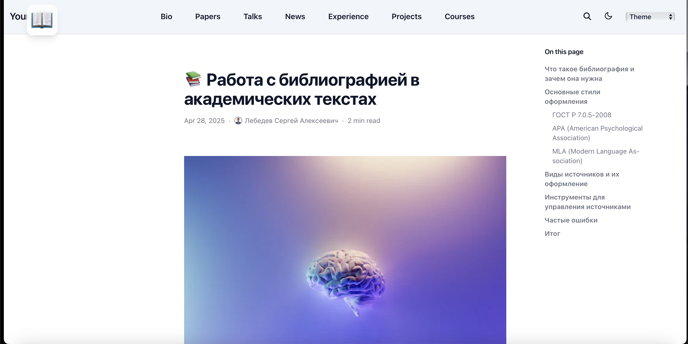

## Титульный слайд

**Дисциплина:** Архитектура компьютеров и операционные системы (раздел «Операционные системы»)  
**Работа:** Индивидуальный проект. Этап 4 — Добавление ссылок на научные ресурсы

**Студент:** Лебедев Сергей Алексеевич  
**Преподаватель:** Кулябов Дмитрий Сергеевич, д.ф.-м.н., профессор  
**Организация:** Российский университет дружбы народов (РУДН)

---

## Содержание

1. Цель и задачи работы
2. Ссылки на ресурсы на сайте
3. GitHub — профиль
4. Google Scholar — профиль
5. ORCID — профиль
6. Academia.edu — профиль
7. Mendeley — библиотека публикаций
8. eLibrary.ru — регистрация
9. Пост по прошедшей неделе
10. Пост «Работа с библиографией»
11. Выводы

---

## Информация о докладчике

:::::::::::::: {.columns align=center}
::: {.column width="65%"}
- **Лебедев Сергей Алексеевич**
- студент направления **02.03.00 Компьютерные и информационные науки**
- РУДН, 1 курс
- Этап 4: добавление ссылок на научные и библиометрические ресурсы
:::

::: {.column width="35%"}

:::
::::::::::::::

---

## Цель работы

Зарегистрироваться на научных и библиометрических платформах и разместить ссылки на них на персональном сайте, а также создать два поста — по прошедшей неделе и на тему работы с библиографией.

---

## Задачи

1. Зарегистрироваться на ресурсах: eLibrary, Google Scholar, ORCID, Mendeley, ResearchGate, Academia.edu, arXiv, GitHub
2. Разместить ссылки на эти ресурсы на персональном сайте
3. Сделать пост по прошедшей неделе
4. Добавить пост на тему **Работа с библиографией**

---

## Ссылки на ресурсы на сайте

На персональном сайте в разделе РУДН размещены иконки-ссылки на все зарегистрированные научные и библиометрические платформы: GitHub, Google Scholar, ORCID, Mendeley, Academia.edu и Hugo.

---

## GitHub — профиль

Создан профиль на GitHub под именем **lebedev-s-a**. В профиле размещены публичные репозитории учебных работ: `study_2025-2026_arh-pc` (TeX), `study_2025-2026_os-intro` (HTML), `git-extended`, `mysite` (форк HugoBlox), `password-store`, `personal_site`.

---

## Google Scholar — профиль

Создан профиль в Google Scholar на имя **Sergey**, аффилиация — Student of Computer Since, RUDN, подтверждённый email на домене rudn.ru. Публикации в профиле отсутствуют, поскольку учебная деятельность ещё не включает научных статей.

---

## ORCID — профиль

Зарегистрирован профиль ORCID для **Sergey Lebedev** (https://orcid.org/0009-0009-0223-2239). В разделе Employment указана аффилиация: Peoples' Friendship University of Russia, Moscow, RU.

---

## Academia.edu — профиль

Создан профиль на Academia.edu — **Sergey Lebedev**, People's Friendship University of Russia, Computer science, Undergraduate. Публикации в разделе Uploads пока отсутствуют.

---

## Mendeley — библиотека публикаций

Создан аккаунт в Mendeley Reference Manager. Библиотека публикаций пуста (раздел My Publications). Платформа готова к использованию для управления библиографическими ссылками в будущих работах.

---

## eLibrary.ru — регистрация

Выполнена регистрация на Научной электронной библиотеке **eLibrary.ru**. Платформа предоставляет доступ к РИНЦ, инструментам для авторов (Science Index) и научным журналам открытого доступа.

---

## Пост по прошедшей неделе

Создан пост «Итоги недели» (Apr 28, 2026). В посте описаны ключевые события: выполнение лабораторной работы №9 (текстовый редактор Emacs) и работа над индивидуальным проектом.

---

## Пост по прошедшей неделе (продолжение)

Пост включает раздел **Лабораторная работа №9: Текстовый редактор Emacs** с описанием освоенных навыков: основные понятия (буферы, фреймы, окна), навигация с префиксными клавишами `Ctrl` и `Meta`, создание и редактирование файлов, поиск и замена текста, управление окнами внутри фрейма.

---

## Пост «Работа с библиографией в академических текстах»

Создан тематический пост о работе с библиографией. Пост охватывает разделы: что такое библиография, основные стили оформления (ГОСТ Р 7.0.5-2008, APA, MLA), виды источников, инструменты для управления источниками, частые ошибки и итог.

---

## Пост «Работа с библиографией» (продолжение)

В посте раскрыто понятие библиографии: упорядоченный перечень источников, подтверждающий достоверность работы, защищающий от плагиата, показывающий глубину исследования и помогающий другим исследователям найти связанные источники.

---

## Выводы

- Размещены ссылки на все научные ресурсы на персональном сайте
- Создан профиль **GitHub** с публичными репозиториями учебных работ
- Зарегистрированы профили на **Google Scholar** и **ORCID** с аффилиацией РУДН
- Созданы профили на **Academia.edu** и **Mendeley** для управления публикациями
- Выполнена регистрация на **eLibrary.ru**
- Создан еженедельный пост «Итоги недели» с описанием ЛР №9 и индивидуального проекта
- Создан тематический пост «Работа с библиографией в академических текстах»

---

## Ресурсы

- eLibrary.ru: https://elibrary.ru/
- Google Scholar: https://scholar.google.com/
- ORCID: https://orcid.org/
- Mendeley: https://www.mendeley.com/
- Academia.edu: https://www.academia.edu/
- GitHub: https://github.com/lebedev-s-a
