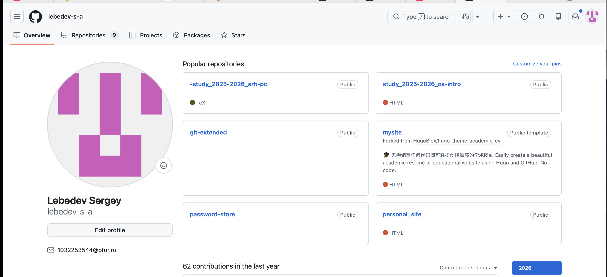
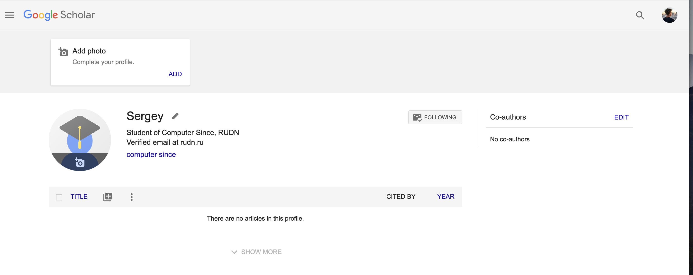
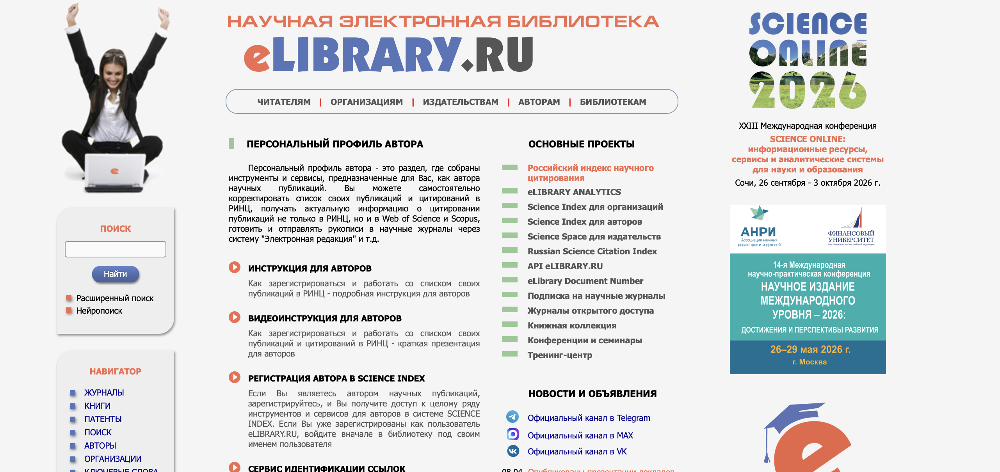
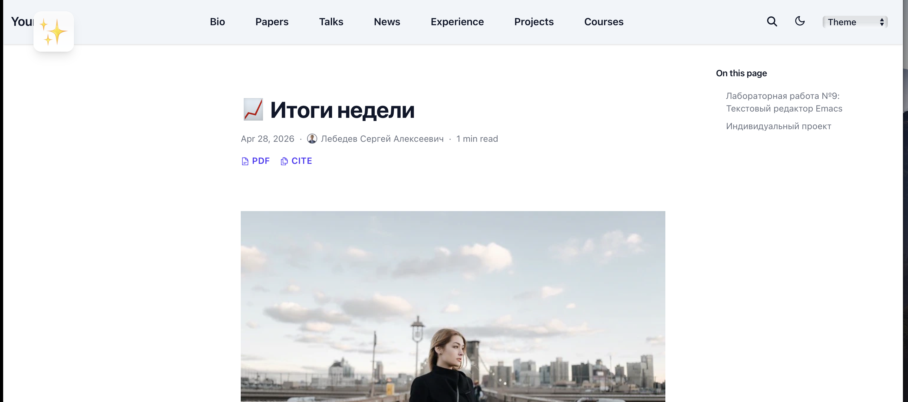
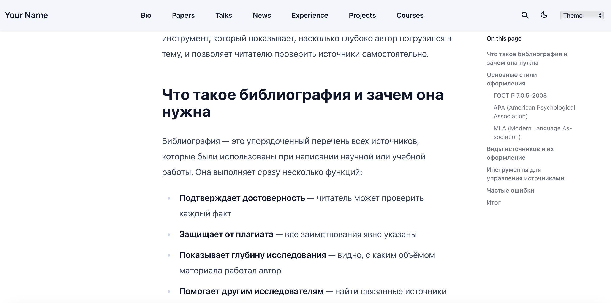

---
## Front matter
title: "Индивидуальный проект. Этап 4"
subtitle: "Добавление ссылок на научные и библиометрические ресурсы"
author: "Лебедев С. А."

## Generic options
lang: ru-RU
toc-title: "Содержание"

## Bibliography
bibliography: bib/cite.bib
csl: pandoc/csl/gost-r-7-0-5-2008-numeric.csl

## Pdf output format
toc: true # Table of contents
toc-depth: 2
lof: true # List of figures
lot: true # List of tables
fontsize: 12pt
linestretch: 1.5
papersize: a4
documentclass: scrreprt

## I18n polyglossia
polyglossia-lang:
  name: russian
  options:
  - spelling=modern
  - babelshorthands=true
polyglossia-otherlangs:
  name: english

## I18n babel
babel-lang: russian
babel-otherlangs: english

## Fonts
mainfont: IBM Plex Serif
romanfont: IBM Plex Serif
sansfont: IBM Plex Sans
monofont: IBM Plex Mono
mathfont: STIX Two Math
mainfontoptions: Ligatures=Common,Ligatures=TeX,Scale=0.94
romanfontoptions: Ligatures=Common,Ligatures=TeX,Scale=0.94
sansfontoptions: Ligatures=Common,Ligatures=TeX,Scale=MatchLowercase,Scale=0.94
monofontoptions: Scale=MatchLowercase,Scale=0.94,FakeStretch=0.9
mathfontoptions:

## Biblatex
biblatex: true
biblio-style: "gost-numeric"
biblatexoptions:
  - parentracker=true
  - backend=biber
  - hyperref=auto
  - language=auto
  - autolang=other*
  - citestyle=gost-numeric

## Pandoc-crossref LaTeX customization
figureTitle: "Рис."
tableTitle: "Таблица"
listingTitle: "Листинг"
lofTitle: "Список иллюстраций"
lotTitle: "Список таблиц"
lolTitle: "Листинги"

## Misc options
indent: true
header-includes:
  - \usepackage{indentfirst}
  - \usepackage{float} # keep figures where there are in the text
  - \floatplacement{figure}{H} # keep figures where there are in the text
---

# Цель работы

Целью данной работы является регистрация на научных и библиометрических платформах, размещение ссылок на них на персональном сайте, а также создание двух постов — по прошедшей неделе и на тему работы с библиографией в академических текстах.

# Задание

1. Зарегистрироваться на соответствующих ресурсах и разместить на них ссылки на сайте:
   - eLibrary: https://elibrary.ru/
   - Google Scholar: https://scholar.google.com/
   - ORCID: https://orcid.org/
   - Mendeley: https://www.mendeley.com/
   - ResearchGate: https://www.researchgate.net/
   - Academia.edu: https://www.academia.edu/
   - arXiv: https://arxiv.org/
   - GitHub: https://github.com/
2. Сделать пост по прошедшей неделе.
3. Добавить пост на тему по выбору: **Работа с библиографией**.

# Выполнение лабораторной работы

## Размещение ссылок на научные ресурсы на сайте

На персональном сайте в разделе РУДН размещены иконки-ссылки на все зарегистрированные научные и библиометрические платформы: GitHub, Google Scholar, ORCID, Mendeley, Academia.edu и Hugo. Иконки отображаются в виде круглых кнопок на светлом фоне и ведут на соответствующие профили (рис. -@fig:001).

{#fig:001 width=70%}

## Регистрация на GitHub

Создан профиль на GitHub под именем **lebedev-s-a** с электронной почтой 1032253544@pfur.ru. В профиле размещены публичные репозитории учебных работ: `study_2025-2026_arh-pc` (язык TeX), `study_2025-2026_os-intro` (HTML), `git-extended`, `mysite` — форк шаблона HugoBlox/hugo-theme-academic-cv для создания академического сайта, `password-store`, `personal_site`. За последний год выполнено 62 вклада (contributions) (рис. -@fig:002).

{#fig:002 width=70%}

## Регистрация на Google Scholar

Создан профиль в Google Scholar на имя **Sergey** с аффилиацией Student of Computer Since, RUDN и подтверждённым email на домене rudn.ru. Список публикаций в профиле пуст, так как учебная деятельность первого курса не предполагает наличия научных статей (рис. -@fig:003).

{#fig:003 width=70%}

## Регистрация на ORCID

Зарегистрирован профиль ORCID для **Sergey Lebedev** с идентификатором https://orcid.org/0009-0009-0223-2239. В разделе Activities — Employment добавлена запись об аффилиации: Peoples' Friendship University of Russia, Moscow, Moscow, RU. Персональная информация в профиле пока не заполнена (рис. -@fig:004).

{#fig:004 width=70%}

## Регистрация на Academia.edu

Создан профиль на Academia.edu — **Sergey Lebedev**, People's Friendship University of Russia, Computer science, Undergraduate. Раздел Uploads (публикации) пока пуст. Профиль имеет 1 публичный просмотр (рис. -@fig:005).

{#fig:005 width=70%}

## Регистрация на Mendeley

Создан аккаунт в **Mendeley Reference Manager**. Открыт раздел My Publications — библиотека публикаций пуста. Интерфейс содержит разделы All References, Recently Added, Recently Read, Favorites, My Publications, Unsorted, Duplicates, Trash, а также возможность создавать коллекции и группы. Платформа готова к использованию для управления библиографическими ссылками (рис. -@fig:006).

{#fig:006 width=70%}

## Регистрация на eLibrary.ru

Выполнена регистрация на Научной электронной библиотеке **eLibrary.ru**. Платформа предоставляет доступ к Российскому индексу научного цитирования (РИНЦ), инструментам для авторов в системе Science Index, журналам открытого доступа, а также сервисам eLIBRARY ANALYTICS и Russian Science Citation Index. На момент выполнения работы на платформе анонсирована XXIII Международная конференция SCIENCE ONLINE 2026 (рис. -@fig:007).

{#fig:007 width=70%}

## Пост по прошедшей неделе

Создан пост «Итоги недели» на персональном сайте, опубликованный 28 апреля 2026 года за авторством Лебедева Сергея Алексеевича. Время чтения — 1 минута. Пост включает два раздела: лабораторная работа и индивидуальный проект (рис. -@fig:008).

{#fig:008 width=70%}

В разделе **Лабораторная работа №9: Текстовый редактор Emacs** описаны освоенные навыки работы в редакторе Emacs. Основные достижения: освоена база (буферы, фреймы, окна) и навигация с помощью префиксных клавиш `Ctrl` и `Meta`; приобретены практические навыки создания и редактирования файлов (на примере `lab07.sh`), поиска и замены текста, управления окнами; освоена работа с интерфейсом — разделение экрана на несколько частей для одновременной работы с разными буферами (рис. -@fig:009).

{#fig:009 width=70%}

## Пост «Работа с библиографией в академических текстах»

Создан тематический пост «Работа с библиографией в академических текстах», опубликованный 28 апреля 2025 года. Время чтения — 2 минуты. Пост содержит разделы: что такое библиография и зачем она нужна, основные стили оформления (ГОСТ Р 7.0.5-2008, APA, MLA), виды источников и их оформление, инструменты для управления источниками, частые ошибки и итог (рис. -@fig:010).

{#fig:010 width=70%}

В разделе **Что такое библиография и зачем она нужна** поста дано определение: библиография — это упорядоченный перечень всех источников, которые были использованы при написании научной или учебной работы. Выделены четыре функции: подтверждает достоверность (читатель может проверить каждый факт), защищает от плагиата (все заимствования явно указаны), показывает глубину исследования (видно, с каким объёмом материала работал автор), помогает другим исследователям найти связанные источники (рис. -@fig:011).

{#fig:011 width=70%}

# Выводы

В ходе выполнения четвёртого этапа индивидуального проекта выполнена регистрация на основных научных и библиометрических платформах: GitHub, Google Scholar, ORCID, Academia.edu, Mendeley и eLibrary.ru. На персональном сайте размещены ссылки-иконки на все зарегистрированные ресурсы. Создан еженедельный пост «Итоги недели» с описанием работы по лабораторной работе №9 (текстовый редактор Emacs) и индивидуальному проекту. Создан тематический пост «Работа с библиографией в академических текстах», раскрывающий понятие библиографии, стили оформления, инструменты и типичные ошибки.

# Список литературы{.unnumbered}

::: {#refs}
:::
