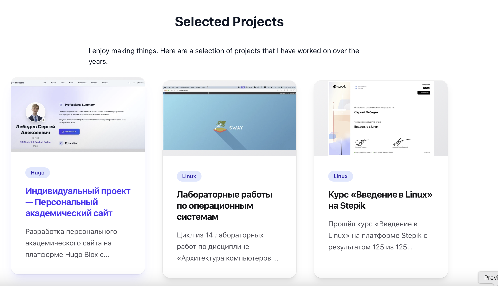
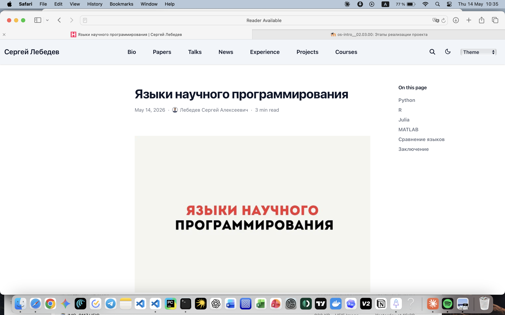

## Титульный слайд

**Дисциплина:** Архитектура компьютеров и операционные системы (раздел «Операционные системы»)  
**Работа:** Индивидуальный проект. Этап 5 — Добавление остальных элементов сайта

**Студент:** Лебедев Сергей Алексеевич  
**Преподаватель:** Кулябов Дмитрий Сергеевич, д.ф.-м.н., профессор  
**Организация:** Российский университет дружбы народов (РУДН)

---

## Содержание

1. Цель и задачи работы
2. Записи для персональных проектов
3. Пост по прошедшей неделе
4. Содержание поста о прошедшей неделе
5. Пост «Языки научного программирования»
6. Содержание поста о языках программирования
7. Выводы

---

## Информация о докладчике

:::::::::::::: {.columns align=center}
::: {.column width="65%"}
- **Лебедев Сергей Алексеевич**
- студент направления **02.03.00 Компьютерные и информационные науки**
- РУДН, 1 курс
- Этап 5: добавление остальных элементов персонального сайта
:::

::: {.column width="35%"}

:::
::::::::::::::

---

## Цель работы

Добавить на персональный сайт оставшиеся элементы: записи о персональных проектах, пост по прошедшей неделе и тематический пост на тему «Языки научного программирования».

---

## Задачи

1. Сделать записи для персональных проектов
2. Сделать пост по прошедшей неделе
3. Добавить пост на тему **Языки научного программирования**

---

## Записи для персональных проектов

В разделе **Selected Projects** оформлены три проекта:

- **Индивидуальный проект — Персональный академический сайт** (Hugo) — разработка сайта на Hugo Blox с размещением на GitHub Pages
- **Лабораторные работы по операционным системам** (Linux) — цикл из 14 лабораторных работ по дисциплине «Архитектура компьютеров и операционные системы»
- **Курс «Введение в Linux» на Stepik** (Linux) — прохождение курса с результатом 125 из 125 баллов

---

## Пост по прошедшей неделе

Создан пост **«Результаты прошлой недели»**, опубликованный 14 мая 2026 года. Время чтения — 2 минуты. На странице размещена обложка с крупной надписью. В боковом меню отображаются разделы: «Что было сделано» и «Итог».

---

## Содержание поста о прошедшей неделе

Основная тема недели — лабораторная работа №13: написание shell-скриптов с управляющими конструкциями и циклами:

- **Задание 1** — командный файл с `getopts` и `grep` для разбора ключей (`-i`, `-o`, `-p`, `-C`, `-n`) и поиска по файлу
- **Задание 2** — программа на Си для определения знака числа через `exit(n)` и анализ `$?` в командном файле
- **Задание 3** — скрипт создания и удаления пронумерованных файлов (`1.tmp` ... `N.tmp`)
- **Задание 4** — архивирование директории через `tar` с фильтром `find -mtime` для файлов моложе недели

---

## Пост «Языки научного программирования»

Создан тематический пост **«Языки научного программирования»**, опубликованный 14 мая 2026 года. Время чтения — 3 минуты. В боковом меню отображаются разделы: Python, R, Julia, MATLAB, Сравнение языков, Заключение.

---

## Содержание поста о языках программирования

Пост охватывает четыре ключевых языка научных вычислений:

| Язык | Сильная сторона |
|------|----------------|
| **Python** | универсальность, экосистема NumPy/SciPy/Pandas |
| **R** | статистика, визуализация (ggplot2), биоинформатика |
| **Julia** | высокая производительность, JIT-компиляция |
| **MATLAB** | инженерные вычисления, Simulink |

---

## Выводы

- Оформлены три записи в разделе **Selected Projects**: персональный сайт, лабораторные работы по ОС, курс Stepik
- Создан еженедельный пост **«Результаты прошлой недели»** с описанием ЛР №13 (ветвления и циклы в Bash, программа на Си, архивирование через `tar`)
- Создан тематический пост **«Языки научного программирования»** с обзором Python, R, Julia и MATLAB, их экосистем и сравнительной таблицей

---

## Ресурсы

- Hugo Blox: https://hugoblox.com
- GitHub: https://github.com/lebedev-s-a
- Stepik «Введение в Linux»: https://stepik.org/course/73/info
