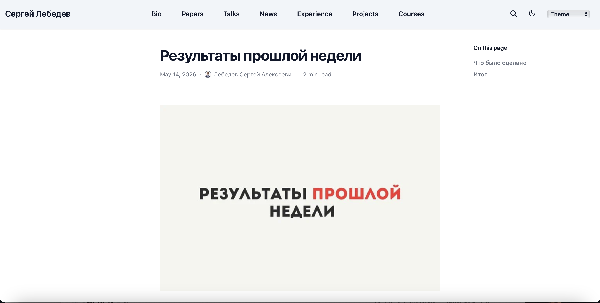
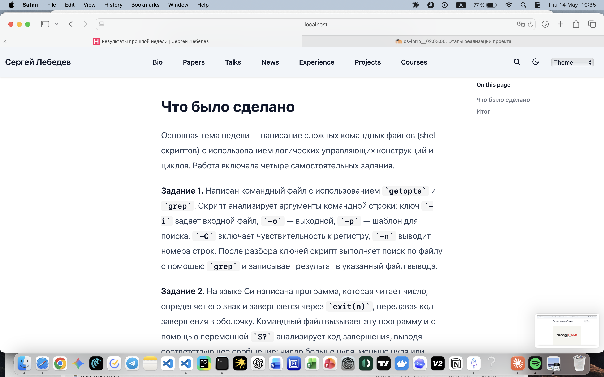
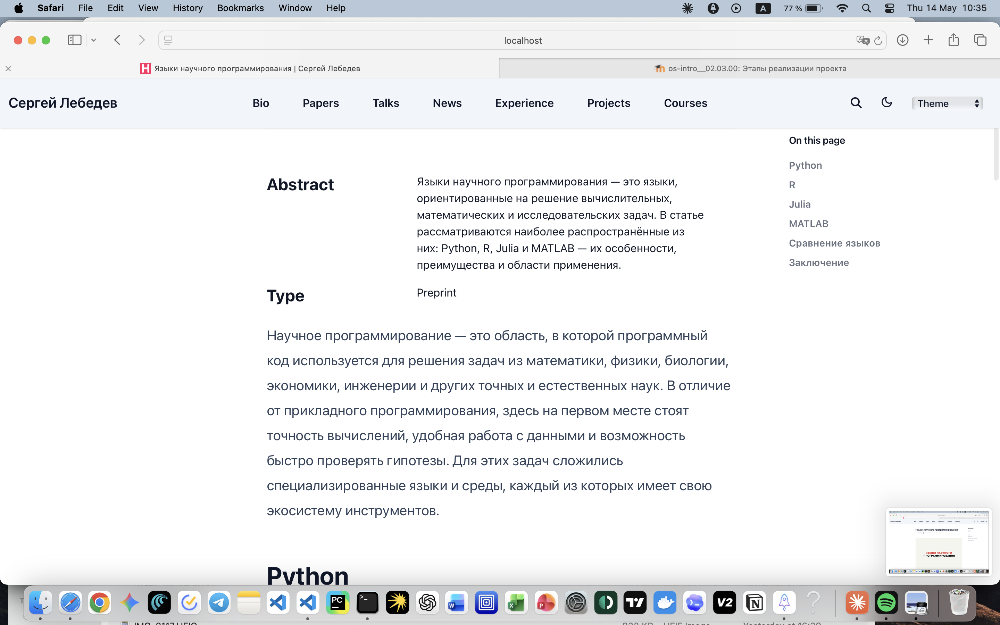

---
## Front matter
title: "Индивидуальный проект. Этап 5"
subtitle: "Добавление остальных элементов сайта"
author: "Лебедев С. А."

## Generic options
lang: ru-RU
toc-title: "Содержание"

## Bibliography
bibliography: bib/cite.bib
csl: pandoc/csl/gost-r-7-0-5-2008-numeric.csl

## Pdf output format
toc: true # Table of contents
toc-depth: 2
lof: true # List of figures
lot: true # List of tables
fontsize: 12pt
linestretch: 1.5
papersize: a4
documentclass: scrreprt

## I18n polyglossia
polyglossia-lang:
  name: russian
  options:
  - spelling=modern
  - babelshorthands=true
polyglossia-otherlangs:
  name: english

## I18n babel
babel-lang: russian
babel-otherlangs: english

## Fonts
mainfont: IBM Plex Serif
romanfont: IBM Plex Serif
sansfont: IBM Plex Sans
monofont: IBM Plex Mono
mathfont: STIX Two Math
mainfontoptions: Ligatures=Common,Ligatures=TeX,Scale=0.94
romanfontoptions: Ligatures=Common,Ligatures=TeX,Scale=0.94
sansfontoptions: Ligatures=Common,Ligatures=TeX,Scale=MatchLowercase,Scale=0.94
monofontoptions: Scale=MatchLowercase,Scale=0.94,FakeStretch=0.9
mathfontoptions:

## Biblatex
biblatex: true
biblio-style: "gost-numeric"
biblatexoptions:
  - parentracker=true
  - backend=biber
  - hyperref=auto
  - language=auto
  - autolang=other*
  - citestyle=gost-numeric

## Pandoc-crossref LaTeX customization
figureTitle: "Рис."
tableTitle: "Таблица"
listingTitle: "Листинг"
lofTitle: "Список иллюстраций"
lotTitle: "Список таблиц"
lolTitle: "Листинги"

## Misc options
indent: true
header-includes:
  - \usepackage{indentfirst}
  - \usepackage{float} # keep figures where there are in the text
  - \floatplacement{figure}{H} # keep figures where there are in the text
---

# Цель работы

Целью данной работы является добавление на персональный сайт оставшихся элементов: записей о персональных проектах, поста по прошедшей неделе и тематического поста на тему «Языки научного программирования».

# Задание

1. Сделать записи для персональных проектов.
2. Сделать пост по прошедшей неделе.
3. Добавить пост на тему по выбору: **Языки научного программирования**.

# Выполнение лабораторной работы

## Записи для персональных проектов

На персональном сайте в разделе **Selected Projects** оформлены записи для трёх персональных проектов. Карточки проектов отображаются на главной странице в виде плиток с превью, тегами и кратким описанием (рис. -@fig:001).

Первый проект — **Индивидуальный проект — Персональный академический сайт** (тег Hugo) — описывает разработку текущего сайта на платформе Hugo Blox с размещением на GitHub Pages. Второй проект — **Лабораторные работы по операционным системам** (тег Linux) — представляет цикл из 14 лабораторных работ по дисциплине «Архитектура компьютеров и операционные системы». Третий проект — **Курс «Введение в Linux» на Stepik** (тег Linux) — фиксирует прохождение курса с результатом 125 из 125 баллов.

{#fig:001 width=70%}

## Пост по прошедшей неделе

Создан пост **«Результаты прошлой недели»**, опубликованный 14 мая 2026 года за авторством Лебедева Сергея Алексеевича. Время чтения составляет 2 минуты. На странице поста размещена обложка с крупной надписью «РЕЗУЛЬТАТЫ ПРОШЛОЙ НЕДЕЛИ». В боковом меню «On this page» отображаются два раздела: «Что было сделано» и «Итог» (рис. -@fig:002).

{#fig:002 width=70%}

В разделе **«Что было сделано»** описана основная тема недели — написание сложных командных файлов (shell-скриптов) с использованием логических управляющих конструкций и циклов в рамках лабораторной работы №13. Работа включала четыре самостоятельных задания. Задание 1: написан командный файл с использованием `getopts` и `grep` для разбора ключей командной строки (`-i`, `-o`, `-p`, `-C`, `-n`) и поиска по файлу. Задание 2: на языке Си написана программа определения знака числа, завершающаяся через `exit(n)`, и командный файл, анализирующий код завершения через переменную `$?`. Задание 3: написан скрипт, создающий и удаляющий пронумерованные временные файлы (`1.tmp`, `2.tmp`, ..., `N.tmp`). Задание 4: написан командный файл для архивирования директории с помощью `tar`, доработанный фильтрацией через `find -mtime` для включения только файлов, изменённых менее недели назад (рис. -@fig:003).

{#fig:003 width=70%}

## Пост «Языки научного программирования»

Создан тематический пост **«Языки научного программирования»**, опубликованный 14 мая 2026 года за авторством Лебедева Сергея Алексеевича. Время чтения составляет 3 минуты. На странице поста размещена обложка с крупной надписью «ЯЗЫКИ НАУЧНОГО ПРОГРАММИРОВАНИЯ». В боковом меню «On this page» отображаются разделы: Python, R, Julia, MATLAB, Сравнение языков, Заключение (рис. -@fig:004).

{#fig:004 width=70%}

Пост открывается блоком **Abstract**, в котором дано определение: языки научного программирования — это языки, ориентированные на решение вычислительных, математических и исследовательских задач; в статье рассматриваются наиболее распространённые из них: Python, R, Julia и MATLAB с описанием их особенностей, преимуществ и областей применения. Тип публикации указан как Preprint. Основной текст начинается с вводного абзаца, раскрывающего понятие научного программирования, после чего следует раздел **Python** (рис. -@fig:005).

{#fig:005 width=70%}

# Выводы

В ходе выполнения пятого этапа индивидуального проекта на персональном сайте добавлены записи для трёх персональных проектов в разделе Selected Projects: «Индивидуальный проект — Персональный академический сайт», «Лабораторные работы по операционным системам» и «Курс "Введение в Linux" на Stepik». Создан еженедельный пост «Результаты прошлой недели» с описанием выполнения лабораторной работы №13 по программированию в командном процессоре ОС UNIX. Создан тематический пост «Языки научного программирования», охватывающий обзор четырёх ключевых языков научных вычислений: Python, R, Julia и MATLAB.

# Список литературы{.unnumbered}

::: {#refs}
:::
