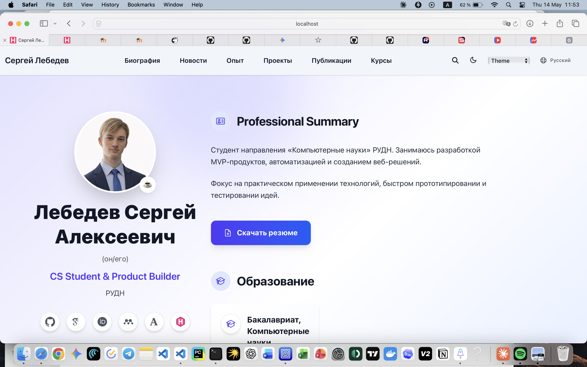
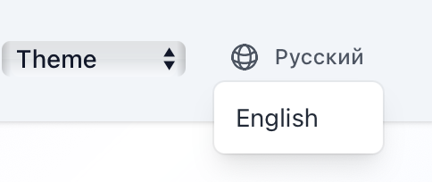
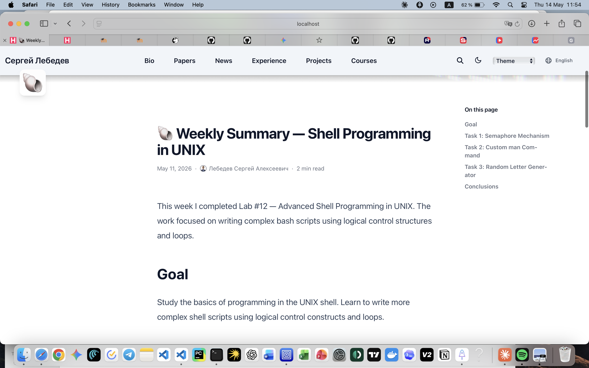
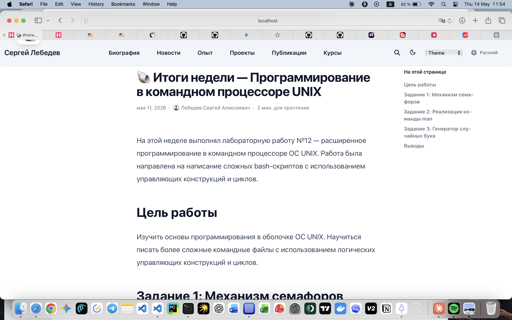
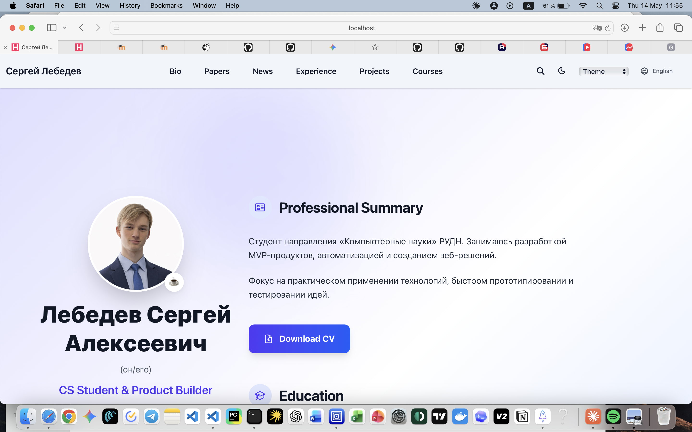

---
## Front matter
title: "Индивидуальный проект. Этап 6"
subtitle: "Размещение двуязычного сайта на Github"
author: "Лебедев С. А."

## Generic options
lang: ru-RU
toc-title: "Содержание"

## Bibliography
bibliography: bib/cite.bib
csl: pandoc/csl/gost-r-7-0-5-2008-numeric.csl

## Pdf output format
toc: true # Table of contents
toc-depth: 2
lof: true # List of figures
lot: true # List of tables
fontsize: 12pt
linestretch: 1.5
papersize: a4
documentclass: scrreprt

## I18n polyglossia
polyglossia-lang:
  name: russian
  options:
  - spelling=modern
  - babelshorthands=true
polyglossia-otherlangs:
  name: english

## I18n babel
babel-lang: russian
babel-otherlangs: english

## Fonts
mainfont: IBM Plex Serif
romanfont: IBM Plex Serif
sansfont: IBM Plex Sans
monofont: IBM Plex Mono
mathfont: STIX Two Math
mainfontoptions: Ligatures=Common,Ligatures=TeX,Scale=0.94
romanfontoptions: Ligatures=Common,Ligatures=TeX,Scale=0.94
sansfontoptions: Ligatures=Common,Ligatures=TeX,Scale=MatchLowercase,Scale=0.94
monofontoptions: Scale=MatchLowercase,Scale=0.94,FakeStretch=0.9
mathfontoptions:

## Biblatex
biblatex: true
biblio-style: "gost-numeric"
biblatexoptions:
  - parentracker=true
  - backend=biber
  - hyperref=auto
  - language=auto
  - autolang=other*
  - citestyle=gost-numeric

## Pandoc-crossref LaTeX customization
figureTitle: "Рис."
tableTitle: "Таблица"
listingTitle: "Листинг"
lofTitle: "Список иллюстраций"
lotTitle: "Список таблиц"
lolTitle: "Листинги"

## Misc options
indent: true
header-includes:
  - \usepackage{indentfirst}
  - \usepackage{float} # keep figures where there are in the text
  - \floatplacement{figure}{H} # keep figures where there are in the text
---

# Цель работы

Целью данной работы является добавление поддержки двух языков — русского и английского — на персональный сайт, размещение элементов и контента сайта на обоих языках, а также создание поста по прошедшей неделе.

# Задание

1. Сделать поддержку английского и русского языков.
2. Разместить элементы сайта на обоих языках.
3. Разместить контент на обоих языках.
4. Сделать пост по прошедшей неделе.

# Выполнение лабораторной работы

## Поддержка русского языка и переключатель языков

В конфигурации Hugo активированы два языка: русский (`ru`) и английский (`en`). В правом верхнем углу сайта появился переключатель языков в виде кнопки с иконкой глобуса. На русскоязычной версии сайта навигационная панель содержит пункты: «Биография», «Новости», «Опыт», «Проекты», «Публикации», «Курсы». Профиль владельца отображается с кнопкой «Скачать резюме». Переключатель показывает текущий язык — «Русский» (рис. -@fig:001).

{#fig:001 width=70%}

## Переключатель языков — выпадающее меню

При нажатии на переключатель языков открывается выпадающее меню с двумя вариантами: «Русский» и «English». Выбор языка мгновенно переключает интерфейс и весь контент сайта на соответствующую языковую версию (рис. -@fig:002).

{#fig:002 width=70%}

## Английская версия сайта — пост по прошедшей неделе

После переключения на английский язык навигационная панель отображает пункты в переводе: Bio, Papers, News, Experience, Projects, Courses. Создан пост по прошедшей неделе на английском языке — **«Weekly Summary — Shell Programming in UNIX»**, опубликованный 11 мая 2026 года. Время чтения — 2 минуты. В боковом меню «On this page» отображаются разделы: Goal, Task 1: Semaphore Mechanism, Task 2: Custom man Command, Task 3: Random Letter Generator, Conclusions. Вводный абзац сообщает, что на этой неделе была выполнена лабораторная работа №12 — расширенное программирование в командном процессоре ОС UNIX с написанием сложных bash-скриптов с логическими управляющими конструкциями и циклами. Раздел **Goal** содержит цель: изучить основы программирования в оболочке ОС UNIX, научиться писать более сложные командные файлы с использованием логических управляющих конструкций и циклов (рис. -@fig:003).

{#fig:003 width=70%}

## Русская версия сайта — пост по прошедшей неделе

Тот же пост доступен и на русском языке — **«Итоги недели — Программирование в командном процессоре UNIX»**, опубликованный 11 мая 2026 года. Время чтения — 2 минуты. В боковом меню «На этой странице» отображаются разделы: Цель работы, Задание 1: Механизм семафоров, Задание 2: Реализация команды man, Задание 3: Генератор случайных букв, Выводы. Вводный абзац соответствует содержанию английской версии: на этой неделе выполнялась лабораторная работа №12 — расширенное программирование в командном процессоре ОС UNIX. Раздел **Цель работы** воспроизводит цель работы на русском языке (рис. -@fig:004).

{#fig:004 width=70%}

## Английская версия главной страницы

Главная страница сайта на английском языке отображает те же данные профиля, что и русская версия, но на английском языке. Раздел **Professional Summary** содержит описание: студент направления «Компьютерные науки» РУДН, занимается разработкой MVP-продуктов, автоматизацией и созданием веб-решений; фокус на практическом применении технологий, быстром прототипировании и тестировании идей. Кнопка загрузки резюме отображается как **Download CV**. Раздел Education переведён на английский язык (рис. -@fig:005).

{#fig:005 width=70%}

# Выводы

В ходе выполнения шестого этапа индивидуального проекта реализована поддержка двух языков на персональном сайте: русского и английского. Добавлен переключатель языков в интерфейс сайта. Элементы навигации, кнопки и разделы профиля переведены на оба языка: русскоязычная версия содержит пункты «Биография», «Новости», «Опыт», «Проекты», «Публикации», «Курсы» и кнопку «Скачать резюме», англоязычная — Bio, Papers, News, Experience, Projects, Courses и кнопку Download CV. Создан пост по прошедшей неделе на двух языках: «Weekly Summary — Shell Programming in UNIX» (English) и «Итоги недели — Программирование в командном процессоре UNIX» (Русский), описывающий выполнение лабораторной работы №12.

# Список литературы{.unnumbered}

::: {#refs}
:::
