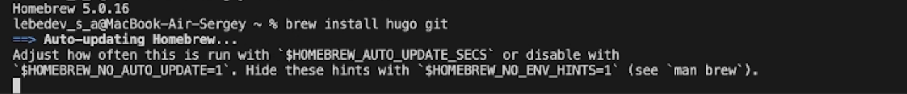

## Титульный слайд

**Дисциплина:** Архитектура компьютера  
**Работа:** Индивидуальный проект 1 этап

**Студент:** Лебедев Сергей Алексеевич  
**Преподаватель:** Кулябов Дмитрий Сергеевич, д.ф.-м.н., профессор  
**Организация:** Российский университет дружбы народов (РУДН)

---

## Содержание

1. Цель работы  
2. Задачи  
3. Ход выполнения  
4. Выводы

---

## Информация о докладчике

:::::::::::::: {.columns align=center}
::: {.column width="65%"}
- **Лебедев Сергей Алексеевич**
- студент направления **02.03.00 Компьютерные и информационные науки**
- РУДН, 1 курс
- Индивидуальный проект: размещение персонального сайта на Github pages
:::

::: {.column width="35%"}

:::
::::::::::::::

---

## Цель работы

Разместить на Github pages заготовку персонального сайта, выполнив установку необходимого программного обеспечения, настройку шаблона и публикацию на хостинге.

---

## Задачи

1. Установить необходимое программное обеспечение  
2. Скачать шаблон темы сайта  
3. Разместить его на хостинге git  
4. Установить параметр для URLs сайта  
5. Разместить заготовку сайта на Github pages

---

## Установка программного обеспечения

Для работы с генератором статических сайтов Hugo устанавливаю инструменты через пакетный менеджер Homebrew:

```
brew install hugo git
```


---

## Создание форка шаблона сайта

На GitHub выполняю форк репозитория **hugo-theme-academic-cv** от HugoBlox в личный аккаунт. Это даёт возможность свободно изменять шаблон под собственные нужды.



---

## Подключение репозитория в VS Code

Открываю Visual Studio Code и подключаю репозиторий **lebedev-s-a/mysite**, созданный после форка. Локальная работа с файлами позволяет синхронизировать изменения с GitHub.


---

## Проверка структуры и запуск локального сервера

Изучаю структуру проекта: директории `assets`, `content`, `config`, `layouts` и другие. Запускаю локальный сервер для предварительного просмотра:

```
hugo server
```


---

## Просмотр сайта в браузере

После запуска сервера перехожу по адресу `localhost`. Шаблон персонального сайта отображается корректно — генератор Hugo работает исправно.


---

## Публикация на GitHub Pages

В настройках репозитория активирую GitHub Pages, указывая ветку **main** в качестве источника публикации. Сайт становится доступен по адресу:

**https://lebedev-s-a.github.io/mysite/**


---

## Выводы

- Установлено необходимое программное обеспечение (Hugo, Git)
- Скачан и настроен шаблон персонального сайта
- Репозиторий размещён на GitHub
- Заготовка сайта успешно опубликована на **Github pages**

Первый этап индивидуального проекта выполнен в полном объеме 

---

## Ресурсы

- Hugo: https://gohugo.io  
- HugoBlox (Academic CV): https://github.com/HugoBlox/hugo-theme-academic-cv  
- GitHub Pages: https://pages.github.com  
- Homebrew: https://brew.sh
