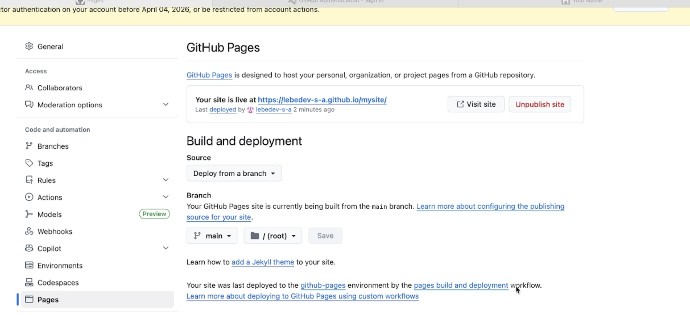
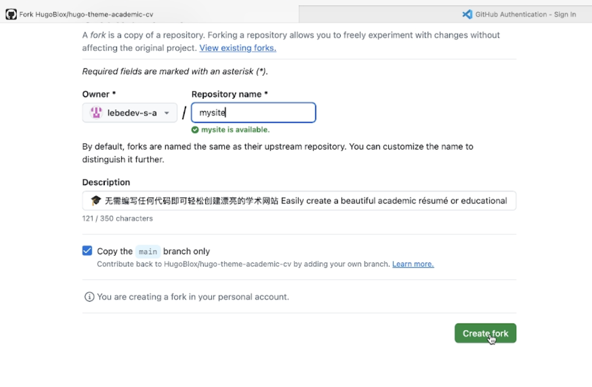
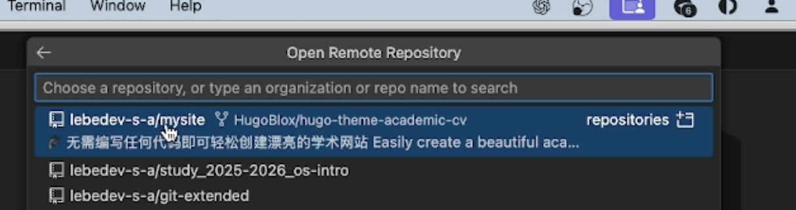
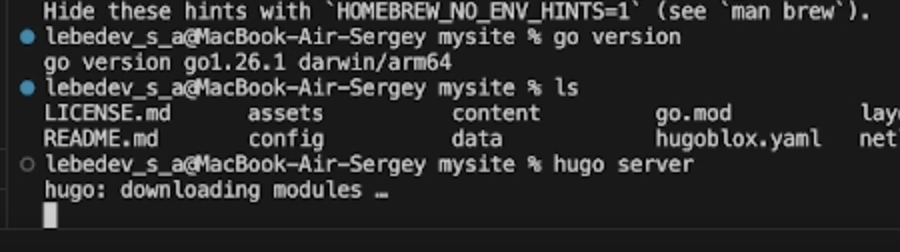

---
## Front matter
title: "Индивидуальный проект 1 этап"
subtitle: "Дисциплина: Архитектура компьютера"
author: "Лебедев Сергей Алексеевич"

## Generic otions
lang: ru-RU
toc-title: "Содержание"

## Bibliography
bibliography: bib/cite.bib
csl: pandoc/csl/gost-r-7-0-5-2008-numeric.csl

## Pdf output format
toc: true # Table of contents
toc-depth: 2
lof: true # List of figures
lot: true # List of tables
fontsize: 12pt
linestretch: 1.5
papersize: a4
documentclass: scrreprt
## I18n polyglossia
polyglossia-lang:
  name: russian
  options:
	- spelling=modern
	- babelshorthands=true
polyglossia-otherlangs:
  name: english
## I18n babel
babel-lang: russian
babel-otherlangs: english
## Fonts
mainfont: IBM Plex Serif
romanfont: IBM Plex Serif
sansfont: IBM Plex Sans
monofont: IBM Plex Mono
mathfont: STIX Two Math
mainfontoptions: Ligatures=Common,Ligatures=TeX,Scale=0.94
romanfontoptions: Ligatures=Common,Ligatures=TeX,Scale=0.94
sansfontoptions: Ligatures=Common,Ligatures=TeX,Scale=MatchLowercase,Scale=0.94
monofontoptions: Scale=MatchLowercase,Scale=0.94,FakeStretch=0.9
mathfontoptions:
## Biblatex
biblatex: true
biblio-style: "gost-numeric"
biblatexoptions:
  - parentracker=true
  - backend=biber
  - hyperref=auto
  - language=auto
  - autolang=other*
  - citestyle=gost-numeric
## Pandoc-crossref LaTeX customization
figureTitle: "Рис."
tableTitle: "Таблица"
listingTitle: "Листинг"
lofTitle: "Список иллюстраций"
lotTitle: "Список таблиц"
lolTitle: "Листинги"
## Misc options
indent: true
header-includes:
  - \usepackage{indentfirst}
  - \usepackage{float} # keep figures where there are in the text
  - \floatplacement{figure}{H} # keep figures where there are in the text
---

# Цель работы

Разместить на Github pages заготовку персонального сайта, выполнив установку необходимого программного обеспечения, настройку шаблона и публикацию на хостинге.

# Задание

1. Установить необходимое программное обеспечение.
2. Скачать шаблон темы сайта.
3. Разместить его на хостинге git.
4. Установить параметр для URLs сайта.
5. Разместить заготовку сайта на Github pages.

# Выполнение индивидуального проекта

Для начала устанавливаю необходимые инструменты: генератор статических сайтов Hugo и систему контроля версий Git. Установка выполняется через пакетный менеджер Homebrew с помощью команды `brew install hugo git`. (рис. -@fig:001)

{#fig:001 width=70%}

Перехожу на GitHub и создаю форк репозитория с шаблоном сайта hugo-theme-academic-cv от HugoBlox. Форк копирует шаблон в мой личный аккаунт, что даёт возможность свободно изменять его под собственные нужды. (рис. -@fig:002)

{#fig:002 width=70%}

Открываю Visual Studio Code и подключаю репозиторий lebedev-s-a/mysite, созданный после форка. Это позволяет редактировать файлы проекта локально и синхронизировать изменения с удалённым репозиторием на GitHub. (рис. -@fig:003)

{#fig:003 width=70%}

Изучаю структуру проекта — директории assets, content, config, layouts и другие. После этого запускаю локальный сервер командой `hugo server` для предварительного просмотра сайта. (рис. -@fig:004)

{#fig:004 width=70%}

Открываю браузер и перехожу по адресу localhost. Сайт корректно отображается с шаблонными данными, что подтверждает успешную работу генератора Hugo. (рис. -@fig:005)

{#fig:005 width=70%}

В настройках репозитория активирую GitHub Pages, указывая ветку main в качестве источника публикации. После применения настроек сайт становится доступен по адресу https://lebedev-s-a.github.io/mysite/. (рис. -@fig:006)

{#fig:006 width=70%}

# Выводы

Была успешно выполнена первая часть индивидуального проекта: установлено необходимое программное обеспечение, скачан и настроен шаблон персонального сайта, репозиторий размещён на GitHub, а заготовка сайта опубликована на GitHub Pages.

# Список литературы{.unnumbered}

::: {#refs}
:::
